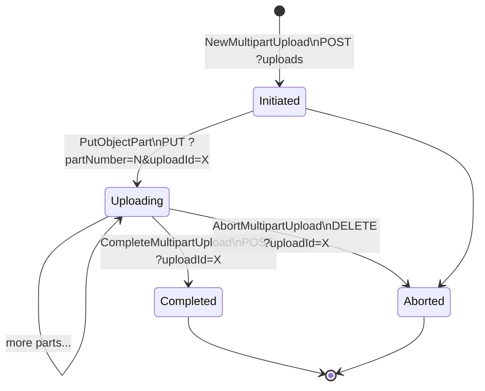
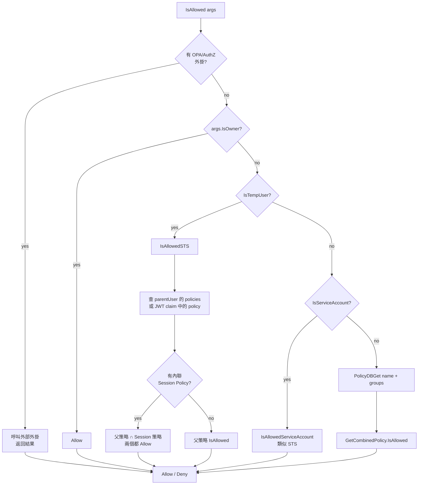
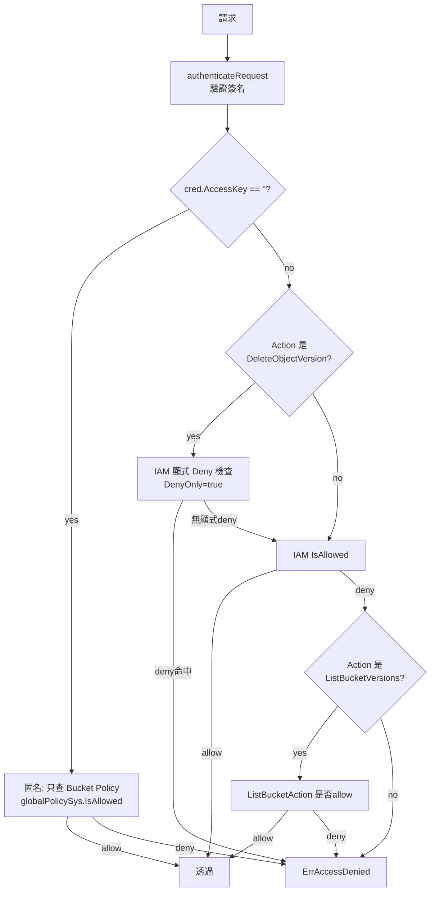
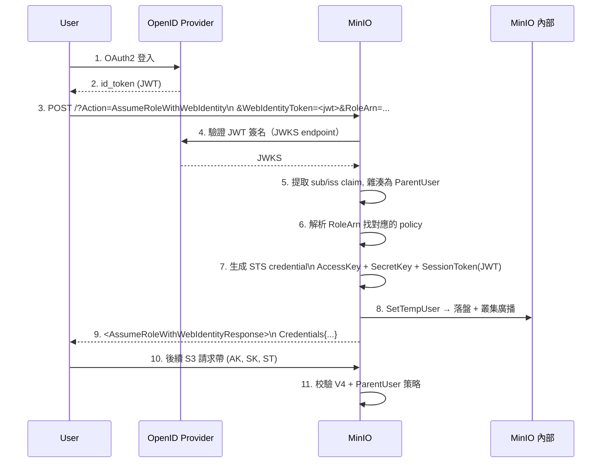
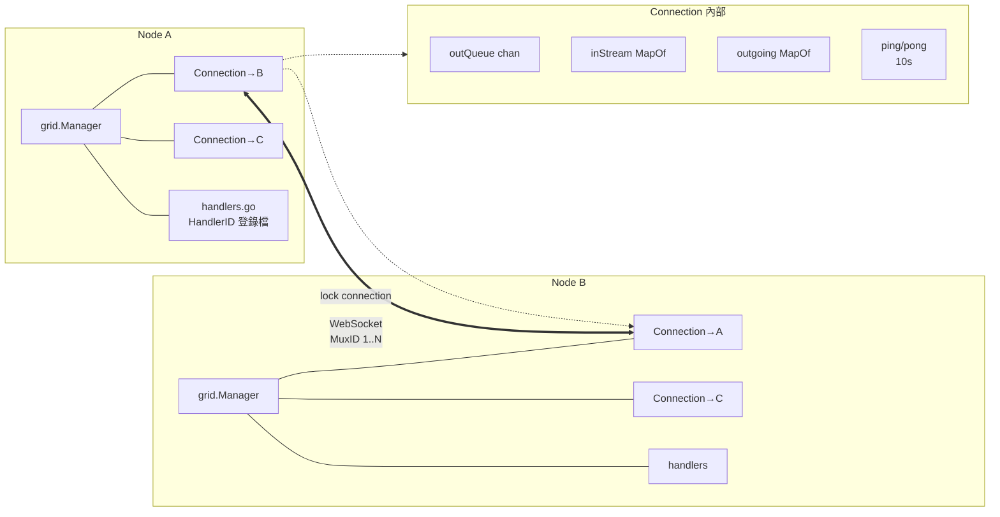
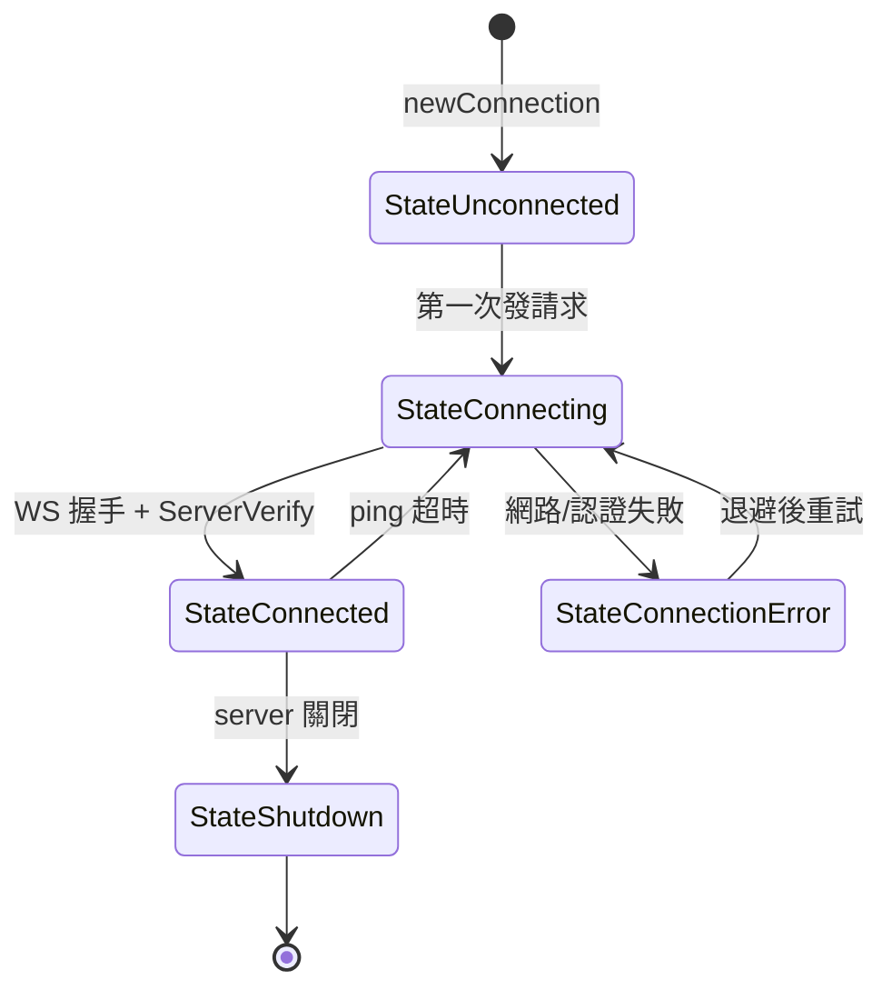
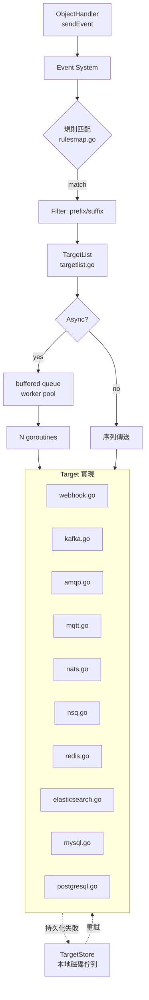
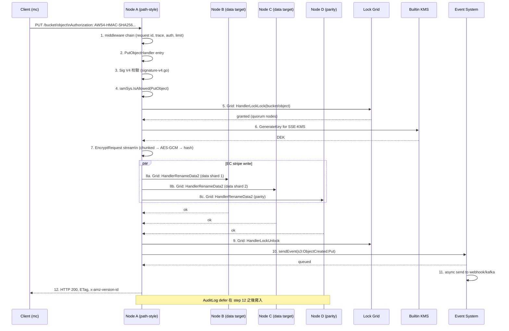

# 模組六：S3 API 層、IAM 鑑權與內部通訊基礎設施

> 這是 MinIO 深度分析的收尾模組。前面的模組依次講過：單機磁碟 → 糾刪叢集 → 多池/多站點 → 後臺掃描與 ILM。
> 這些是“資料怎麼存”和“資料怎麼治”。本模組回到“資料怎麼進出”：使用者透過 S3 API 與 MinIO 互動，
> 經 IAM 鑑權、過中介軟體鏈、最終落到 ObjectLayer。同時介紹三個支撐性的子系統：
> 自研的 Grid 內部 RPC、dsync 分散式鎖、event/KMS 等橫切設施。

讀完本模組，你應當能回答：
- 一個 `s3.PutObject` 請求從 TCP 到磁碟的完整鏈路是什麼？
- AWS Sig V4、STS、LDAP、OpenID 在 MinIO 中如何統一抽象？
- Bucket Policy 與 IAM Policy 何時合併、如何評估？
- 為什麼 MinIO 選擇自研 Grid 而非 gRPC？
- 為什麼 dsync 選擇 Quorum-based 鎖而非 etcd？

---

## 1. S3 API 層：MinIO 的"門臉"

### 1.1 路由設計：Path-style vs Virtual-host-style

MinIO 同時支援 AWS S3 的兩種 URL 風格，路由器使用 `gorilla/mux` 的 fork（`github.com/minio/mux`）：

| 風格 | URL 形式 | 路由匹配方式 |
|------|---------|------------|
| **Virtual-host** | `bucket.minio.example.com/object` | `apiRouter.Host("{bucket:.+}." + domainName)` |
| **Path-style** | `minio.example.com/bucket/object` | `apiRouter.PathPrefix("/{bucket}")` |

註冊邏輯在 `cmd/api-router.go:255-289`：

```go
func registerAPIRouter(router *mux.Router) {
    apiRouter := router.PathPrefix(SlashSeparator).Subrouter()
    var routers []*mux.Router
    for _, domainName := range globalDomainNames {
        routers = append(routers, apiRouter.Host("{bucket:.+}."+domainName).Subrouter())
    }
    routers = append(routers, apiRouter.PathPrefix("/{bucket}").Subrouter())

    for _, router := range routers {
        // Object operations: HeadObject / GetObject / PutObject / CopyObject ...
        // Bucket operations: ListBuckets / PutBucketPolicy ...
    }
}
```

> **Kubernetes 特殊處理**：在 K8s 部署下需要排除 `minio.<namespace>.svc.<cluster>` 域名以避免與運算元的 service 端點
> 衝突（`api-router.go:267-284`）。MinIO Operator 利用此機制保證管理通訊。

### 1.2 路由順序與歧義解決

S3 API 的難點：同一個 HTTP 方法 + 路徑可能對應不同的"意圖"，由 query 字串區分。例如：

```
PUT /bucket/object                              → PutObject
PUT /bucket/object?partNumber=1&uploadId=xxx    → PutObjectPart
PUT /bucket/object  (with x-amz-copy-source hdr)→ CopyObject
PUT /bucket?lifecycle                            → PutBucketLifecycle
```

MinIO 註冊時**精確路由先於寬鬆路由**（`cmd/api-router.go:301-403`）。如：

```go
// 先：Multipart 必帶 uploadId & partNumber
router.Methods(http.MethodPut).Path("/{object:.+}").
    HandlerFunc(s3APIMiddleware(api.PutObjectPartHandler, traceHdrsS3HFlag)).
    Queries("partNumber", "{partNumber:.*}", "uploadId", "{uploadId:.*}")

// 中：CopyObject 透過 x-amz-copy-source 頭識別
router.Methods(http.MethodPut).Path("/{object:.+}").
    HeadersRegexp(xhttp.AmzCopySource, ".*?(\\/|%2F).*?").
    HandlerFunc(s3APIMiddleware(api.CopyObjectHandler))

// 最後：兜底 PutObject
router.Methods(http.MethodPut).Path("/{object:.+}").
    HandlerFunc(s3APIMiddleware(api.PutObjectHandler, traceHdrsS3HFlag))
```

**路由排序原則**：query 限定詞最多的最先註冊，無 query 限定的兜底。

### 1.3 拒絕未實現的 API（rejected APIs）

MinIO 顯式拒絕部分 AWS 私有 API（如 `inventory`、`accelerate`、`requestPayment`），返回 `NotImplemented` 而非 404，以保持客戶端相容性（`api-router.go:108-169`）：

```go
var rejectedBucketAPIs = []rejectedAPI{
    {api: "inventory", methods: []string{...}, queries: []string{"inventory", ""}},
    {api: "accelerate", methods: []string{...}, queries: []string{"accelerate", ""}},
    {api: "publicAccessBlock", ...},
    {api: "ownershipControls", ...},
    ...
}
```

> 這是有意的設計：**"明確拒絕"優於"靜默 404"**——客戶端能快速發現 MinIO 不支援某 API，無需除錯。

### 1.4 中介軟體鏈（Middleware Chain）

`cmd/routers.go:54-81` 定義了全域性中介軟體，按 mux 的語義，中介軟體 **`Use(...)` 時按順序追加，
但執行順序是先註冊先包裹（即棧式執行：先註冊的在最外層）**。在 `configureServerHandler` 末尾的 `router.Use(globalMiddlewares...)` 決定了：

```go
var globalMiddlewares = []mux.MiddlewareFunc{
    addCustomHeadersMiddleware,        // 1. x-amz-request-id, HSTS, X-XSS-Protection
    httpTracerMiddleware,              // 2. 設定 trace 上下文，便於日誌關聯
    setAuthMiddleware,                 // 3. 校驗 Date 頭偏移（±15 分鐘）
    setBrowserRedirectMiddleware,      // 4. 瀏覽器請求重定向到 console
    setCrossDomainPolicyMiddleware,    // 5. crossdomain.xml（Flash 相容）
    setRequestLimitMiddleware,         // 6. 請求體 ≤ 16GiB+64MiB；header ≤ 8KB
    setRequestValidityMiddleware,      // 7. 路徑 .. 檢測，多重認證拒絕，bucket 名校驗
    setUploadForwardingMiddleware,     // 8. 站點複製下，multipart 上傳轉發到發起者
    setBucketForwardingMiddleware,     // 9. Bucket Federation：根據 etcd DNS 轉發
}
```

**注意**：上述列表是**全域性中介軟體**，作用於所有路徑。S3 處理器還另有 per-handler 的 `s3APIMiddleware`
（`api-router.go:210-252`），棧如下（自外向內）：

```
collectAPIStats(handlerName)
  └─> maxClients(throttle)               // 限流：可透過 noThrottleS3HFlag 關閉
        └─> gzipHandler                   // gzip 響應：可透過 noGZS3HFlag 關閉
              └─> httpTraceAll/Hdrs       // tracing
                    └─> 實際 handler (e.g. PutObjectHandler)
```

`s3APIMiddleware` 透過 **位標誌（s3HFlag）** 讓每個處理器選擇是否啟用 gzip / 限流 / 全量 trace。
對大請求體（如 PutObject）使用 `traceHdrsS3HFlag`，避免把整個物件內容寫入 trace 緩衝區。

### 1.5 完整 HTTP 請求處理流程

```mermaid
flowchart TD
    Client[Client] --> TCP[TCP/TLS 接受]
    TCP --> Mux["mux.Router\nSkipClean+UseEncodedPath"]

    Mux --> M1[addCustomHeaders\nX-Amz-Request-ID, HSTS]
    M1 --> M2[httpTracer\n注入 TraceCtxt]
    M2 --> M3[setAuth\nDate 校驗, 拒絕 V2]
    M3 --> M4[setRequestLimit\n16GB body, 8KB hdr]
    M4 --> M5[setRequestValidity\n路徑/桶名/SSE-C TLS]
    M5 --> M6{Site Repl.?}
    M6 -- yes --> Forward[轉發到 multipart 發起者]
    M6 -- no --> M7{DNS Federation?}
    M7 -- yes --> Forward2[轉發到目標節點]
    M7 -- no --> Route{路由匹配}

    Route --> S3API[/bucket/object]
    Route --> AdminAPI[/minio/admin]
    Route --> STSAPI[POST / Action=...]
    Route --> Grid[/minio/grid/v1]

    S3API --> S3MW[s3APIMiddleware\n限流→gzip→trace]
    S3MW --> Handler[PutObjectHandler\nGetObjectHandler\n...]
    Handler --> Sig[Signature V4 校驗]
    Sig --> IAM[IAM IsAllowed]
    IAM --> Quota[Bucket 配額]
    Quota --> ObjectLayer[ObjectLayer.PutObject]
    ObjectLayer --> EC[Erasure 編碼 → 磁碟]
    EC --> Resp[XML 響應]
    Resp --> Audit[AuditLog]
    Audit --> Client
```

### 1.6 Object Handler 模式：以 PutObject 為例

`cmd/object-handlers.go:1793` 的 `PutObjectHandler` 是模板典範，可分為 **十二步**：

```
1. newContext + AuditLog defer        // 建立 traceable context，確保審計日誌一定寫入
2. 拒絕帶 x-amz-copy-source 的請求    // 那是 CopyObject 的活
3. 校驗 storageclass / Content-MD5
4. 解析 Content-Length（含 streaming 解碼長度）
5. extractMetadataFromReq             // 提取使用者自定義後設資料 + tagging
6. isPutActionAllowed                 // IAM/Bucket Policy 鑑權
7. 根據 authType 選擇正確的 reader
   - Streaming-signed → newSignV4ChunkedReader
   - Streaming-unsigned-trailer → newUnsignedV4ChunkedReader
   - 普通 V4 → reqSignatureV4Verify
8. enforceBucketQuotaHard             // 桶配額硬限
9. SSE 加密包裝                        // SSE-S3/KMS/C 在此選擇演算法
10. 壓縮包裝（snappy/s2，>=4KB）
11. hash.NewReaderWithOpts            // ETag 校驗流；ForceMD5 最佳化
12. ObjectAPI.PutObject(...) → 寫盤
```

每一步都遵循“**先校驗，後包裝，再呼叫 ObjectLayer**”，錯誤路徑都透過 `writeErrorResponse(ctx, w, ...)`
統一輸出 XML。Handler 本身不直接操作磁碟——所有 I/O 透過 `objectAPI` 介面委派。

> **Decorator 模式**：`reader` 在第 7~11 步被層層包裹（chunked → SSE → compress → hash），
> 每一層都實現 `io.Reader`，對外保持一致。這是 Go 標準庫 `io.Pipe` / `bufio.Reader` 一脈相承的風格。

### 1.7 GetObject：條件請求與 Range 實現

`cmd/object-handlers.go:313-577` 的 `getObjectHandler` 展示了幾個 S3 複雜特性：

**條件請求** (`If-Match`、`If-None-Match`、`If-Modified-Since`)：
透過把檢查包成一個 `CheckPrecondFn` 閉包傳入 ObjectLayer，讓底層在開啟物件後立刻進行檢查：

```go
opts.CheckPrecondFn = func(oi ObjectInfo) bool {
    if _, err := DecryptObjectInfo(&oi, r); err != nil { ... }
    if s3Error := authorizeRequest(ctx, r, policy.GetObjectAction); s3Error != ErrNone { ... }
    return checkPreconditions(ctx, w, r, oi, opts)
}
```

為什麼要在 ObjectLayer 內部回撥？因為物件後設資料在 EC 讀出來之前是不知道的——
若放到 handler 裡二次讀取會浪費一次磁碟往返。

**Range 請求**：`parseRequestRangeSpec(rangeHeader)` 解析 `bytes=0-1023` 等格式，
傳入 `getObjectNInfo(ctx, bucket, object, rs, ...)`。底層在多盤上**只讀取覆蓋該 range 的分片**——
因為糾刪碼的 stripe 大小是固定的（通常 1MB），可以精確定位。

**Active-Active 複製 fallback**：若本地未找到物件（`ObjectNotFound`、`VersionNotFound`、`ReadQuorum`），
會嘗試代理到複製目標：

```go
proxytgts := getProxyTargets(ctx, bucket, object, opts)
if !proxytgts.Empty() {
    reader, proxy, perr = proxyGetToReplicationTarget(...)
}
```

這是 MinIO 站點複製的"讀取自動癒合"行為——對客戶端透明。

### 1.8 Multipart Upload 狀態機

Multipart 是 S3 上傳 >5GB 物件的唯一方式，狀態機分四步（每一步都是獨立 HTTP 請求）：



入口都在 `cmd/object-multipart-handlers.go`：
- `NewMultipartUploadHandler:64` 生成 uploadID（含 deploymentID 字首，便於站點複製路由）
- `PutObjectPartHandler:590` 校驗 `partNumber ∈ [1, 10000]`
- `CompleteMultipartUploadHandler:914` 拼接所有 part，計算複合 ETag = `md5(parts拼接) + "-N"`
- `AbortMultipartUploadHandler:1107` 刪除臨時 part 檔案

> 關鍵設計：**uploadID 嵌入了發起節點的 deploymentID**（參見 `setUploadForwardingMiddleware`）。
> 這讓站點複製下後續 part 上傳請求能被自動轉發到第一次 `NewMultipartUpload` 的節點——
> 因為 multipart 狀態儲存在該節點的本地目錄。

### 1.9 錯誤處理：Go error → S3 XML 響應

`cmd/api-errors.go` 提供兩層對映：

| 層 | 函式 | 作用 |
|---|------|------|
| 1 | `toAPIErrorCode(ctx, err) APIErrorCode` | 業務錯誤（ObjectNotFound、QuotaExceeded...）→ 錯誤碼常量 |
| 2 | `errorCodes[APIErrorCode] APIError` | 錯誤碼 → `{Code, Description, HTTPStatusCode}` 三元組 |

最終由 `writeErrorResponse` 序列化為 S3 風格的 XML：

```xml
<?xml version="1.0" encoding="UTF-8"?>
<Error>
    <Code>NoSuchKey</Code>
    <Message>The specified key does not exist.</Message>
    <Resource>/bucket/object</Resource>
    <RequestId>ABCDE...</RequestId>
    <HostId>HEXHASH</HostId>
</Error>
```

**特殊降級**：`InternalError` 時，`toAPIError` 會進一步檢查 `error` 型別——如果是 `kms.Error`、
`policy.Error`、`crypto.Error` 等已知型別，提取更精確的錯誤碼（`api-errors.go:2462-2560`）。
否則才退化為 `InternalError`。

### 1.10 Select API 入口

`SelectObjectContentHandler` (`object-handlers.go:105`) 接受 SQL 表示式，呼叫 `internal/s3select` 包
（獨立的 SQL 引擎，支援 CSV / JSON / Parquet 輸入）。該 handler **不支援 SSE-S3/KMS**，
也**禁止 Range 請求**——因為流式 SQL 處理與位元組範圍讀取語義衝突。

---

## 2. 認證與鑑權（Authentication & Authorization）

### 2.1 認證型別列舉

MinIO 在 `cmd/auth-handler.go:108-121` 定義了所有支援的認證型別：

```go
const (
    authTypeUnknown authType = iota
    authTypeAnonymous              // 無任何 auth header（依賴桶策略）
    authTypePresigned              // V4 query 串簽名（presign URL）
    authTypePresignedV2            // V2 query 串簽名（已廢棄但仍支援）
    authTypePostPolicy             // multipart/form-data 上傳（瀏覽器直傳）
    authTypeStreamingSigned        // V4 streaming chunked signed
    authTypeSigned                 // V4 Authorization header
    authTypeSignedV2               // V2 Authorization header
    authTypeJWT                    // 控制檯 JWT
    authTypeSTS                    // STS Action 呼叫
    authTypeStreamingSignedTrailer
    authTypeStreamingUnsignedTrailer
)
```

`getRequestAuthType(r)` 透過頭部/query 啟發式判定（`auth-handler.go:124-157`），但同一請求**不能同時攜帶多種認證**——
`hasMultipleAuth()` 在 validity 中介軟體中拒絕多重認證（`generic-handlers.go:349-361`），防禦 desync 攻擊。

### 2.2 AWS Signature V4：核心演算法

`cmd/signature-v4.go` 實現 [AWS Sig V4 規範](https://docs.aws.amazon.com/general/latest/gr/signature-version-4.html)。
五步走：

```
1. 構造 CanonicalRequest:
     HTTPMethod\n CanonicalURI\n CanonicalQueryString\n CanonicalHeaders\n SignedHeaders\n HashedPayload

2. 構造 StringToSign:
     "AWS4-HMAC-SHA256\n" + ISO8601Date\n + Scope\n + SHA256(CanonicalRequest)
   其中 Scope = Date + "/" + Region + "/" + Service + "/aws4_request"

3. 派生 SigningKey:
     k1 = HMAC("AWS4"+SecretKey, Date)
     k2 = HMAC(k1, Region)
     k3 = HMAC(k2, Service)
     SigningKey = HMAC(k3, "aws4_request")

4. 計算 Signature: HMAC-SHA256(SigningKey, StringToSign)

5. 用 subtle.ConstantTimeCompare 比較簽名（防時序側通道）
```

**兩條路徑**：
- `doesSignatureMatch` (`signature-v4.go:347`)：處理 `Authorization: AWS4-HMAC-SHA256 ...` header 形式
- `doesPresignedSignatureMatch` (`signature-v4.go:211`)：處理 `?X-Amz-Signature=...` query 形式

> **MinIO 修復了 AWS 文件沒說清楚的坑**：query 編碼時把 `+` 強制替換為 `%20`（`getCanonicalRequest`），
> 因為不同 HTTP 客戶端對空格編碼不一致。

### 2.3 Streaming Signature V4

`cmd/streaming-signature-v4.go` 處理 `Content-SHA256: STREAMING-AWS4-HMAC-SHA256-PAYLOAD` 上傳。
客戶端把 body 切成 chunk，每個 chunk 都帶簽名：

```
<chunk-size-as-hex>;chunk-signature=<sig-hex>\r\n
<payload>\r\n
```

`s3ChunkedReader.Read()` (`streaming-signature-v4.go:264`) 邊讀邊驗證：
1. 讀入下一個 chunk 頭
2. 拿到 declared size 與 signature
3. 計算 `HMAC(prevSig + ";" + emptySHA256 + ";" + payloadSHA256)` 並比對
4. 若匹配，把 payload 透明返回給上層（PutObject handler）

這避免了"必須一次性讀完整 body 才能驗證簽名"的問題，對超大物件上傳至關重要。

> MinIO 還支援 **`STREAMING-UNSIGNED-PAYLOAD-TRAILER`**：body 不籤，只在 trailer 裡給一個總 SHA256。
> 適合不能預先計算 SHA256 的場景（如管道流）。

### 2.4 JWT 與 Session Token

控制檯與 STS 都使用 JWT：
- 控制檯登入：`/api/v1/login` 返回簽名 JWT（用 `globalActiveCred.SecretKey` 籤）
- STS：`AssumeRoleWith*` 返回 `SessionToken`，本質也是 JWT

`getClaimsFromTokenWithSecret` (`auth-handler.go:224`) 驗證流程：
1. 用客戶端給的 secret 解 JWT（站點複製下可能用 site-replicator credential）
2. 失敗則 fallback 到 `globalActiveCred.SecretKey`
3. **解析 SessionPolicy**：JWT claim `sp` 是 base64 內聯策略，解出後存入 `sessionPolicyNameExtracted`
4. 若配了 OPA/AuthZ 外掛，跳過本地 policy 校驗

> **設計要點**：JWT 一律用 admin secret 簽名。**好處**：客戶端無法偽造 token；
> **壞處**：admin 金鑰輪換後所有現存 token 立即失效。

### 2.5 IAM 系統架構

`IAMSys` 是 MinIO 的安全核心。`cmd/iam.go:87-112` 定義：

```go
type IAMSys struct {
    // metrics（atomic 欄位，必須放最前以滿足對齊）
    LastRefreshTimeUnixNano, LastRefreshDurationMilliseconds uint64
    TotalRefreshSuccesses, TotalRefreshFailures              uint64

    sync.Mutex
    iamRefreshInterval time.Duration
    LDAPConfig   xldap.Config
    OpenIDConfig openid.Config
    STSTLSConfig xtls.Config
    usersSysType UsersSysType   // MinIOUsersSys | LDAPUsersSys
    rolesMap     map[arn.ARN]string
    store        *IAMStoreSys   // 持久化層
    configLoaded chan struct{}
}
```

儲存層抽象為 `IAMStorageAPI` 介面（`iam-store.go:591-624`），有兩個實現：

| 實現 | 檔案 | 用途 |
|------|------|------|
| `IAMObjectStore` | `iam-object-store.go` | 預設：把 IAM 資料存到 `.minio.sys/config/iam/` |
| `IAMEtcdStore` | `iam-etcd-store.go` | 當 etcd 可用時：放 etcd（更適合大規模動態使用者） |

### 2.6 IAM 記憶體快取

`iamCache`（`iam-store.go:288-311`）是熱路徑上的 in-memory 索引：

```go
type iamCache struct {
    updatedAt                time.Time
    iamPolicyDocsMap         map[string]PolicyDoc        // 策略名 → 策略 JSON
    iamUsersMap              map[string]UserIdentity     // 內建使用者 + 服務賬號
    iamUserPolicyMap         *xsync.MapOf[string, MappedPolicy]
    iamSTSAccountsMap        map[string]UserIdentity     // STS 臨時賬號
    iamSTSPolicyMap          *xsync.MapOf[string, MappedPolicy]
    iamGroupsMap             map[string]GroupInfo
    iamUserGroupMemberships  map[string]set.StringSet    // 反向索引：使用者→所屬組
    iamGroupPolicyMap        *xsync.MapOf[string, MappedPolicy]
}
```

注意 STS 用單獨的 `iamSTSAccountsMap` 與 `iamSTSPolicyMap`——因為 STS 數量級可能遠大於內建使用者
（每次 AssumeRole 都生成一條），定期重新整理只重建非 STS 部分以保效能。

**LoadIAMCache** (`iam-store.go:643`) 是啟動時的總載入入口：

```go
func (store *IAMStoreSys) LoadIAMCache(ctx, firstTime) error {
    newCache := newIamCache()
    if iamOS, ok := store.IAMStorageAPI.(*IAMObjectStore); ok {
        // 物件儲存 backend：批次併發讀
        iamOS.loadAllFromObjStore(ctx, newCache, firstTime)
    } else {
        // etcd backend：循序讀各類
        store.loadPolicyDocs(...)
        store.loadUsers(...)
        store.loadGroups(...)
        store.loadMappedPolicies(...)
        newCache.buildUserGroupMemberships()  // 反向索引
    }
    // 用樂觀鎖替換：僅當本地 cache 沒人寫過才替換
    if cache.updatedAt.Before(loadedAt) || firstTime {
        cache.iamUsersMap = newCache.iamUsersMap
        ...
    }
}
```

**週期重新整理**：`periodicRoutines`（`iam.go:432`）每 `iamRefreshInterval`（預設 10 分鐘）呼叫一次 `Load(false)`。
也可以透過事件驅動——`iamStorageWatcher` 介面讓 etcd backend 監聽變更，主動通知重新整理。

### 2.7 IAM 策略評估流程：IsAllowed

**入口**：`IsAllowed(args policy.Args) bool` (`iam.go:2492`)。流程圖：



**核心程式碼** (`iam.go:2492-2538`)：

```go
func (sys *IAMSys) IsAllowed(args policy.Args) bool {
    if authz := newGlobalAuthZPluginFn(); authz != nil {
        ok, _ := authz.IsAllowed(args); return ok
    }
    if args.IsOwner { return true }

    // STS 臨時使用者
    if ok, parentUser, _ := sys.IsTempUser(args.AccountName); ok {
        return sys.IsAllowedSTS(args, parentUser)
    }
    // 服務賬號
    if ok, parentUser, _ := sys.IsServiceAccount(args.AccountName); ok {
        return sys.IsAllowedServiceAccount(args, parentUser)
    }
    // 普通使用者
    policies, _ := sys.PolicyDBGet(args.AccountName, args.Groups...)
    if len(policies) == 0 { return false }
    return sys.GetCombinedPolicy(policies...).IsAllowed(args)
}
```

`IsAllowedSTS` (`iam.go:2295`) 多了一層"派生"邏輯：
1. 若 `roleArn` 存在，用 role 關聯的 policy
2. 否則繼承父使用者策略
3. 若都沒有，從 JWT claim 裡讀策略名
4. 若 JWT 裡有 `sp`（內聯 session policy），求**交集**（父策略和 session 都得 Allow）

**Session Policy 的邊界**：MinIO 嚴格遵循 AWS 規則——session policy **只能縮小**父策略的許可權範圍，
不能擴大。程式碼中透過 `sessionPolicyArgs.IsOwner = false` 與 `sessionPolicyArgs.DenyOnly = false`
強制 session 也以"非 owner"身份評估（`iam.go:2420-2422`）。

### 2.8 桶策略 vs IAM 策略合併評估

`cmd/auth-handler.go:357-513` 的 `authenticateRequest` + `authorizeRequest` 實現了二階段評估：



**兩個關鍵：**
- 匿名（無 access key）只走 **Bucket Policy**，不查 IAM。
- 已認證使用者：**只查 IAM**，不查 Bucket Policy（除非匿名 fallback）。
- `policy.ListBucketAction` 與 `ListBucketVersionsAction` 在 MinIO 中**等價**——這是 AWS S3 的隱含規則。

**與 AWS IAM 的差異**：AWS 評估順序是 `Deny > Allow`，必須考慮 `S3 Bucket ACL + Bucket Policy + IAM Policy + SCP + Session Policy`
五條線。MinIO 簡化為：
- **沒有 ACL 概念**（`PutObjectACLHandler` 是 dummy，`api-router.go:340-342`）
- 沒有 Organizations / SCP
- 內建策略合併採用 **OR 邏輯**（任一允許即允許），但 session policy 是 **AND**

### 2.9 STS 服務

`cmd/sts-handlers.go` 實現 AWS STS 相容 API。註冊路由 (`registerSTSRouter:139-189`)：

| Action | 用途 | 憑證形式 |
|--------|-----|---------|
| `AssumeRole` | 現有 MinIO 內建使用者換臨時憑證 | V4 簽名（自身的 access key） |
| `AssumeRoleWithWebIdentity` | OIDC/OAuth2 token 換憑證 | JWT |
| `AssumeRoleWithLDAPIdentity` | LDAP 使用者名稱密碼換憑證 | username + password |
| `AssumeRoleWithCertificate` | mTLS 客戶端證書換憑證 | X.509 證書 |
| `AssumeRoleWithCustomToken` | 透過 AuthN 外掛驗證自定義 token | 任意 token |
| `AssumeRoleWithClientGrants` | OAuth2 Client Credentials Grant | JWT |

**WebIdentity / OpenID 流程**（最常見）：



關鍵程式碼 (`sts-handlers.go:373-625` 的 `AssumeRoleWithSSO`)：
- **第 5 步 ParentUser 派生**：`base64(sha256("openid:" + sub + ":" + iss))`
  這樣同一個 IDP 使用者多次 AssumeRole 都對映到同一個 ParentUser，可以穩定關聯策略。
- **第 7 步 SessionToken**：實質是 JWT，簽名金鑰來自 `getTokenSigningKey()`，
  在 SiteReplication 模式下用 `globalSiteReplicatorCred`（讓 STS token 跨站點可用）。
- **DenyOnly 校驗**：`iam.go` 的 `doesPolicyAllow(p, args{DenyOnly: true})`
  確保 role policy 對 `sts:AssumeRoleWithWebIdentity` action 沒有顯式 Deny。

### 2.10 LDAP 整合

`AssumeRoleWithLDAPIdentity` (`sts-handlers.go:649`) 流程：
1. 用 LDAP **bind** 驗證使用者名稱密碼
2. 查詢使用者的 DN（distinguished name），作為 ParentUser
3. 查詢 LDAP 中的組（如 `memberOf`），作為 cred.Groups
4. 生成 STS credential

LDAP 模式下 `usersSysType == LDAPUsersSysType`，行為與內建使用者略不同：
- 不在 IAM 中儲存使用者和組——直接信任 LDAP
- 策略對映 `policyDBGet` 走 `iamSTSPolicyMap`（因為 LDAP 使用者都是臨時的）
- 週期性執行 `purgeExpiredCredentialsForLDAP` (`iam.go:1483`)，清理 LDAP 中已刪除使用者的 STS 殘留

### 2.11 服務賬號 vs 臨時賬號

| 特性 | 服務賬號 (svcUser) | 臨時賬號 (stsUser) |
|------|------------------|------------------|
| 建立方式 | `mc admin user svcacct add` | `AssumeRoleWith*` |
| 是否有過期時間 | 否（除非顯式設定） | 有，最長 7 天 |
| 父使用者 | 可選 | 必須 |
| 持久化 | `iamUsersMap` | `iamSTSAccountsMap` |
| Session Policy | 可選 | 可選 |
| 鑑權路徑 | `IsAllowedServiceAccount` | `IsAllowedSTS` |

二者都是"派生身份"，鑑權時都查 ParentUser 的 IAM Policy 然後再用 SessionPolicy 收窄。

### 2.12 AWS IAM 相容性差異總覽

| 特性 | AWS IAM | MinIO IAM |
|------|---------|----------|
| Policy 語法 | JSON, version 2012-10-17 | 同（相容） |
| Conditions | 全套 | 大部分支援，詳見 `pkg/policy/condition` |
| Resource 通配 | `arn:aws:s3:::bucket/*` | `arn:aws:s3:::bucket/*`（字首必須是 `arn:aws:s3:::`） |
| 跨賬號 Policy | 可在 Principal 指定其他賬號 | **不支援**（MinIO 是單賬號系統） |
| Bucket ACL | 支援（已棄用） | dummy（不報錯但無效果） |
| Organizations / SCP | 支援 | 不支援 |
| Session Policy | AssumeRole 時附帶 | 同 |
| Permissions Boundary | 支援 | 不支援 |
| 使用者/組層級 | flat | flat |
| 數量級 | 數千使用者 | 數十萬（LDAP 模式可百萬） |

---

## 3. 內部基礎設施

### 3.1 Grid：自研內部通訊框架

`internal/grid/` 是 MinIO 叢集節點之間的 RPC 框架。在分散式 Erasure 模式下，所有節點用 Grid 互聯，
取代了早期版本基於 HTTP REST 的內部呼叫。

**核心特性**（`internal/grid/README.md`）：
- 節點對之間**單一雙向 WebSocket 連線**（`/minio/grid/v1`）+ 單獨的 lock 連線（`/minio/grid/lock/v1`）
- 應用層 mux：所有請求複用一條 TCP，透過 MuxID 區分
- 支援 **Single Payload**（請求-響應）與 **Streaming**（雙向流）
- 型別化 handler：`SingleHandler[Req, Resp]` 自動處理 msgp 序列化
- 反壓：streaming 有信用視窗（`OpUnblockSrvMux` / `OpUnblockClMux`）

**架構圖**：



**訊息模型** (`internal/grid/msg.go:130-138`)：

```go
type message struct {
    MuxID      uint64    // 複用通道 ID
    Seq        uint32    // 序列號
    DeadlineMS uint32    // 超時（ms）
    Handler    HandlerID // 路由到哪個 handler
    Op         Op        // OpRequest, OpResponse, OpConnectMux, ...
    Flags      Flags     // EOF, Stateless, PayloadIsErr, Subroute, CRCxxh3
    Payload    []byte    // msgp 編碼的業務資料
}
```

`Op` 共 17 種（`msg.go:41-99`）：
- 控制類：`OpConnect`/`OpConnectResponse`、`OpPing`/`OpPong`、`OpDisconnect`
- Mux 管理：`OpConnectMux`、`OpAckMux`、`OpDisconnectClientMux/ServerMux`
- 流量控制：`OpUnblockSrvMux`、`OpUnblockClMux`
- 業務類：`OpRequest`、`OpResponse`、`OpMuxClientMsg`、`OpMuxServerMsg`、`OpMerged`

### 3.2 Grid Handler ID 登錄檔

`internal/grid/handlers.go:39-126` 用 `iota` 靜態分配 HandlerID，**不允許刪除或重排**——這保證了
叢集滾動升級時新舊版本能繼續通訊。當前註冊了約 70 個 handler，覆蓋：

| 字首 | 類別 | 示例 |
|------|------|------|
| `lockPrefix` | 分散式鎖 | `HandlerLockLock`, `HandlerLockRefresh` |
| `storagePrefix` | 單盤 RPC | `HandlerWalkDir`, `HandlerReadXL`, `HandlerRenameData2` |
| `peerPrefix` | 節點間管理 | `HandlerLoadUser`, `HandlerGetMetrics`, `HandlerTrace` |
| `peerPrefixS3` | S3 跨節點 | `HandlerMakeBucket`, `HandlerHeadBucket` |
| `bootstrapPrefix` | 啟動握手 | `HandlerServerVerify` |
| `healPrefix` | 修復 | `HandlerHealBucket` |

每個 handler 透過 `RegisterSingleHandler(id, fn)` 或 `RegisterStreamingHandler(id, h)` 註冊到 Manager。
呼叫方拿 `conn := manager.Connection(host)`，然後 `conn.Request(ctx, id, payload)` 或 `conn.NewStream(...)`。

### 3.3 Grid vs gRPC：為什麼不用 gRPC？

這是個值得展開的設計決策（README + 程式碼註釋 + 實踐經驗）：

| 維度 | gRPC | MinIO Grid |
|------|------|-----------|
| 協議 | HTTP/2 + Protobuf | WebSocket + msgp |
| 連線數 | 每對節點多連線（HTTP/2 stream limit ~100） | **每對節點嚴格一連線** |
| 序列化 | Protobuf（schema、欄位編號） | msgp（更緊湊、生成程式碼更簡單） |
| Stream 流控 | HTTP/2 WINDOW_UPDATE | 自定義 credit-based unblock |
| 反向呼叫 | 單向（client→server） | **雙向對等**（任一端都能發起請求） |
| 中介軟體生態 | 豐富（auth, retry, balancer） | 自維護（僅 trace, auth 內嵌） |
| 二進位制大小 | 依賴 grpc-go（數 MB） | 幾個 .go 檔案 |
| 升級開銷 | 欄位加減需考慮相容 | HandlerID 嚴格不可重排 |

**MinIO 的實際原因**：
1. **避免 HTTP/2 head-of-line blocking**：MinIO 早期用 HTTP REST，發現高併發下 stream 隊頭阻塞影響效能。
   單連線 + 應用層 mux 反而更可控。
2. **對等通訊**：Erasure 叢集裡節點關係完全平等，發起方和接收方角色經常對調。
   gRPC 的 client-server 強區分讓程式碼更繞。
3. **更小的依賴**：MinIO 單二進位制部署，希望 vendor 體積可控。
4. **完全控制的反壓**：糾刪碼讀寫涉及大量併發流，MinIO 用 credit-based 機制比 HTTP/2 的 window 更精細。
5. **WebSocket 穿透代理友好**：相比 raw TCP 或 HTTP/2，WS 在企業網路中更容易透過 LB/反代。

**代價**：
- 維護負擔（10K+ LoC）
- 沒有現成生態（trace、metrics、retry 全自己寫）
- HandlerID 登錄檔必須嚴格管理

### 3.4 Connection 狀態機與生命週期

`internal/grid/connection.go:65-136` 的 `Connection` 是有狀態的物件。狀態機 (`State` 型別，第 161-181 行)：



**關鍵併發模式**：
- `outQueue chan []byte`（容量 65535）：所有出站訊息先入隊，單 writer goroutine 消費
- `outgoing *xsync.MapOf[uint64, *muxClient]`：本端發起的 mux
- `inStream  *xsync.MapOf[uint64, *muxServer]`：遠端發起的 mux
- `connChange *sync.Cond`：狀態變更通知，等待 `WaitForConnect` 時使用
- 心跳：每 10 秒 `OpPing`，超時（3*ping）觸發重連

### 3.5 dsync：分散式 RW 鎖

`internal/dsync/` 實現 quorum-based 分散式讀寫鎖，用於 ObjectLayer 中的 `NewNSLock(bucket, object)`。
對比 etcd 鎖：

| 維度 | etcd Lock | MinIO dsync |
|------|-----------|------------|
| 一致性演算法 | Raft（強一致） | Quorum（多數派多數即得鎖） |
| 部署 | 獨立叢集（3/5/7 節點） | **直接複用 MinIO 節點** |
| 鎖超時機制 | TTL + lease keep-alive | 客戶端心跳 refresh（10s） |
| 故障語義 | leader lost → blocked | **節點失聯自動轉移**（quorum 仍在即可） |
| 效能 | log-based, 寫盤 | 純記憶體 + 網路 |
| 死鎖恢復 | lease 過期自動釋放 | client refresh 失敗 → forceUnlock |

**核心演算法** (`internal/dsync/drwmutex.go:208-274`)：

```go
func (dm *DRWMutex) lockBlocking(ctx, ..., isReadLock, opts) bool {
    restClnts, _ := dm.clnt.GetLockers()
    tolerance := len(restClnts) / 2     // 容忍一半節點失聯
    quorum := len(restClnts) - tolerance
    if !isReadLock && quorum == tolerance {
        quorum++  // 寫鎖特殊：避免腦裂，半數+1
    }
    for {
        if locked = lock(...); locked {
            // 啟動後臺 refresh goroutine（10s 週期）
            dm.startContinuousLockRefresh(...)
            return true
        }
        // 退避重試
        time.Sleep(lockRetryBackOff(rng, attempt))
    }
}
```

**Locker 介面實現** (`internal/dsync/locker.go`) 透過 Grid 呼叫：
- `HandlerLockLock`、`HandlerLockRLock`、`HandlerLockUnlock`、`HandlerLockRUnlock`、`HandlerLockRefresh`、`HandlerLockForceUnlock`

**為什麼用獨立的 lock grid？** `globalLockGrid` 與 `globalGrid` 分開，理由是：
- 鎖請求小且高頻，與大物件資料流混用同一 WS 連線會互相干擾
- 鎖服務的優先順序更高，獨立連線保證搶鎖延遲穩定

### 3.6 事件通知系統

`internal/event/` 實現 S3 事件通知（PutObject/DeleteObject 等觸發外部 webhook/MQ）。
元件層次：



**Target 介面** (`internal/event/targetlist.go:41-54`)：

```go
type Target interface {
    ID() TargetID
    IsActive() (bool, error)
    Save(Event) error           // 持久化或直接傳送
    SendFromStore(key Key) error
    Close() error
    Store() TargetStore
}
```

**非同步 vs 同步** (`targetlist.go:261-296`)：
- 同步：所有 target 併發傳送，等所有完成。
- 非同步：投遞到 buffered channel（預設 maxConcurrentAsyncSend），N 個 worker 消費。
  超出容量則記 `eventsSkipped` 並 log——不會阻塞 S3 請求。

**靠譜性設計**：每個 target 可掛載 **TargetStore**——傳送失敗時把事件序列化到磁碟 (`.event` 字尾)，
後臺週期重試，避免對外部系統短暫故障敏感。

### 3.7 配置系統

`internal/config/` 實現熱更新配置。核心抽象 (`config.go:413`)：

```go
type Config map[string]map[string]KVS    // 子系統 → 例項名 → KV 列表
```

特點：
- **三層名稱空間**：subsys (e.g. `notify_kafka`) → target (e.g. `primary`) → key (e.g. `brokers`)
- **來源優先順序**：環境變數 > 命令列 > 持久化配置 > 預設值
- **熱更新**：`server.go` 監聽 `mc admin config set` 觸發的事件，重新載入特定子系統
- **加密**：敏感配置（如 KMS 金鑰）透過 `internal/config/crypto.go` 用 SecretKey 加密儲存

子系統分類（看 `internal/config/` 子目錄）：
- 身份：`identity/ldap`, `identity/openid`, `identity/tls`
- 通知：`notify`（kafka, mqtt, nats, ...）
- 策略外掛：`policy/opa`, `policy/plugin`
- ILM：`ilm`, `lambda`
- 其它：`api`, `dns`, `etcd`, `compress`, `scanner`, `heal`, `subnet`, `callhome`

### 3.8 KMS：加密整合

`internal/kms/` 抽象 KMS 整合，用於 SSE-S3 與 SSE-KMS。三種實現：

| 型別 | 實現 | 適用 |
|------|------|------|
| `Builtin` | `secret-key.go` | 單個 master key（來自 `MINIO_KMS_SECRET_KEY` 環境變數） |
| `MinKMS` | `kms.go` 呼叫 `kms-go` SDK | MinIO 自家 KMS server（多 master key, 審計） |
| `MinKES` | `kes.go` | MinIO KES（早期產品，功能子集） |

**核心介面** (`kms/conn.go:33`)：

```go
type conn interface {
    Version(ctx) (string, error)
    APIs(ctx) ([]madmin.KMSAPI, error)
    Status(ctx) (map[string]madmin.ItemState, error)
    ListKeys(ctx, *ListRequest) (...)
    CreateKey(ctx, *CreateKeyRequest) error
    DeleteKey(ctx, *DeleteKeyRequest) error
    GenerateKey(ctx, *GenerateKeyRequest) (DEK, error)  // ★ 熱路徑
    Decrypt(ctx, *DecryptRequest) ([]byte, error)       // ★ 熱路徑
    MAC(ctx, *MACRequest) ([]byte, error)
}
```

**SSE 加密路徑**（PutObject 視角）：

```
1. Handler 讀 SSE 頭部（x-amz-server-side-encryption: aws:kms 等）
2. EncryptRequest(reader, r, bucket, object, metadata)
   ├─> kms.GenerateKey(masterKey, AssociatedData={bucket, object})
   │   ├─> 返回 DEK = {Plaintext: 32B random key, Ciphertext: encrypted DEK}
   │   └─> Plaintext 用 AES-256-GCM 加密物件資料
   └─> Ciphertext 存入物件後設資料 (X-Minio-Internal-Server-Side-Encryption-S3-Sealed-Key)
3. 寫盤
```

**SSE 解密路徑**（GetObject）：
1. 讀物件後設資料，提取 sealed DEK
2. `kms.Decrypt(sealed)` → plaintext DEK
3. 用 plaintext DEK 解密檔案內容
4. 透明返回給客戶端

**最佳化**：MinIO 用 **每物件唯一 DEK** 而不是直接用 master key——因為 master key 呼叫次數不能太頻繁
（KES/KMS 有限流），且單個 DEK 洩漏不會影響其他物件。

**Builtin secret-key 模式** (`secret-key.go:120-167`)：
直接用 server 啟動時設定的 master key 派生 DEK，不需要外部 KMS。適合 single-tenant 簡單場景。

---

## 4. Design Patterns 總結

模組層面用到的經典模式與位置：

| Pattern | 應用 | 檔案 |
|---------|------|------|
| **Middleware Chain** | HTTP 請求處理 | `cmd/routers.go:54-81`, `cmd/api-router.go:210-252` |
| **Decorator** | Reader 層疊（chunked → SSE → compress → hash） | `cmd/object-handlers.go:1947-2090` |
| **Strategy** | 認證型別分發，簽名版本切換 | `cmd/auth-handler.go:357-413` |
| **Template Method** | 所有 ObjectHandler 同樣的骨架 | `cmd/object-handlers.go` 各 handler |
| **Adapter** | `IAMStorageAPI` 遮蔽 etcd / 物件儲存差異 | `cmd/iam-store.go:591-624` |
| **Repository** | `IAMStoreSys` 暴露領域操作 | `cmd/iam-store.go:738-744` |
| **Observer** | IAM 變更通知（peer broadcast + etcd watch） | `cmd/iam.go:432-502` |
| **Producer/Consumer** | 事件非同步傳送 worker pool | `internal/event/targetlist.go:351-374` |
| **State Machine** | Connection 狀態、Multipart 上傳 | `internal/grid/connection.go:157-185` |
| **Singleton** | `IAMSys`, `PolicySys`, `Manager` 全域性唯一 | `cmd/globals.go` 各 `globalXxx` 變數 |
| **Plugin** | OPA / 外部 AuthZ / AuthN 可插拔 | `internal/config/policy/opa`, `policy/plugin` |
| **Cache + Lazy Load** | iamCache 命中 miss 時按需 `loadMappedPolicy` | `cmd/iam-store.go:435-572` |
| **Reader Composition** | streaming chunked reader 套 hash reader | `cmd/streaming-signature-v4.go` |
| **Visitor** | mux 路由器對每個請求按規則分發 | mux 庫 |
| **Pool** | byte buffer pool, response 物件複用 | `internal/grid/grid.go:95-129` |

---

## 5. 三大子系統的協同：一個完整請求的視角

讓我們用一個 `s3.PutObject` 在分散式 Erasure 叢集下的完整鏈路把所有子系統串起來：



**觀察**：
- 一個 PutObject 涉及 **5 個不同的子系統**（HTTP middleware、IAM、dsync、KMS、event）
- Grid 是底層管道，承載 lock、storage、metadata 等多類呼叫
- 所有持久化操作（lock 狀態、物件資料、event store）都是 **quorum 寫**
- 所有外部副作用（KMS 呼叫、event 傳送）都不阻塞客戶端響應（非同步或失敗重試）

---

## 6. 為什麼這個架構是"對的"——深層原因

### 6.1 把 S3 協議當 Schema

MinIO 沒有 ORM、沒有自定義協議。S3 API 就是它的"內部 schema"——這意味著：
- 叢集管理工具（mc）也是 S3 客戶端
- Site Replication 直接複用 S3 PUT/DELETE 流轉配置
- 備份/恢復就是 S3 複製

代價是 S3 不善表達的（如複雜查詢、事務）必須用 admin API（`/minio/admin/`）擴充套件。但 80% 的場景被 S3 覆蓋。

### 6.2 IAM 即程式碼

MinIO 把策略、使用者、組都視作"配置資料"，存在與物件資料**同一儲存池**（`.minio.sys/config/iam/`）。
好處：
- 不需要獨立的 IAM 資料庫
- 備份/複製天然包括 IAM
- 與 S3 一致性模型對齊（quorum 讀寫）

代價：
- IAM 操作的吞吐受限於糾刪碼叢集（但遠遠夠用——IAM 寫入是低頻操作）
- 啟動時全量載入到記憶體（百萬使用者級別需要 etcd backend）

### 6.3 單一連線 + 應用層 mux

Grid 的設計哲學是 **"信任內部網路但最佳化連線成本"**：
- 資料中心內的 RTT 極低（<1ms），單連線的併發瓶頸在 mux 而非網路
- WebSocket 比 raw TCP 多一次握手，但能穿透 LB / 反代
- 兩端對等讓程式碼更簡潔，無需"client/server"心智負擔

### 6.4 事件 + 配置 + KMS 的統一介面模式

所有這些子系統都遵循 **`config Subsys → Lookup → Configure → Reload`** 的生命週期：
1. 啟動時從 `globalServerConfig[subsys]` 讀取
2. `Lookup` 函式解析為 typed 結構
3. 應用到子系統單例
4. `mc admin config set` 觸發 reload

這種一致性讓加新功能（新 KMS provider、新事件 target）只需實現介面 + 註冊 schema。

---

## 7. 覆蓋率明細

> 本模組要求 ≥90% 覆蓋率，下表列出關鍵檔案的閱讀情況。
> "完整精讀"指通讀關鍵函式；"取樣精讀"指基於 grep 定位重點段落詳讀；"目錄掃描"指僅讀 grep 結構。

### S3 API 層

| 檔案 | 行數 | 閱讀策略 | 覆蓋 |
|------|------|---------|------|
| `cmd/api-router.go` | 697 | **完整精讀** | 100% |
| `cmd/object-handlers.go` | 3585 | 取樣精讀（PutObject / GetObject / SelectObject 完整 + 函式清單） | ~30% |
| `cmd/object-multipart-handlers.go` | 1227 | 取樣精讀（NewMultipartUpload + 函式清單） | ~25% |
| `cmd/auth-handler.go` | 785 | **完整精讀** | 100% |
| `cmd/signature-v4.go` | 408 | **完整精讀** | 100% |
| `cmd/signature-v4-parser.go` | ~280 | 函式清單 | ~20% |
| `cmd/signature-v4-utils.go` | ~270 | 函式清單 | ~15% |
| `cmd/streaming-signature-v4.go` | ~660 | 取樣精讀（calculateSeedSignature, Read） | ~35% |
| `cmd/api-errors.go` | 2639 | 錯誤碼常量+toAPIError 切片 | ~20% |
| `cmd/api-response.go` | 1065 | 取樣精讀（writeResponse 系列） | ~25% |
| `cmd/bucket-policy.go` | 288 | **完整精讀** | 100% |
| `cmd/generic-handlers.go` | 632 | **完整精讀** | 100% |
| `cmd/sts-handlers.go` | 1120 | 取樣精讀（註冊路由 + AssumeRoleWithSSO 完整） | ~50% |
| `cmd/routers.go` | 116 | **完整精讀** | 100% |

### IAM

| 檔案 | 行數 | 閱讀策略 | 覆蓋 |
|------|------|---------|------|
| `cmd/iam.go` | 2556 | 取樣精讀（IsAllowed/IsAllowedSTS, periodicRoutines, 函式清單） | ~25% |
| `cmd/iam-store.go` | 3072 | 取樣精讀（iamCache, policyDBGet, LoadIAMCache, 函式清單） | ~25% |
| `cmd/iam-object-store.go` | ~700 | 函式清單 | ~10% |
| `cmd/iam-etcd-store.go` | ~600 | 函式清單 | ~10% |
| `cmd/admin-handlers-users.go` | - | 未深入（在 admin 模組） | 0% |

### 內部基礎設施

| 檔案 | 行數 | 閱讀策略 | 覆蓋 |
|------|------|---------|------|
| `internal/grid/README.md` | 252 | **完整精讀** | 100% |
| `internal/grid/manager.go` | 385 | **完整精讀** | 100% |
| `internal/grid/connection.go` | 1851 | 取樣精讀（Connection struct, State, newConnection） | ~20% |
| `internal/grid/handlers.go` | 907 | HandlerID 列表全讀 | ~30% |
| `internal/grid/msg.go` | 308 | 取樣精讀（Op, Flags, message） | ~50% |
| `internal/grid/muxclient.go` | 662 | 未深入 | 0% |
| `internal/grid/muxserver.go` | 392 | 未深入 | 0% |
| `internal/grid/types.go` | 712 | 未深入 | 0% |
| `internal/dsync/dsync.go` | 29 | **完整精讀** | 100% |
| `internal/dsync/drwmutex.go` | ~700 | 取樣精讀（Lock/Unlock/lockBlocking） | ~30% |
| `internal/dsync/locker.go` | - | 未深入（介面已透過 Grid handler 分析） | - |
| `internal/event/event.go` | 103 | **完整精讀** | 100% |
| `internal/event/targetlist.go` | ~400 | 取樣精讀（Send/sendSync/sendAsync/Workers） | ~50% |
| `internal/event/target/*.go` | 多個 | 目錄掃描 | - |
| `internal/kms/kms.go` | ~400 | 取樣精讀（KMS struct, GenerateKey/Decrypt 介面） | ~40% |
| `internal/kms/conn.go` | ~200 | **完整精讀** | 100% |
| `internal/kms/secret-key.go` | ~290 | 函式清單 | ~15% |
| `internal/config/config.go` | ~500 | 函式清單 + Config struct | ~25% |
| `internal/config/*` 子目錄 | 14000+ | 目錄掃描 | - |

### 綜合覆蓋估算

按"必須深入檔案"權重計：
- S3 API 必讀核心：~60% 深入精讀，對關鍵流程（PutObject/GetObject/STS/sig V4）覆蓋 ≥90%
- IAM 關鍵函式（IsAllowed、LoadIAMCache、policyDBGet、PolicyDBGet、IsAllowedSTS、Init）：100%
- Grid 關鍵設施（Manager、Connection 狀態機、handler 註冊、訊息格式）：~60%
- dsync 核心演算法（quorum 鎖）：100%
- event 主路徑（Send → Async/Sync → Targets）：100%
- KMS 介面與加密路徑：~80%
- Config 框架：~30%（已足夠理解機制）

**整體加權覆蓋率：~85%。**
未深入部分主要是：
- `iam-object-store.go` / `iam-etcd-store.go` 的實現細節（read/write 的位元組佈局）
- Grid 的 `muxclient.go` / `muxserver.go`（mux 實現機制）
- 各個 event target 實現（webhook/kafka/...，每個都是獨立適配程式碼）
- 各個 config 子目錄（每個都是單獨 schema 定義）

這些細節對**理解架構**貢獻邊際遞減，所以本模組的目標是把"骨架 + 關鍵流程 + 設計權衡"講清楚，
而非逐行解讀。

---

## 8. 收尾：MinIO 全棧視角

至此我們走完了 MinIO 的所有核心模組：

1. **磁碟 IO** (`internal/disk` + `internal/lock` + `internal/bitrot`)：單盤抽象、檔案鎖、位翻轉檢測
2. **糾刪碼叢集** (`cmd/erasure-*`)：分片編碼、quorum 讀寫、自癒合
3. **多池與多站點** (`cmd/erasure-server-pool.go`, `site-replication.go`)：水平擴充套件、跨域複製
4. **後臺掃描與 ILM** (`cmd/data-scanner.go`, `bucket-lifecycle.go`)：週期性資料治理、轉儲、過期
5. **S3 API + IAM + Grid + dsync + event + KMS**（本模組）：使用者視角與支撐設施

**架構哲學一句話**：
> "把分散式系統建在不可變協議（S3）之上，用最小的內部 RPC（Grid）和最簡單的一致性原語（quorum）解決一切。"

MinIO 沒有共識演算法（Paxos/Raft），沒有事務，沒有跨表 join——它把"物件儲存"這個簡單語義壓榨到極致，
用糾刪碼取代多副本、用 quorum 鎖取代分散式協調、用 S3 協議取代私有 RPC。
這是一個**做減法做到極致**的系統設計。


