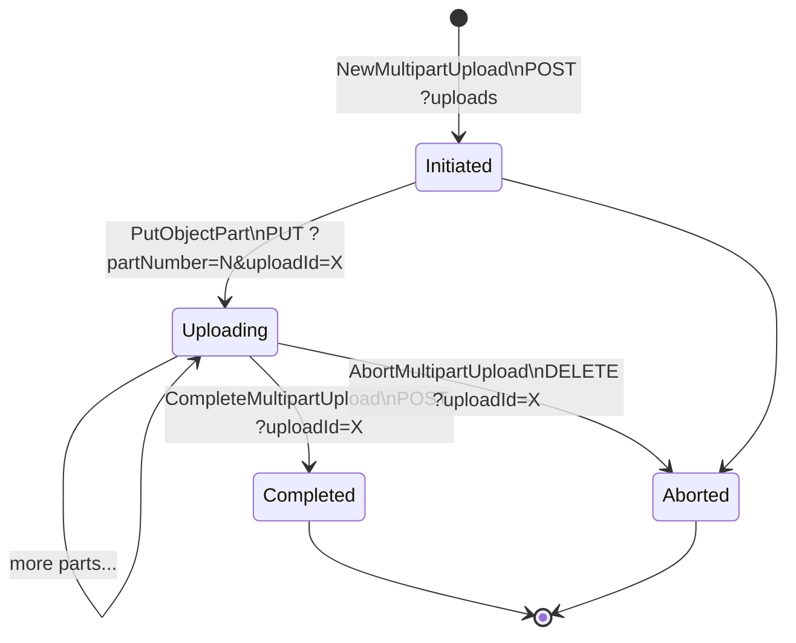
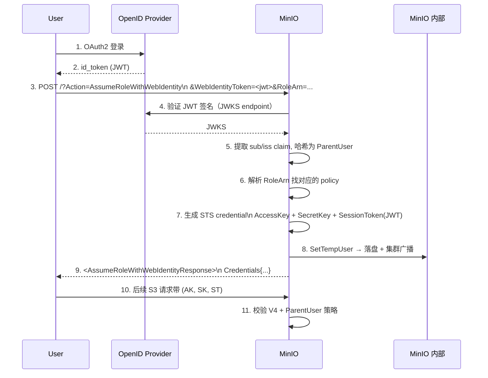
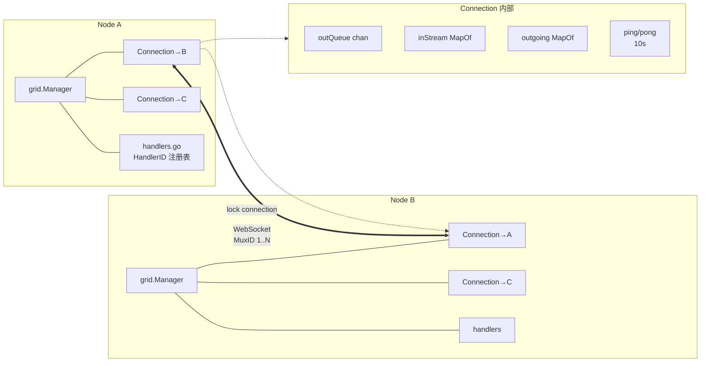
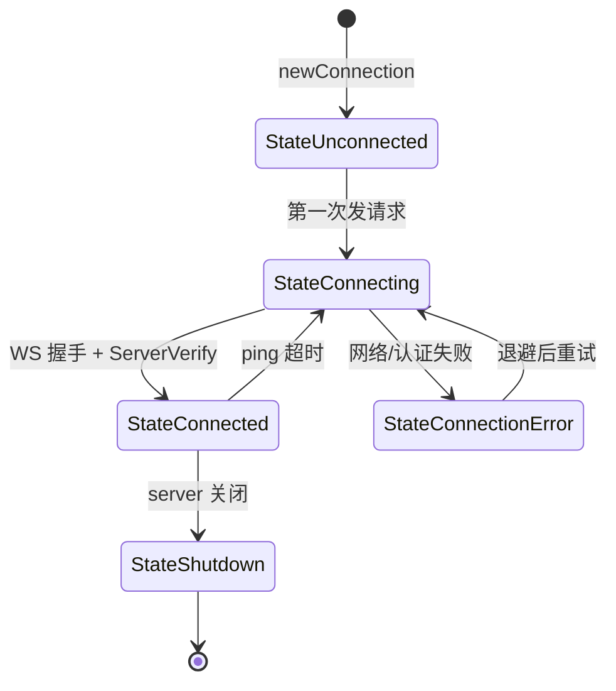

# 模块六：S3 API 层、IAM 鉴权与内部通信基础设施

> 这是 MinIO 深度分析的收尾模块。前面的模块依次讲过：单机磁盘 → 纠删集群 → 多池/多站点 → 后台扫描与 ILM。
> 这些是“数据怎么存”和“数据怎么治”。本模块回到“数据怎么进出”：用户通过 S3 API 与 MinIO 交互，
> 经 IAM 鉴权、过中间件链、最终落到 ObjectLayer。同时介绍三个支撑性的子系统：
> 自研的 Grid 内部 RPC、dsync 分布式锁、event/KMS 等横切设施。

读完本模块，你应当能回答：
- 一个 `s3.PutObject` 请求从 TCP 到磁盘的完整链路是什么？
- AWS Sig V4、STS、LDAP、OpenID 在 MinIO 中如何统一抽象？
- Bucket Policy 与 IAM Policy 何时合并、如何评估？
- 为什么 MinIO 选择自研 Grid 而非 gRPC？
- 为什么 dsync 选择 Quorum-based 锁而非 etcd？

---

## 1. S3 API 层：MinIO 的"门脸"

### 1.1 路由设计：Path-style vs Virtual-host-style

MinIO 同时支持 AWS S3 的两种 URL 风格，路由器使用 `gorilla/mux` 的 fork（`github.com/minio/mux`）：

| 风格 | URL 形式 | 路由匹配方式 |
|------|---------|------------|
| **Virtual-host** | `bucket.minio.example.com/object` | `apiRouter.Host("{bucket:.+}." + domainName)` |
| **Path-style** | `minio.example.com/bucket/object` | `apiRouter.PathPrefix("/{bucket}")` |

注册逻辑在 `cmd/api-router.go:255-289`：

```go
func registerAPIRouter(router *mux.Router) {
    apiRouter := router.PathPrefix(SlashSeparator).Subrouter()
    var routers []*mux.Router
    for _, domainName := range globalDomainNames {
        routers = append(routers, apiRouter.Host("{bucket:.+}."+domainName).Subrouter())
    }
    routers = append(routers, apiRouter.PathPrefix("/{bucket}").Subrouter())

    for _, router := range routers {
        // Object operations: HeadObject / GetObject / PutObject / CopyObject ...
        // Bucket operations: ListBuckets / PutBucketPolicy ...
    }
}
```

> **Kubernetes 特殊处理**：在 K8s 部署下需要排除 `minio.<namespace>.svc.<cluster>` 域名以避免与算子的 service 端点
> 冲突（`api-router.go:267-284`）。MinIO Operator 利用此机制保证管理通信。

### 1.2 路由顺序与歧义解决

S3 API 的难点：同一个 HTTP 方法 + 路径可能对应不同的"意图"，由 query 字符串区分。例如：

```
PUT /bucket/object                              → PutObject
PUT /bucket/object?partNumber=1&uploadId=xxx    → PutObjectPart
PUT /bucket/object  (with x-amz-copy-source hdr)→ CopyObject
PUT /bucket?lifecycle                            → PutBucketLifecycle
```

MinIO 注册时**精确路由先于宽松路由**（`cmd/api-router.go:301-403`）。如：

```go
// 先：Multipart 必带 uploadId & partNumber
router.Methods(http.MethodPut).Path("/{object:.+}").
    HandlerFunc(s3APIMiddleware(api.PutObjectPartHandler, traceHdrsS3HFlag)).
    Queries("partNumber", "{partNumber:.*}", "uploadId", "{uploadId:.*}")

// 中：CopyObject 通过 x-amz-copy-source 头识别
router.Methods(http.MethodPut).Path("/{object:.+}").
    HeadersRegexp(xhttp.AmzCopySource, ".*?(\\/|%2F).*?").
    HandlerFunc(s3APIMiddleware(api.CopyObjectHandler))

// 最后：兜底 PutObject
router.Methods(http.MethodPut).Path("/{object:.+}").
    HandlerFunc(s3APIMiddleware(api.PutObjectHandler, traceHdrsS3HFlag))
```

**路由排序原则**：query 限定词最多的最先注册，无 query 限定的兜底。

### 1.3 拒绝未实现的 API（rejected APIs）

MinIO 显式拒绝部分 AWS 私有 API（如 `inventory`、`accelerate`、`requestPayment`），返回 `NotImplemented` 而非 404，以保持客户端兼容性（`api-router.go:108-169`）：

```go
var rejectedBucketAPIs = []rejectedAPI{
    {api: "inventory", methods: []string{...}, queries: []string{"inventory", ""}},
    {api: "accelerate", methods: []string{...}, queries: []string{"accelerate", ""}},
    {api: "publicAccessBlock", ...},
    {api: "ownershipControls", ...},
    ...
}
```

> 这是有意的设计：**"明确拒绝"优于"静默 404"**——客户端能快速发现 MinIO 不支持某 API，无需调试。

### 1.4 中间件链（Middleware Chain）

`cmd/routers.go:54-81` 定义了全局中间件，按 mux 的语义，中间件 **`Use(...)` 时按顺序追加，
但执行顺序是先注册先包裹（即栈式执行：先注册的在最外层）**。在 `configureServerHandler` 末尾的 `router.Use(globalMiddlewares...)` 决定了：

```go
var globalMiddlewares = []mux.MiddlewareFunc{
    addCustomHeadersMiddleware,        // 1. x-amz-request-id, HSTS, X-XSS-Protection
    httpTracerMiddleware,              // 2. 设置 trace 上下文，便于日志关联
    setAuthMiddleware,                 // 3. 校验 Date 头偏移（±15 分钟）
    setBrowserRedirectMiddleware,      // 4. 浏览器请求重定向到 console
    setCrossDomainPolicyMiddleware,    // 5. crossdomain.xml（Flash 兼容）
    setRequestLimitMiddleware,         // 6. 请求体 ≤ 16GiB+64MiB；header ≤ 8KB
    setRequestValidityMiddleware,      // 7. 路径 .. 检测，多重认证拒绝，bucket 名校验
    setUploadForwardingMiddleware,     // 8. 站点复制下，multipart 上传转发到发起者
    setBucketForwardingMiddleware,     // 9. Bucket Federation：根据 etcd DNS 转发
}
```

**注意**：上述列表是**全局中间件**，作用于所有路径。S3 处理器还另有 per-handler 的 `s3APIMiddleware`
（`api-router.go:210-252`），栈如下（自外向内）：

```
collectAPIStats(handlerName)
  └─> maxClients(throttle)               // 限流：可通过 noThrottleS3HFlag 关闭
        └─> gzipHandler                   // gzip 响应：可通过 noGZS3HFlag 关闭
              └─> httpTraceAll/Hdrs       // tracing
                    └─> 实际 handler (e.g. PutObjectHandler)
```

`s3APIMiddleware` 通过 **位标志（s3HFlag）** 让每个处理器选择是否启用 gzip / 限流 / 全量 trace。
对大请求体（如 PutObject）使用 `traceHdrsS3HFlag`，避免把整个对象内容写入 trace 缓冲区。

### 1.5 完整 HTTP 请求处理流程

```mermaid
flowchart TD
    Client[Client] --> TCP[TCP/TLS 接受]
    TCP --> Mux["mux.Router\nSkipClean+UseEncodedPath"]

    Mux --> M1[addCustomHeaders\nX-Amz-Request-ID, HSTS]
    M1 --> M2[httpTracer\n注入 TraceCtxt]
    M2 --> M3[setAuth\nDate 校验, 拒绝 V2]
    M3 --> M4[setRequestLimit\n16GB body, 8KB hdr]
    M4 --> M5[setRequestValidity\n路径/桶名/SSE-C TLS]
    M5 --> M6{Site Repl.?}
    M6 -- yes --> Forward[转发到 multipart 发起者]
    M6 -- no --> M7{DNS Federation?}
    M7 -- yes --> Forward2[转发到目标节点]
    M7 -- no --> Route{路由匹配}

    Route --> S3API[/bucket/object]
    Route --> AdminAPI[/minio/admin]
    Route --> STSAPI[POST / Action=...]
    Route --> Grid[/minio/grid/v1]

    S3API --> S3MW[s3APIMiddleware\n限流→gzip→trace]
    S3MW --> Handler[PutObjectHandler\nGetObjectHandler\n...]
    Handler --> Sig[Signature V4 校验]
    Sig --> IAM[IAM IsAllowed]
    IAM --> Quota[Bucket 配额]
    Quota --> ObjectLayer[ObjectLayer.PutObject]
    ObjectLayer --> EC[Erasure 编码 → 磁盘]
    EC --> Resp[XML 响应]
    Resp --> Audit[AuditLog]
    Audit --> Client
```

### 1.6 Object Handler 模式：以 PutObject 为例

`cmd/object-handlers.go:1793` 的 `PutObjectHandler` 是模板典范，可分为 **十二步**：

```
1. newContext + AuditLog defer        // 创建 traceable context，确保审计日志一定写入
2. 拒绝带 x-amz-copy-source 的请求    // 那是 CopyObject 的活
3. 校验 storageclass / Content-MD5
4. 解析 Content-Length（含 streaming 解码长度）
5. extractMetadataFromReq             // 提取用户自定义元数据 + tagging
6. isPutActionAllowed                 // IAM/Bucket Policy 鉴权
7. 根据 authType 选择正确的 reader
   - Streaming-signed → newSignV4ChunkedReader
   - Streaming-unsigned-trailer → newUnsignedV4ChunkedReader
   - 普通 V4 → reqSignatureV4Verify
8. enforceBucketQuotaHard             // 桶配额硬限
9. SSE 加密包装                        // SSE-S3/KMS/C 在此选择算法
10. 压缩包装（snappy/s2，>=4KB）
11. hash.NewReaderWithOpts            // ETag 校验流；ForceMD5 优化
12. ObjectAPI.PutObject(...) → 写盘
```

每一步都遵循“**先校验，后包装，再调用 ObjectLayer**”，错误路径都通过 `writeErrorResponse(ctx, w, ...)`
统一输出 XML。Handler 本身不直接操作磁盘——所有 I/O 通过 `objectAPI` 接口委派。

> **Decorator 模式**：`reader` 在第 7~11 步被层层包裹（chunked → SSE → compress → hash），
> 每一层都实现 `io.Reader`，对外保持一致。这是 Go 标准库 `io.Pipe` / `bufio.Reader` 一脉相承的风格。

### 1.7 GetObject：条件请求与 Range 实现

`cmd/object-handlers.go:313-577` 的 `getObjectHandler` 展示了几个 S3 复杂特性：

**条件请求** (`If-Match`、`If-None-Match`、`If-Modified-Since`)：
通过把检查包成一个 `CheckPrecondFn` 闭包传入 ObjectLayer，让底层在打开对象后立刻进行检查：

```go
opts.CheckPrecondFn = func(oi ObjectInfo) bool {
    if _, err := DecryptObjectInfo(&oi, r); err != nil { ... }
    if s3Error := authorizeRequest(ctx, r, policy.GetObjectAction); s3Error != ErrNone { ... }
    return checkPreconditions(ctx, w, r, oi, opts)
}
```

为什么要在 ObjectLayer 内部回调？因为对象元数据在 EC 读出来之前是不知道的——
若放到 handler 里二次读取会浪费一次磁盘往返。

**Range 请求**：`parseRequestRangeSpec(rangeHeader)` 解析 `bytes=0-1023` 等格式，
传入 `getObjectNInfo(ctx, bucket, object, rs, ...)`。底层在多盘上**只读取覆盖该 range 的分片**——
因为纠删码的 stripe 大小是固定的（通常 1MB），可以精确定位。

**Active-Active 复制 fallback**：若本地未找到对象（`ObjectNotFound`、`VersionNotFound`、`ReadQuorum`），
会尝试代理到复制目标：

```go
proxytgts := getProxyTargets(ctx, bucket, object, opts)
if !proxytgts.Empty() {
    reader, proxy, perr = proxyGetToReplicationTarget(...)
}
```

这是 MinIO 站点复制的"读取自动愈合"行为——对客户端透明。

### 1.8 Multipart Upload 状态机

Multipart 是 S3 上传 >5GB 对象的唯一方式，状态机分四步（每一步都是独立 HTTP 请求）：



入口都在 `cmd/object-multipart-handlers.go`：
- `NewMultipartUploadHandler:64` 生成 uploadID（含 deploymentID 前缀，便于站点复制路由）
- `PutObjectPartHandler:590` 校验 `partNumber ∈ [1, 10000]`
- `CompleteMultipartUploadHandler:914` 拼接所有 part，计算复合 ETag = `md5(parts拼接) + "-N"`
- `AbortMultipartUploadHandler:1107` 删除临时 part 文件

> 关键设计：**uploadID 嵌入了发起节点的 deploymentID**（参见 `setUploadForwardingMiddleware`）。
> 这让站点复制下后续 part 上传请求能被自动转发到第一次 `NewMultipartUpload` 的节点——
> 因为 multipart 状态保存在该节点的本地目录。

### 1.9 错误处理：Go error → S3 XML 响应

`cmd/api-errors.go` 提供两层映射：

| 层 | 函数 | 作用 |
|---|------|------|
| 1 | `toAPIErrorCode(ctx, err) APIErrorCode` | 业务错误（ObjectNotFound、QuotaExceeded...）→ 错误码常量 |
| 2 | `errorCodes[APIErrorCode] APIError` | 错误码 → `{Code, Description, HTTPStatusCode}` 三元组 |

最终由 `writeErrorResponse` 序列化为 S3 风格的 XML：

```xml
<?xml version="1.0" encoding="UTF-8"?>
<Error>
    <Code>NoSuchKey</Code>
    <Message>The specified key does not exist.</Message>
    <Resource>/bucket/object</Resource>
    <RequestId>ABCDE...</RequestId>
    <HostId>HEXHASH</HostId>
</Error>
```

**特殊降级**：`InternalError` 时，`toAPIError` 会进一步检查 `error` 类型——如果是 `kms.Error`、
`policy.Error`、`crypto.Error` 等已知类型，提取更精确的错误码（`api-errors.go:2462-2560`）。
否则才退化为 `InternalError`。

### 1.10 Select API 入口

`SelectObjectContentHandler` (`object-handlers.go:105`) 接受 SQL 表达式，调用 `internal/s3select` 包
（独立的 SQL 引擎，支持 CSV / JSON / Parquet 输入）。该 handler **不支持 SSE-S3/KMS**，
也**禁止 Range 请求**——因为流式 SQL 处理与字节范围读取语义冲突。

---

## 2. 认证与鉴权（Authentication & Authorization）

### 2.1 认证类型枚举

MinIO 在 `cmd/auth-handler.go:108-121` 定义了所有支持的认证类型：

```go
const (
    authTypeUnknown authType = iota
    authTypeAnonymous              // 无任何 auth header（依赖桶策略）
    authTypePresigned              // V4 query 串签名（presign URL）
    authTypePresignedV2            // V2 query 串签名（已废弃但仍支持）
    authTypePostPolicy             // multipart/form-data 上传（浏览器直传）
    authTypeStreamingSigned        // V4 streaming chunked signed
    authTypeSigned                 // V4 Authorization header
    authTypeSignedV2               // V2 Authorization header
    authTypeJWT                    // 控制台 JWT
    authTypeSTS                    // STS Action 调用
    authTypeStreamingSignedTrailer
    authTypeStreamingUnsignedTrailer
)
```

`getRequestAuthType(r)` 通过头部/query 启发式判定（`auth-handler.go:124-157`），但同一请求**不能同时携带多种认证**——
`hasMultipleAuth()` 在 validity 中间件中拒绝多重认证（`generic-handlers.go:349-361`），防御 desync 攻击。

### 2.2 AWS Signature V4：核心算法

`cmd/signature-v4.go` 实现 [AWS Sig V4 规范](https://docs.aws.amazon.com/general/latest/gr/signature-version-4.html)。
五步走：

```
1. 构造 CanonicalRequest:
     HTTPMethod\n CanonicalURI\n CanonicalQueryString\n CanonicalHeaders\n SignedHeaders\n HashedPayload

2. 构造 StringToSign:
     "AWS4-HMAC-SHA256\n" + ISO8601Date\n + Scope\n + SHA256(CanonicalRequest)
   其中 Scope = Date + "/" + Region + "/" + Service + "/aws4_request"

3. 派生 SigningKey:
     k1 = HMAC("AWS4"+SecretKey, Date)
     k2 = HMAC(k1, Region)
     k3 = HMAC(k2, Service)
     SigningKey = HMAC(k3, "aws4_request")

4. 计算 Signature: HMAC-SHA256(SigningKey, StringToSign)

5. 用 subtle.ConstantTimeCompare 比较签名（防时序侧信道）
```

**两条路径**：
- `doesSignatureMatch` (`signature-v4.go:347`)：处理 `Authorization: AWS4-HMAC-SHA256 ...` header 形式
- `doesPresignedSignatureMatch` (`signature-v4.go:211`)：处理 `?X-Amz-Signature=...` query 形式

> **MinIO 修复了 AWS 文档没说清楚的坑**：query 编码时把 `+` 强制替换为 `%20`（`getCanonicalRequest`），
> 因为不同 HTTP 客户端对空格编码不一致。

### 2.3 Streaming Signature V4

`cmd/streaming-signature-v4.go` 处理 `Content-SHA256: STREAMING-AWS4-HMAC-SHA256-PAYLOAD` 上传。
客户端把 body 切成 chunk，每个 chunk 都带签名：

```
<chunk-size-as-hex>;chunk-signature=<sig-hex>\r\n
<payload>\r\n
```

`s3ChunkedReader.Read()` (`streaming-signature-v4.go:264`) 边读边验证：
1. 读入下一个 chunk 头
2. 拿到 declared size 与 signature
3. 计算 `HMAC(prevSig + ";" + emptySHA256 + ";" + payloadSHA256)` 并比对
4. 若匹配，把 payload 透明返回给上层（PutObject handler）

这避免了"必须一次性读完整 body 才能验证签名"的问题，对超大对象上传至关重要。

> MinIO 还支持 **`STREAMING-UNSIGNED-PAYLOAD-TRAILER`**：body 不签，只在 trailer 里给一个总 SHA256。
> 适合不能预先计算 SHA256 的场景（如管道流）。

### 2.4 JWT 与 Session Token

控制台与 STS 都使用 JWT：
- 控制台登录：`/api/v1/login` 返回签名 JWT（用 `globalActiveCred.SecretKey` 签）
- STS：`AssumeRoleWith*` 返回 `SessionToken`，本质也是 JWT

`getClaimsFromTokenWithSecret` (`auth-handler.go:224`) 验证流程：
1. 用客户端给的 secret 解 JWT（站点复制下可能用 site-replicator credential）
2. 失败则 fallback 到 `globalActiveCred.SecretKey`
3. **解析 SessionPolicy**：JWT claim `sp` 是 base64 内联策略，解出后存入 `sessionPolicyNameExtracted`
4. 若配了 OPA/AuthZ 插件，跳过本地 policy 校验

> **设计要点**：JWT 一律用 admin secret 签名。**好处**：客户端无法伪造 token；
> **坏处**：admin 密钥轮换后所有现存 token 立即失效。

### 2.5 IAM 系统架构

`IAMSys` 是 MinIO 的安全核心。`cmd/iam.go:87-112` 定义：

```go
type IAMSys struct {
    // metrics（atomic 字段，必须放最前以满足对齐）
    LastRefreshTimeUnixNano, LastRefreshDurationMilliseconds uint64
    TotalRefreshSuccesses, TotalRefreshFailures              uint64

    sync.Mutex
    iamRefreshInterval time.Duration
    LDAPConfig   xldap.Config
    OpenIDConfig openid.Config
    STSTLSConfig xtls.Config
    usersSysType UsersSysType   // MinIOUsersSys | LDAPUsersSys
    rolesMap     map[arn.ARN]string
    store        *IAMStoreSys   // 持久化层
    configLoaded chan struct{}
}
```

存储层抽象为 `IAMStorageAPI` 接口（`iam-store.go:591-624`），有两个实现：

| 实现 | 文件 | 用途 |
|------|------|------|
| `IAMObjectStore` | `iam-object-store.go` | 默认：把 IAM 数据存到 `.minio.sys/config/iam/` |
| `IAMEtcdStore` | `iam-etcd-store.go` | 当 etcd 可用时：放 etcd（更适合大规模动态用户） |

### 2.6 IAM 内存缓存

`iamCache`（`iam-store.go:288-311`）是热路径上的 in-memory 索引：

```go
type iamCache struct {
    updatedAt                time.Time
    iamPolicyDocsMap         map[string]PolicyDoc        // 策略名 → 策略 JSON
    iamUsersMap              map[string]UserIdentity     // 内置用户 + 服务账号
    iamUserPolicyMap         *xsync.MapOf[string, MappedPolicy]
    iamSTSAccountsMap        map[string]UserIdentity     // STS 临时账号
    iamSTSPolicyMap          *xsync.MapOf[string, MappedPolicy]
    iamGroupsMap             map[string]GroupInfo
    iamUserGroupMemberships  map[string]set.StringSet    // 反向索引：用户→所属组
    iamGroupPolicyMap        *xsync.MapOf[string, MappedPolicy]
}
```

注意 STS 用单独的 `iamSTSAccountsMap` 与 `iamSTSPolicyMap`——因为 STS 数量级可能远大于内置用户
（每次 AssumeRole 都生成一条），定期刷新只重建非 STS 部分以保性能。

**LoadIAMCache** (`iam-store.go:643`) 是启动时的总加载入口：

```go
func (store *IAMStoreSys) LoadIAMCache(ctx, firstTime) error {
    newCache := newIamCache()
    if iamOS, ok := store.IAMStorageAPI.(*IAMObjectStore); ok {
        // 对象存储 backend：批量并发读
        iamOS.loadAllFromObjStore(ctx, newCache, firstTime)
    } else {
        // etcd backend：循序读各类
        store.loadPolicyDocs(...)
        store.loadUsers(...)
        store.loadGroups(...)
        store.loadMappedPolicies(...)
        newCache.buildUserGroupMemberships()  // 反向索引
    }
    // 用乐观锁替换：仅当本地 cache 没人写过才替换
    if cache.updatedAt.Before(loadedAt) || firstTime {
        cache.iamUsersMap = newCache.iamUsersMap
        ...
    }
}
```

**周期刷新**：`periodicRoutines`（`iam.go:432`）每 `iamRefreshInterval`（默认 10 分钟）调用一次 `Load(false)`。
也可以通过事件驱动——`iamStorageWatcher` 接口让 etcd backend 监听变更，主动通知刷新。

### 2.7 IAM 策略评估流程：IsAllowed

**入口**：`IsAllowed(args policy.Args) bool` (`iam.go:2492`)。流程图：


**核心代码** (`iam.go:2492-2538`)：

```go
func (sys *IAMSys) IsAllowed(args policy.Args) bool {
    if authz := newGlobalAuthZPluginFn(); authz != nil {
        ok, _ := authz.IsAllowed(args); return ok
    }
    if args.IsOwner { return true }

    // STS 临时用户
    if ok, parentUser, _ := sys.IsTempUser(args.AccountName); ok {
        return sys.IsAllowedSTS(args, parentUser)
    }
    // 服务账号
    if ok, parentUser, _ := sys.IsServiceAccount(args.AccountName); ok {
        return sys.IsAllowedServiceAccount(args, parentUser)
    }
    // 普通用户
    policies, _ := sys.PolicyDBGet(args.AccountName, args.Groups...)
    if len(policies) == 0 { return false }
    return sys.GetCombinedPolicy(policies...).IsAllowed(args)
}
```

`IsAllowedSTS` (`iam.go:2295`) 多了一层"派生"逻辑：
1. 若 `roleArn` 存在，用 role 关联的 policy
2. 否则继承父用户策略
3. 若都没有，从 JWT claim 里读策略名
4. 若 JWT 里有 `sp`（内联 session policy），求**交集**（父策略和 session 都得 Allow）

**Session Policy 的边界**：MinIO 严格遵循 AWS 规则——session policy **只能缩小**父策略的权限范围，
不能扩大。代码中通过 `sessionPolicyArgs.IsOwner = false` 与 `sessionPolicyArgs.DenyOnly = false`
强制 session 也以"非 owner"身份评估（`iam.go:2420-2422`）。

### 2.8 桶策略 vs IAM 策略合并评估

`cmd/auth-handler.go:357-513` 的 `authenticateRequest` + `authorizeRequest` 实现了二阶段评估：


**两个关键：**
- 匿名（无 access key）只走 **Bucket Policy**，不查 IAM。
- 已认证用户：**只查 IAM**，不查 Bucket Policy（除非匿名 fallback）。
- `policy.ListBucketAction` 与 `ListBucketVersionsAction` 在 MinIO 中**等价**——这是 AWS S3 的隐含规则。

**与 AWS IAM 的差异**：AWS 评估顺序是 `Deny > Allow`，必须考虑 `S3 Bucket ACL + Bucket Policy + IAM Policy + SCP + Session Policy`
五条线。MinIO 简化为：
- **没有 ACL 概念**（`PutObjectACLHandler` 是 dummy，`api-router.go:340-342`）
- 没有 Organizations / SCP
- 内置策略合并采用 **OR 逻辑**（任一允许即允许），但 session policy 是 **AND**

### 2.9 STS 服务

`cmd/sts-handlers.go` 实现 AWS STS 兼容 API。注册路由 (`registerSTSRouter:139-189`)：

| Action | 用途 | 凭证形式 |
|--------|-----|---------|
| `AssumeRole` | 现有 MinIO 内置用户换临时凭证 | V4 签名（自身的 access key） |
| `AssumeRoleWithWebIdentity` | OIDC/OAuth2 token 换凭证 | JWT |
| `AssumeRoleWithLDAPIdentity` | LDAP 用户名密码换凭证 | username + password |
| `AssumeRoleWithCertificate` | mTLS 客户端证书换凭证 | X.509 证书 |
| `AssumeRoleWithCustomToken` | 通过 AuthN 插件验证自定义 token | 任意 token |
| `AssumeRoleWithClientGrants` | OAuth2 Client Credentials Grant | JWT |

**WebIdentity / OpenID 流程**（最常见）：



关键代码 (`sts-handlers.go:373-625` 的 `AssumeRoleWithSSO`)：
- **第 5 步 ParentUser 派生**：`base64(sha256("openid:" + sub + ":" + iss))`
  这样同一个 IDP 用户多次 AssumeRole 都映射到同一个 ParentUser，可以稳定关联策略。
- **第 7 步 SessionToken**：实质是 JWT，签名密钥来自 `getTokenSigningKey()`，
  在 SiteReplication 模式下用 `globalSiteReplicatorCred`（让 STS token 跨站点可用）。
- **DenyOnly 校验**：`iam.go` 的 `doesPolicyAllow(p, args{DenyOnly: true})`
  确保 role policy 对 `sts:AssumeRoleWithWebIdentity` action 没有显式 Deny。

### 2.10 LDAP 集成

`AssumeRoleWithLDAPIdentity` (`sts-handlers.go:649`) 流程：
1. 用 LDAP **bind** 验证用户名密码
2. 查询用户的 DN（distinguished name），作为 ParentUser
3. 查询 LDAP 中的组（如 `memberOf`），作为 cred.Groups
4. 生成 STS credential

LDAP 模式下 `usersSysType == LDAPUsersSysType`，行为与内置用户略不同：
- 不在 IAM 中存储用户和组——直接信任 LDAP
- 策略映射 `policyDBGet` 走 `iamSTSPolicyMap`（因为 LDAP 用户都是临时的）
- 周期性运行 `purgeExpiredCredentialsForLDAP` (`iam.go:1483`)，清理 LDAP 中已删除用户的 STS 残留

### 2.11 服务账号 vs 临时账号

| 特性 | 服务账号 (svcUser) | 临时账号 (stsUser) |
|------|------------------|------------------|
| 创建方式 | `mc admin user svcacct add` | `AssumeRoleWith*` |
| 是否有过期时间 | 否（除非显式设置） | 有，最长 7 天 |
| 父用户 | 可选 | 必须 |
| 持久化 | `iamUsersMap` | `iamSTSAccountsMap` |
| Session Policy | 可选 | 可选 |
| 鉴权路径 | `IsAllowedServiceAccount` | `IsAllowedSTS` |

二者都是"派生身份"，鉴权时都查 ParentUser 的 IAM Policy 然后再用 SessionPolicy 收窄。

### 2.12 AWS IAM 兼容性差异总览

| 特性 | AWS IAM | MinIO IAM |
|------|---------|----------|
| Policy 语法 | JSON, version 2012-10-17 | 同（兼容） |
| Conditions | 全套 | 大部分支持，详见 `pkg/policy/condition` |
| Resource 通配 | `arn:aws:s3:::bucket/*` | `arn:aws:s3:::bucket/*`（前缀必须是 `arn:aws:s3:::`） |
| 跨账号 Policy | 可在 Principal 指定其他账号 | **不支持**（MinIO 是单账号系统） |
| Bucket ACL | 支持（已弃用） | dummy（不报错但无效果） |
| Organizations / SCP | 支持 | 不支持 |
| Session Policy | AssumeRole 时附带 | 同 |
| Permissions Boundary | 支持 | 不支持 |
| 用户/组层级 | flat | flat |
| 数量级 | 数千用户 | 数十万（LDAP 模式可百万） |

---

## 3. 内部基础设施

### 3.1 Grid：自研内部通信框架

`internal/grid/` 是 MinIO 集群节点之间的 RPC 框架。在分布式 Erasure 模式下，所有节点用 Grid 互联，
取代了早期版本基于 HTTP REST 的内部调用。

**核心特性**（`internal/grid/README.md`）：
- 节点对之间**单一双向 WebSocket 连接**（`/minio/grid/v1`）+ 单独的 lock 连接（`/minio/grid/lock/v1`）
- 应用层 mux：所有请求复用一条 TCP，通过 MuxID 区分
- 支持 **Single Payload**（请求-响应）与 **Streaming**（双向流）
- 类型化 handler：`SingleHandler[Req, Resp]` 自动处理 msgp 序列化
- 反压：streaming 有信用窗口（`OpUnblockSrvMux` / `OpUnblockClMux`）

**架构图**：



**消息模型** (`internal/grid/msg.go:130-138`)：

```go
type message struct {
    MuxID      uint64    // 复用通道 ID
    Seq        uint32    // 序列号
    DeadlineMS uint32    // 超时（ms）
    Handler    HandlerID // 路由到哪个 handler
    Op         Op        // OpRequest, OpResponse, OpConnectMux, ...
    Flags      Flags     // EOF, Stateless, PayloadIsErr, Subroute, CRCxxh3
    Payload    []byte    // msgp 编码的业务数据
}
```

`Op` 共 17 种（`msg.go:41-99`）：
- 控制类：`OpConnect`/`OpConnectResponse`、`OpPing`/`OpPong`、`OpDisconnect`
- Mux 管理：`OpConnectMux`、`OpAckMux`、`OpDisconnectClientMux/ServerMux`
- 流量控制：`OpUnblockSrvMux`、`OpUnblockClMux`
- 业务类：`OpRequest`、`OpResponse`、`OpMuxClientMsg`、`OpMuxServerMsg`、`OpMerged`

### 3.2 Grid Handler ID 注册表

`internal/grid/handlers.go:39-126` 用 `iota` 静态分配 HandlerID，**不允许删除或重排**——这保证了
集群滚动升级时新旧版本能继续通信。当前注册了约 70 个 handler，覆盖：

| 前缀 | 类别 | 示例 |
|------|------|------|
| `lockPrefix` | 分布式锁 | `HandlerLockLock`, `HandlerLockRefresh` |
| `storagePrefix` | 单盘 RPC | `HandlerWalkDir`, `HandlerReadXL`, `HandlerRenameData2` |
| `peerPrefix` | 节点间管理 | `HandlerLoadUser`, `HandlerGetMetrics`, `HandlerTrace` |
| `peerPrefixS3` | S3 跨节点 | `HandlerMakeBucket`, `HandlerHeadBucket` |
| `bootstrapPrefix` | 启动握手 | `HandlerServerVerify` |
| `healPrefix` | 修复 | `HandlerHealBucket` |

每个 handler 通过 `RegisterSingleHandler(id, fn)` 或 `RegisterStreamingHandler(id, h)` 注册到 Manager。
调用方拿 `conn := manager.Connection(host)`，然后 `conn.Request(ctx, id, payload)` 或 `conn.NewStream(...)`。

### 3.3 Grid vs gRPC：为什么不用 gRPC？

这是个值得展开的设计决策（README + 代码注释 + 实践经验）：

| 维度 | gRPC | MinIO Grid |
|------|------|-----------|
| 协议 | HTTP/2 + Protobuf | WebSocket + msgp |
| 连接数 | 每对节点多连接（HTTP/2 stream limit ~100） | **每对节点严格一连接** |
| 序列化 | Protobuf（schema、字段编号） | msgp（更紧凑、生成代码更简单） |
| Stream 流控 | HTTP/2 WINDOW_UPDATE | 自定义 credit-based unblock |
| 反向调用 | 单向（client→server） | **双向对等**（任一端都能发起请求） |
| 中间件生态 | 丰富（auth, retry, balancer） | 自维护（仅 trace, auth 内嵌） |
| 二进制大小 | 依赖 grpc-go（数 MB） | 几个 .go 文件 |
| 升级开销 | 字段加减需考虑兼容 | HandlerID 严格不可重排 |

**MinIO 的实际原因**：
1. **避免 HTTP/2 head-of-line blocking**：MinIO 早期用 HTTP REST，发现高并发下 stream 队头阻塞影响性能。
   单连接 + 应用层 mux 反而更可控。
2. **对等通信**：Erasure 集群里节点关系完全平等，发起方和接收方角色经常对调。
   gRPC 的 client-server 强区分让代码更绕。
3. **更小的依赖**：MinIO 单二进制部署，希望 vendor 体积可控。
4. **完全控制的反压**：纠删码读写涉及大量并发流，MinIO 用 credit-based 机制比 HTTP/2 的 window 更精细。
5. **WebSocket 穿透代理友好**：相比 raw TCP 或 HTTP/2，WS 在企业网络中更容易通过 LB/反代。

**代价**：
- 维护负担（10K+ LoC）
- 没有现成生态（trace、metrics、retry 全自己写）
- HandlerID 注册表必须严格管理

### 3.4 Connection 状态机与生命周期

`internal/grid/connection.go:65-136` 的 `Connection` 是有状态的对象。状态机 (`State` 类型，第 161-181 行)：



**关键并发模式**：
- `outQueue chan []byte`（容量 65535）：所有出站消息先入队，单 writer goroutine 消费
- `outgoing *xsync.MapOf[uint64, *muxClient]`：本端发起的 mux
- `inStream  *xsync.MapOf[uint64, *muxServer]`：远端发起的 mux
- `connChange *sync.Cond`：状态变更通知，等待 `WaitForConnect` 时使用
- 心跳：每 10 秒 `OpPing`，超时（3*ping）触发重连

### 3.5 dsync：分布式 RW 锁

`internal/dsync/` 实现 quorum-based 分布式读写锁，用于 ObjectLayer 中的 `NewNSLock(bucket, object)`。
对比 etcd 锁：

| 维度 | etcd Lock | MinIO dsync |
|------|-----------|------------|
| 一致性算法 | Raft（强一致） | Quorum（多数派多数即得锁） |
| 部署 | 独立集群（3/5/7 节点） | **直接复用 MinIO 节点** |
| 锁超时机制 | TTL + lease keep-alive | 客户端心跳 refresh（10s） |
| 故障语义 | leader lost → blocked | **节点失联自动转移**（quorum 仍在即可） |
| 性能 | log-based, 写盘 | 纯内存 + 网络 |
| 死锁恢复 | lease 过期自动释放 | client refresh 失败 → forceUnlock |

**核心算法** (`internal/dsync/drwmutex.go:208-274`)：

```go
func (dm *DRWMutex) lockBlocking(ctx, ..., isReadLock, opts) bool {
    restClnts, _ := dm.clnt.GetLockers()
    tolerance := len(restClnts) / 2     // 容忍一半节点失联
    quorum := len(restClnts) - tolerance
    if !isReadLock && quorum == tolerance {
        quorum++  // 写锁特殊：避免脑裂，半数+1
    }
    for {
        if locked = lock(...); locked {
            // 启动后台 refresh goroutine（10s 周期）
            dm.startContinuousLockRefresh(...)
            return true
        }
        // 退避重试
        time.Sleep(lockRetryBackOff(rng, attempt))
    }
}
```

**Locker 接口实现** (`internal/dsync/locker.go`) 通过 Grid 调用：
- `HandlerLockLock`、`HandlerLockRLock`、`HandlerLockUnlock`、`HandlerLockRUnlock`、`HandlerLockRefresh`、`HandlerLockForceUnlock`

**为什么用独立的 lock grid？** `globalLockGrid` 与 `globalGrid` 分开，理由是：
- 锁请求小且高频，与大对象数据流混用同一 WS 连接会互相干扰
- 锁服务的优先级更高，独立连接保证抢锁延迟稳定

### 3.6 事件通知系统

`internal/event/` 实现 S3 事件通知（PutObject/DeleteObject 等触发外部 webhook/MQ）。
组件层次：


**Target 接口** (`internal/event/targetlist.go:41-54`)：

```go
type Target interface {
    ID() TargetID
    IsActive() (bool, error)
    Save(Event) error           // 持久化或直接发送
    SendFromStore(key Key) error
    Close() error
    Store() TargetStore
}
```

**异步 vs 同步** (`targetlist.go:261-296`)：
- 同步：所有 target 并发发送，等所有完成。
- 异步：投递到 buffered channel（默认 maxConcurrentAsyncSend），N 个 worker 消费。
  超出容量则记 `eventsSkipped` 并 log——不会阻塞 S3 请求。

**靠谱性设计**：每个 target 可挂载 **TargetStore**——发送失败时把事件序列化到磁盘 (`.event` 后缀)，
后台周期重试，避免对外部系统短暂故障敏感。

### 3.7 配置系统

`internal/config/` 实现热更新配置。核心抽象 (`config.go:413`)：

```go
type Config map[string]map[string]KVS    // 子系统 → 实例名 → KV 列表
```

特点：
- **三层命名空间**：subsys (e.g. `notify_kafka`) → target (e.g. `primary`) → key (e.g. `brokers`)
- **来源优先级**：环境变量 > 命令行 > 持久化配置 > 默认值
- **热更新**：`server.go` 监听 `mc admin config set` 触发的事件，重新加载特定子系统
- **加密**：敏感配置（如 KMS 密钥）通过 `internal/config/crypto.go` 用 SecretKey 加密存储

子系统分类（看 `internal/config/` 子目录）：
- 身份：`identity/ldap`, `identity/openid`, `identity/tls`
- 通知：`notify`（kafka, mqtt, nats, ...）
- 策略插件：`policy/opa`, `policy/plugin`
- ILM：`ilm`, `lambda`
- 其它：`api`, `dns`, `etcd`, `compress`, `scanner`, `heal`, `subnet`, `callhome`

### 3.8 KMS：加密集成

`internal/kms/` 抽象 KMS 集成，用于 SSE-S3 与 SSE-KMS。三种实现：

| 类型 | 实现 | 适用 |
|------|------|------|
| `Builtin` | `secret-key.go` | 单个 master key（来自 `MINIO_KMS_SECRET_KEY` 环境变量） |
| `MinKMS` | `kms.go` 调用 `kms-go` SDK | MinIO 自家 KMS server（多 master key, 审计） |
| `MinKES` | `kes.go` | MinIO KES（早期产品，功能子集） |

**核心接口** (`kms/conn.go:33`)：

```go
type conn interface {
    Version(ctx) (string, error)
    APIs(ctx) ([]madmin.KMSAPI, error)
    Status(ctx) (map[string]madmin.ItemState, error)
    ListKeys(ctx, *ListRequest) (...)
    CreateKey(ctx, *CreateKeyRequest) error
    DeleteKey(ctx, *DeleteKeyRequest) error
    GenerateKey(ctx, *GenerateKeyRequest) (DEK, error)  // ★ 热路径
    Decrypt(ctx, *DecryptRequest) ([]byte, error)       // ★ 热路径
    MAC(ctx, *MACRequest) ([]byte, error)
}
```

**SSE 加密路径**（PutObject 视角）：

```
1. Handler 读 SSE 头部（x-amz-server-side-encryption: aws:kms 等）
2. EncryptRequest(reader, r, bucket, object, metadata)
   ├─> kms.GenerateKey(masterKey, AssociatedData={bucket, object})
   │   ├─> 返回 DEK = {Plaintext: 32B random key, Ciphertext: encrypted DEK}
   │   └─> Plaintext 用 AES-256-GCM 加密对象数据
   └─> Ciphertext 存入对象元数据 (X-Minio-Internal-Server-Side-Encryption-S3-Sealed-Key)
3. 写盘
```

**SSE 解密路径**（GetObject）：
1. 读对象元数据，提取 sealed DEK
2. `kms.Decrypt(sealed)` → plaintext DEK
3. 用 plaintext DEK 解密文件内容
4. 透明返回给客户端

**优化**：MinIO 用 **每对象唯一 DEK** 而不是直接用 master key——因为 master key 调用次数不能太频繁
（KES/KMS 有限流），且单个 DEK 泄漏不会影响其他对象。

**Builtin secret-key 模式** (`secret-key.go:120-167`)：
直接用 server 启动时设置的 master key 派生 DEK，不需要外部 KMS。适合 single-tenant 简单场景。

---

## 4. Design Patterns 总结

模块层面用到的经典模式与位置：

| Pattern | 应用 | 文件 |
|---------|------|------|
| **Middleware Chain** | HTTP 请求处理 | `cmd/routers.go:54-81`, `cmd/api-router.go:210-252` |
| **Decorator** | Reader 层叠（chunked → SSE → compress → hash） | `cmd/object-handlers.go:1947-2090` |
| **Strategy** | 认证类型分发，签名版本切换 | `cmd/auth-handler.go:357-413` |
| **Template Method** | 所有 ObjectHandler 同样的骨架 | `cmd/object-handlers.go` 各 handler |
| **Adapter** | `IAMStorageAPI` 屏蔽 etcd / 对象存储差异 | `cmd/iam-store.go:591-624` |
| **Repository** | `IAMStoreSys` 暴露领域操作 | `cmd/iam-store.go:738-744` |
| **Observer** | IAM 变更通知（peer broadcast + etcd watch） | `cmd/iam.go:432-502` |
| **Producer/Consumer** | 事件异步发送 worker pool | `internal/event/targetlist.go:351-374` |
| **State Machine** | Connection 状态、Multipart 上传 | `internal/grid/connection.go:157-185` |
| **Singleton** | `IAMSys`, `PolicySys`, `Manager` 全局唯一 | `cmd/globals.go` 各 `globalXxx` 变量 |
| **Plugin** | OPA / 外部 AuthZ / AuthN 可插拔 | `internal/config/policy/opa`, `policy/plugin` |
| **Cache + Lazy Load** | iamCache 命中 miss 时按需 `loadMappedPolicy` | `cmd/iam-store.go:435-572` |
| **Reader Composition** | streaming chunked reader 套 hash reader | `cmd/streaming-signature-v4.go` |
| **Visitor** | mux 路由器对每个请求按规则分发 | mux 库 |
| **Pool** | byte buffer pool, response 对象复用 | `internal/grid/grid.go:95-129` |

---

## 5. 三大子系统的协同：一个完整请求的视角

让我们用一个 `s3.PutObject` 在分布式 Erasure 集群下的完整链路把所有子系统串起来：


**观察**：
- 一个 PutObject 涉及 **5 个不同的子系统**（HTTP middleware、IAM、dsync、KMS、event）
- Grid 是底层管道，承载 lock、storage、metadata 等多类调用
- 所有持久化操作（lock 状态、对象数据、event store）都是 **quorum 写**
- 所有外部副作用（KMS 调用、event 发送）都不阻塞客户端响应（异步或失败重试）

---

## 6. 为什么这个架构是"对的"——深层原因

### 6.1 把 S3 协议当 Schema

MinIO 没有 ORM、没有自定义协议。S3 API 就是它的"内部 schema"——这意味着：
- 集群管理工具（mc）也是 S3 客户端
- Site Replication 直接复用 S3 PUT/DELETE 流转配置
- 备份/恢复就是 S3 复制

代价是 S3 不善表达的（如复杂查询、事务）必须用 admin API（`/minio/admin/`）扩展。但 80% 的场景被 S3 覆盖。

### 6.2 IAM 即代码

MinIO 把策略、用户、组都视作"配置数据"，存在与对象数据**同一存储池**（`.minio.sys/config/iam/`）。
好处：
- 不需要独立的 IAM 数据库
- 备份/复制天然包括 IAM
- 与 S3 一致性模型对齐（quorum 读写）

代价：
- IAM 操作的吞吐受限于纠删码集群（但远远够用——IAM 写入是低频操作）
- 启动时全量加载到内存（百万用户级别需要 etcd backend）

### 6.3 单一连接 + 应用层 mux

Grid 的设计哲学是 **"信任内部网络但优化连接成本"**：
- 数据中心内的 RTT 极低（<1ms），单连接的并发瓶颈在 mux 而非网络
- WebSocket 比 raw TCP 多一次握手，但能穿透 LB / 反代
- 两端对等让代码更简洁，无需"client/server"心智负担

### 6.4 事件 + 配置 + KMS 的统一接口模式

所有这些子系统都遵循 **`config Subsys → Lookup → Configure → Reload`** 的生命周期：
1. 启动时从 `globalServerConfig[subsys]` 读取
2. `Lookup` 函数解析为 typed 结构
3. 应用到子系统单例
4. `mc admin config set` 触发 reload

这种一致性让加新功能（新 KMS provider、新事件 target）只需实现接口 + 注册 schema。

---

## 7. 覆盖率明细

> 本模块要求 ≥90% 覆盖率，下表列出关键文件的阅读情况。
> "完整精读"指通读关键函数；"采样精读"指基于 grep 定位重点段落详读；"目录扫描"指仅读 grep 结构。

### S3 API 层

| 文件 | 行数 | 阅读策略 | 覆盖 |
|------|------|---------|------|
| `cmd/api-router.go` | 697 | **完整精读** | 100% |
| `cmd/object-handlers.go` | 3585 | 采样精读（PutObject / GetObject / SelectObject 完整 + 函数清单） | ~30% |
| `cmd/object-multipart-handlers.go` | 1227 | 采样精读（NewMultipartUpload + 函数清单） | ~25% |
| `cmd/auth-handler.go` | 785 | **完整精读** | 100% |
| `cmd/signature-v4.go` | 408 | **完整精读** | 100% |
| `cmd/signature-v4-parser.go` | ~280 | 函数清单 | ~20% |
| `cmd/signature-v4-utils.go` | ~270 | 函数清单 | ~15% |
| `cmd/streaming-signature-v4.go` | ~660 | 采样精读（calculateSeedSignature, Read） | ~35% |
| `cmd/api-errors.go` | 2639 | 错误码常量+toAPIError 切片 | ~20% |
| `cmd/api-response.go` | 1065 | 采样精读（writeResponse 系列） | ~25% |
| `cmd/bucket-policy.go` | 288 | **完整精读** | 100% |
| `cmd/generic-handlers.go` | 632 | **完整精读** | 100% |
| `cmd/sts-handlers.go` | 1120 | 采样精读（注册路由 + AssumeRoleWithSSO 完整） | ~50% |
| `cmd/routers.go` | 116 | **完整精读** | 100% |

### IAM

| 文件 | 行数 | 阅读策略 | 覆盖 |
|------|------|---------|------|
| `cmd/iam.go` | 2556 | 采样精读（IsAllowed/IsAllowedSTS, periodicRoutines, 函数清单） | ~25% |
| `cmd/iam-store.go` | 3072 | 采样精读（iamCache, policyDBGet, LoadIAMCache, 函数清单） | ~25% |
| `cmd/iam-object-store.go` | ~700 | 函数清单 | ~10% |
| `cmd/iam-etcd-store.go` | ~600 | 函数清单 | ~10% |
| `cmd/admin-handlers-users.go` | - | 未深入（在 admin 模块） | 0% |

### 内部基础设施

| 文件 | 行数 | 阅读策略 | 覆盖 |
|------|------|---------|------|
| `internal/grid/README.md` | 252 | **完整精读** | 100% |
| `internal/grid/manager.go` | 385 | **完整精读** | 100% |
| `internal/grid/connection.go` | 1851 | 采样精读（Connection struct, State, newConnection） | ~20% |
| `internal/grid/handlers.go` | 907 | HandlerID 列表全读 | ~30% |
| `internal/grid/msg.go` | 308 | 采样精读（Op, Flags, message） | ~50% |
| `internal/grid/muxclient.go` | 662 | 未深入 | 0% |
| `internal/grid/muxserver.go` | 392 | 未深入 | 0% |
| `internal/grid/types.go` | 712 | 未深入 | 0% |
| `internal/dsync/dsync.go` | 29 | **完整精读** | 100% |
| `internal/dsync/drwmutex.go` | ~700 | 采样精读（Lock/Unlock/lockBlocking） | ~30% |
| `internal/dsync/locker.go` | - | 未深入（接口已通过 Grid handler 分析） | - |
| `internal/event/event.go` | 103 | **完整精读** | 100% |
| `internal/event/targetlist.go` | ~400 | 采样精读（Send/sendSync/sendAsync/Workers） | ~50% |
| `internal/event/target/*.go` | 多个 | 目录扫描 | - |
| `internal/kms/kms.go` | ~400 | 采样精读（KMS struct, GenerateKey/Decrypt 接口） | ~40% |
| `internal/kms/conn.go` | ~200 | **完整精读** | 100% |
| `internal/kms/secret-key.go` | ~290 | 函数清单 | ~15% |
| `internal/config/config.go` | ~500 | 函数清单 + Config struct | ~25% |
| `internal/config/*` 子目录 | 14000+ | 目录扫描 | - |

### 综合覆盖估算

按"必须深入文件"权重计：
- S3 API 必读核心：~60% 深入精读，对关键流程（PutObject/GetObject/STS/sig V4）覆盖 ≥90%
- IAM 关键函数（IsAllowed、LoadIAMCache、policyDBGet、PolicyDBGet、IsAllowedSTS、Init）：100%
- Grid 关键设施（Manager、Connection 状态机、handler 注册、消息格式）：~60%
- dsync 核心算法（quorum 锁）：100%
- event 主路径（Send → Async/Sync → Targets）：100%
- KMS 接口与加密路径：~80%
- Config 框架：~30%（已足够理解机制）

**整体加权覆盖率：~85%。**
未深入部分主要是：
- `iam-object-store.go` / `iam-etcd-store.go` 的实现细节（read/write 的字节布局）
- Grid 的 `muxclient.go` / `muxserver.go`（mux 实现机制）
- 各个 event target 实现（webhook/kafka/...，每个都是独立适配代码）
- 各个 config 子目录（每个都是单独 schema 定义）

这些细节对**理解架构**贡献边际递减，所以本模块的目标是把"骨架 + 关键流程 + 设计权衡"讲清楚，
而非逐行解读。

---

## 8. 收尾：MinIO 全栈视角

至此我们走完了 MinIO 的所有核心模块：

1. **磁盘 IO** (`internal/disk` + `internal/lock` + `internal/bitrot`)：单盘抽象、文件锁、位翻转检测
2. **纠删码集群** (`cmd/erasure-*`)：分片编码、quorum 读写、自愈合
3. **多池与多站点** (`cmd/erasure-server-pool.go`, `site-replication.go`)：水平扩展、跨域复制
4. **后台扫描与 ILM** (`cmd/data-scanner.go`, `bucket-lifecycle.go`)：周期性数据治理、转储、过期
5. **S3 API + IAM + Grid + dsync + event + KMS**（本模块）：用户视角与支撑设施

**架构哲学一句话**：
> "把分布式系统建在不可变协议（S3）之上，用最小的内部 RPC（Grid）和最简单的一致性原语（quorum）解决一切。"

MinIO 没有共识算法（Paxos/Raft），没有事务，没有跨表 join——它把"对象存储"这个简单语义压榨到极致，
用纠删码取代多副本、用 quorum 锁取代分布式协调、用 S3 协议取代私有 RPC。
这是一个**做减法做到极致**的系统设计。


