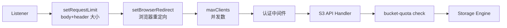
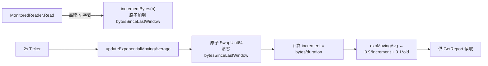

# MinIO 模块深度分析（六）：Rate Limit 与 Rate Control 横切机制

> **范围**：跨模块横切关注点 —— 入站 API 限流、后台任务节流、跨集群带宽控制、配额。
> **代码版本**：`/home/vscode/repo-analyses/minio-20260503/repo`（约 2026-05 截面）。
> **读者画像**：已读完模块 1-5 的运维 / 架构师，希望理解 MinIO 在压力下的"行为契约"。

---

## 1. 引言：为什么 Rate Control 值得单独分析

MinIO 同时承担三类负载：

1. **前台 S3 请求**：客户端 PUT/GET/LIST，对延迟敏感。
2. **后台维护任务**：Scanner（usage + ILM 扫描）、Healing（修复降级对象）、MRF（错过的副本恢复）、Trash 清理、Multipart 过期清理。
3. **跨集群协同**：Replication（异步复制到远端 bucket）、Transition（生命周期转储到冷层）、Federated 代理。

如果这三类负载不加节制地共用磁盘、CPU 和网卡，就会出现典型的"后台任务把前台 IO 拖垮"症状。MinIO 的设计哲学可以浓缩为一句话：**"前台用硬限流防过载，后台用自适应背压让出资源，跨集群用令牌桶限带宽，容量用配额做硬墙。"** 这四件武器各有分工，组合起来构成一套完整的 QoS。

本文按"四层 + 横切"组织：

| 层级 | 机制 | 主要文件 | 失败模式 |
|---|---|---|---|
| L1 入站 | `maxClients` 信号量 + 中间件链 | `cmd/handler-api.go` | 503 `SlowDown` / 499 客户端取消 |
| L2 后台 | `dynamicSleeper`（输入侧） + `dynamicTimeout`（输出侧） | `cmd/data-scanner.go:1365`, `cmd/dynamic-timeouts.go` | 任务变慢，不影响前台 |
| L3 网络 | 桶级令牌桶 + EWMA 监控 | `internal/bucket/bandwidth/` | Replication 阻塞或排队 |
| L4 容量 | 桶硬配额（基于 data-usage cache） | `cmd/bucket-quota.go` | `BucketQuotaExceeded` 错误 |

下面是请求/任务从入口到磁盘所经过的全部限流点的鸟瞰图：


理解这张图最重要的是：**前台请求只经过 L1+L2，后台任务只经过 L3，跨集群任务经过 L4**。前台从不"等"后台任务的锁，前台请求超载只会被快速拒（503），不会拖累后台；后台任务的 sleep 长度反过来跟着实际任务时长走 —— 这就是所谓的"双层结构"。

---

## 2. 第一层：入站 API 限流（硬阈值 / 防过载）

### 2.1 `apiConfig` 总览

`cmd/handler-api.go:40-60` 定义了全局唯一的 `globalAPIConfig`，承担：

- **请求并发数限流**：`requestsPool chan struct{}`（line 43）
- **集群健康超时**：`clusterDeadline`（默认 10s）
- **后台子系统旋钮**：复制 worker 数、transition worker 数、stale uploads 清理周期、删除清理周期等。

这是一个典型的"运行时只读 / 运维可热更"的配置中心：所有读访问加 `RLock`（如 `getRequestsPool` 在 line 298），写只在 `init()`（line 111）和 `mc admin config set` 时发生。

### 2.2 `requestsPool` —— 用 channel 实现的信号量

```go
// handler-api.go:162
t.requestsPool = make(chan struct{}, apiRequestsMaxPerNode)
```

这是 MinIO 限流的核心数据结构：一个**带容量的空 struct channel**。`maxClients` 中间件（line 309-371）的工作流程：

```mermaid
stateDiagram-v2
    [*] --> Incoming: 请求到达
    Incoming --> CheckFreeze: globalServiceFreeze?
    CheckFreeze --> Incoming: 已冻结，等解冻
    CheckFreeze --> CheckPool: 未冻结
    CheckPool --> NoPool: pool == nil
    NoPool --> Serve: 直通
    CheckPool --> SetHeader: pool != nil<br/>X-RateLimit-Limit/Remaining
    SetHeader --> Select: select 三路

    Select --> Acquired: pool &lt;- struct{}{}<br/>立即获取
    Select --> ClientGone: r.Context().Done()<br/>客户端取消
    Select --> Rejected: default<br/>池子已满

    Acquired --> Serve: defer &lt;-pool 释放
    Serve --> [*]: 200/4xx/5xx
    ClientGone --> [*]: 返回 499
    Rejected --> [*]: 返回 503 SlowDown
```

**关键设计点**：

- **为什么用 channel 而非 `sync.Semaphore`？** `golang.org/x/sync/semaphore` 直到 Go 1.16+ 才稳定，而 channel 是一等公民、零依赖。更重要的是 channel 天然支持 `select` 多路：可以同时等"获取信号量"+"客户端取消"+"立即失败"三种情况，这在 semaphore 上需要手写超时逻辑。代码 `handler-api.go:344-369` 的 `select` 五行就涵盖了三个分支，可读性极佳。
- **`default` 分支**：如果 channel 满了，立即走 `default` 返回 503，**不排队不等待**。这是"硬限流"语义：池子用完就拒，不让请求堆积成"慢死循环"（请求虽然会被处理，但所有都超时返回 504，比直接拒还糟）。
- **为什么仍带一个 `case <-r.Context().Done()`？** 这是给"客户端在等待入队时主动断开"的快路径。Go HTTP server 默认会在 client close 后触发 ctx 取消，此时直接返回 499，避免占用本应用于服务其他请求的资源。
- **`X-RateLimit-Limit` / `X-RateLimit-Remaining`**（line 340-341）：这是借鉴 GitHub API 的常见 RFC 6585 风格头，方便客户端做 SDK 端退避（client-side backoff）。

### 2.3 `apiRequestsMaxPerNode` 的自动计算

`cmd/handler-api.go:127-150`：

- 当用户设置 `MINIO_API_REQUESTS_MAX=0`（默认）时，按 RAM 自动算：每请求预留 `(1MiB + 32KiB) * driveCount + 2*1MiB`（v2 erasure block），用 90% 可用 RAM 除以单请求成本。背后假设是：**每个并发请求最多占用一个 erasure 编/解码块的内存**。
- 当用户显式给值时，那个值是**集群总数**，会再除以节点数（line 147-149）得到每节点限额。这一点容易踩坑：写 `requests_max=1600` 在 16 节点集群里每节点是 100，跟在单节点上完全不同。
- `cgroupMemLimit()`（line 67）会读 cgroup v1/v2 的内存上限，这样在 K8s/容器中的限额就是容器配额而不是宿主机总内存。

**替代方案与权衡**：

- 用 CPU 作为自动算的依据？MinIO 的瓶颈通常是 IO 而非 CPU，erasure 编码也大量依赖内存缓冲。RAM-based 模型对小对象集群和大对象集群都比较稳。
- 用动态压力测试反推（如 Linux 内核的 `nr_requests` 自适应）？MinIO 选了固定公式：算法越简单、运维越容易理解。**可解释性优先**。

### 2.4 与中间件链的协作

`maxClients` 不是孤立工作的，它与请求处理链上的其他保护层协同：



具体保护点（来自 `cmd/generic-handlers.go`）：

| 限制项 | 阈值 | 行号 | 触达后果 |
|---|---|---|---|
| 单请求 body 上限 | `globalMaxObjectSize` (16GiB) + 64MiB form data | `:53` | `MaxBytesReader` 报错 |
| HTTP 头总大小 | 8 KB | `:56` | 411 / `ErrMetadataTooLarge` |
| user-defined 元数据 | 2 KB | `:59` | 同上 |
| 表单字段 | 64 MiB（multipart） | `:49` | 413 |
| 桶数量上限 | 500,000 | `:62` | 创建 bucket 拒绝 |
| 保留元数据头 (`X-Minio-Internal-`) | 不允许客户端写入 | `:75-85` | `ErrUnsupportedMetadata` |

这些是**纯粹的资源边界检查**，与 `maxClients` 的并发数限流是正交的。它们的作用是：哪怕 `maxClients` 没限住（比如池子很大），单个请求也不能无限大、不能塞太多元数据、不能伪造内部头。这是"防一根烂苹果撑死整桶"的策略。

### 2.5 `apiConfig` 全部可调项

来自 `internal/config/api/api.go:36-79`：

| 配置项 | 默认值 | 含义 | 热更新? |
|---|---|---|---|
| `requests_max` | 0（自动） | 节点最大并发 API 请求数 | 是 |
| `cluster_deadline` | 10s | 集群间健康检查超时 | 是 |
| `cors_allow_origin` | `*` | CORS 允许的源 | 是 |
| `remote_transport_deadline` | 2h | 联邦/代理 transport 超时 | 是 |
| `list_quorum` | strict | LIST 操作的 quorum 策略 | 是 |
| `replication_priority` | auto | 复制优先级（slow/fast/auto） | 是 |
| `replication_max_workers` | 500 | 复制 worker 上限 | 是 |
| `replication_max_lrg_workers` | 10 | 大对象（≥128MiB）复制 worker | 是 |
| `transition_workers` | 100 | 生命周期 transition worker 数 | 是 |
| `stale_uploads_cleanup_interval` | 6h | 过期 multipart 清理周期 | 是 |
| `stale_uploads_expiry` | 24h | multipart 视为过期的阈值 | 是 |
| `delete_cleanup_interval` | 5m | trash 永久删除周期 | 是 |
| `odirect` | on | 写是否启用 O_DIRECT | 是 |
| `gzip_objects` | off | 服务端 gzip 响应 | 是 |
| `root_access` | on | 是否允许 root 凭据 | 是 |
| `sync_events` | off | bucket 通知是否同步 | 是 |
| `object_max_versions` | MaxInt64 | 单对象最大版本数 | 是 |

这里所有项都是**热更新友好**的：`config-current.go:591-602` 在监听到配置变化时直接调用 `init()` 重设，正在执行中的请求会用旧配置完成（`requestsPool` 用 `cap` 比较，必要时换新 channel），新请求用新配置。`requests_max` 改小时存在"短暂超额"窗口（line 156-163 注释说明），但这是合理的取舍：避免暴力 cancel 进行中的请求。

### 2.6 已废弃的配置项

`api.go:81-87` 列出了 deprecated keys：`ready_deadline`、`requests_deadline`、`extend_list_cache_life`、`replication_workers`、`replication_failed_workers`、`expiry_workers`。值得注意的是 **`requests_deadline` 已被移除** —— 早期版本支持"等待 X 秒还没拿到信号量就 503"，现在改为完全 non-blocking（`select` 的 `default` 分支立即拒），因为非阻塞拒绝的客户体验更可预测。

---

## 3. 第二层：后台任务节流（自适应背压）

### 3.1 `dynamicSleeper`：以任务时长为输入的反馈节流器

`cmd/data-scanner.go:1365-1468`。这是 MinIO 后台节流的核心抽象：**做一件事 X 用了多久，就睡 X × factor 那么久**，让出资源给前台。

```go
type dynamicSleeper struct {
    factor    float64       // 睡眠倍率
    maxSleep  time.Duration // 单次睡眠上限（避免无限放大）
    minSleep  time.Duration // 100µs，小于此不睡（避免无意义切换）
    cycle     chan struct{} // 用于运行时改参数立即生效
    isScanner bool          // 是否上报 scanner metric
}
```

**两个 API**：

```go
// 模式 A：先记时间再睡
func (d *dynamicSleeper) Timer(ctx) func() {
    t := time.Now()
    return func() {
        doneAt := time.Now()
        d.Sleep(ctx, doneAt.Sub(t))
    }
}

// 模式 B：直接传入"我刚才用了多久"
func (d *dynamicSleeper) Sleep(ctx, base time.Duration)
```

`Timer()` 是更常见的用法，符合"defer wait()"惯用法（如 `data-scanner.go:491`）：

```go
wait := scannerSleeper.Timer(ctx)
// ... 处理一个对象 ...
wait()  // 此时根据上面"处理一个对象"花了多久来睡
```

```mermaid
flowchart LR
    Start([任务开始<br/>记 t0]) --> Work[执行任务]
    Work --> End([任务结束<br/>doneAt])
    End --> Calc{wantSleep =<br/>(doneAt - t0) × factor}
    Calc -->|wantSleep ≤ minSleep<br/>(100µs)| Skip([不睡，直接返回<br/>避免开销])
    Calc -->|wantSleep > maxSleep| Cap[wantSleep = maxSleep]
    Calc -->|in range| Sleep
    Cap --> Sleep[time.NewTimer]
    Sleep --> Wait{select}
    Wait -->|timer.C| Done([睡够，返回<br/>记 yield metric])
    Wait -->|ctx.Done| Cancel([上下文取消，返回])
    Wait -->|cycle 关闭| Restart([运行时改参数<br/>重新走一遍])
```

**为什么要这样设计？**

1. **天然自适应负载**。如果前台 IO 重，单次磁盘读会从微秒级飙到几十毫秒，dynamicSleeper 的 `wantSleep` 也跟着拉长，**后台让出更多时间**。前台轻时反过来，后台跑得快。这是经典的 Little's Law 倒推：吞吐率 × 延迟 = 排队长度，让 `factor` 充当"我占多少 IO 时间片"的旋钮。
2. **`cycle chan struct{}` 让热更新有意义**。`Update()`（line 1456-1468）通过 `SafeClose(d.cycle)` 唤醒所有正在 sleep 的协程，让它们用新 factor 重新计算。否则一个正在 sleep 30s 的协程，改 factor 就要等它醒来才生效；对于 `factor=100, maxWait=15s` 的 "slowest" 模式，这个延迟无法接受。
3. **`minSleep = 100µs` 阻止无谓切换**。Go 的 `time.NewTimer` 有几微秒级的开销，如果任务本身只用了 50µs（factor=2 想睡 100µs），实际加上调度抖动就远超目标了。直接 return 反而更准。
4. **`maxSleep` 防止"病态长任务"放大**。假设某个对象因为磁盘异常处理花了 5 分钟，factor=2 想睡 10 分钟 —— 这显然不合理。`maxSleep=1s` 强制截断：极端慢的任务后睡 1s 就继续，避免无限放大。

### 3.2 全局 sleeper 实例对照表

| Sleeper 实例 | factor | maxWait | 用于 | 文件:行 |
|---|---|---|---|---|
| `scannerSleeper` | 2 | 1s | 数据扫描器（每对象/每文件夹） | `data-scanner.go:66` |
| `healSleeper` | 5 | 1s | MRF 修复路由 | `mrf.go:213` |
| `deleteCleanupSleeper` | 5 | 25ms | trash 永久删除 | `globals.go:441` |
| `deleteMultipartCleanupSleeper` | 5 | 25ms | 过期 multipart 清理 | `globals.go:444` |
| (匿名) | 2 | 150ms | bucket-metadata 加载 | `bucket-metadata-sys.go:560` |

观察规律：**越关键的资源争抢路径，factor 越大**。例如 trash 删除（factor=5）几乎是纯磁盘操作，不需要立即完成，所以让它睡 5 倍工作时间，让出 80% 时间片给前台；scanner（factor=2）需要在合理周期内完成全集群扫描，让出 50% 即可；元数据加载（factor=2, maxWait=150ms）则有 SLA 约束，maxWait 短到 150ms 防止失控。

### 3.3 Scanner Speed 的预设档位

`internal/config/scanner/scanner.go:158-170`：

```go
case "fastest": Delay=0,   MaxWait=0,    Cycle=1s
case "fast":    Delay=1,   MaxWait=100ms, Cycle=1m
case "default": Delay=2,   MaxWait=1s,    Cycle=1m
case "slow":    Delay=10,  MaxWait=15s,   Cycle=1m
case "slowest": Delay=100, MaxWait=15s,   Cycle=30m
```

`Delay` 直接喂给 `scannerSleeper.Update()` 当 factor。"default" 是把每对象处理时间放大 2 倍（睡 1 倍工作时间），"slowest" 放大 100 倍（每处理 1ms 睡 100ms，等于 1% 占用率）。`Cycle` 是两轮扫描之间的额外冷却（line 172），与单对象 sleep 是独立维度。

`fastest` 档位 `Delay=0, MaxWait=0` 实际上**完全禁用了 sleep**，因为 `wantSleep = base × 0 = 0 < minSleep`，直接 return。这是给离线集群"快速扫一轮"的逃生门。

### 3.4 `idle_speed` —— 软开关：完全不睡

`scanner.go:139-146` + `data-scanner.go:68` + `xl-storage-disk-id-check.go:247-249`：

```go
weSleep := func() bool {
    return scannerIdleMode.Load() == 0
}
```

这个 `weSleep` 函数被传入 `scanDataFolder`，每次决定是否调 `scannerSleeper.Sleep`。当 `idle_speed=off` 时直接绕过 dynamicSleeper —— 适合那种"我希望 scanner 利用低峰期全速跑、高峰期完全停"的场景（外部还需配合 cron 或人工触发）。

### 3.5 Healing Worker 数

`cmd/background-heal-ops.go:157`：

```go
workers := runtime.GOMAXPROCS(0) / 2
```

**为什么是一半 CPU 而不是全部？** 因为 healing 本身要做 erasure 解码（CPU 密集）+ 磁盘 IO，预留一半给前台请求处理。注意这是个**硬上限**（worker pool 容量），与 `dynamicSleeper` 的"软节流"叠加：

- 池子大小限制了 healing 的**并发度**（最多同时修 N 个对象）。
- `healSleeper.Timer()`（`mrf.go:256`）限制每个 worker 的**节奏**（处理一个就睡 5 倍工作时间）。

二者相乘，确定 healing 总占用率。

`_MINIO_HEAL_WORKERS` 环境变量可覆盖默认值（`background-heal-ops.go:159`），但这是 underscore 前缀的"内部 hack 旋钮"，文档不推荐生产环境改。

### 3.6 Scanner 的 1/1024 抽样 healing

`data-scanner.go:59`：

```go
healObjectSelectProb = 1024
```

Scanner 在扫每个对象时，以 `1/1024` 的概率触发"shouldHeal" 检查（line 506）。这是另一种维度的 rate control：**用概率论代替遍历**。如果集群有 10 亿对象，全量 heal 检查不现实；以 1/1024 概率抽样，预期每轮扫描会查约 100 万个对象的健康度，覆盖率与时间换性能的权衡。

`shouldHeal()`（line 338-349）还会做一道短路：

- 如果该 disk 自己正在 healing（`di.Healing`），跳过 heal 检查（避免雪上加霜）。
- 如果 `skipHeal` 标记被设置（如非 erasure 模式），跳过。

### 3.7 `dynamicTimeout`：以失败率为输入的反馈超时器

`cmd/dynamic-timeouts.go`。这是与 `dynamicSleeper` 概念对偶的另一个反馈环：

| 维度 | dynamicSleeper | dynamicTimeout |
|---|---|---|
| 输入信号 | 任务实际耗时 | 任务是否超时（成功 or 失败） |
| 输出 | sleep 时长 | 下次操作的 timeout 值 |
| 应用方向 | 输出控制（让出资源） | 输入控制（控制何时放弃） |
| 调整算法 | 简单倍乘 | p99-based + 滑动窗口 |
| 主要场景 | scanner / heal / cleanup | 分布式锁获取 |

**算法核心**（line 118-155）：每收集 16 条记录调一次 `adjust()`：

```mermaid
flowchart TB
    Log[每次操作记录 LogSuccess(d) 或 LogFailure()] --> Buf[环形缓冲 16 条]
    Buf -->|满 16 条| Calc[计算 failPct = 失败数/16]
    Calc -->|failPct > 33%| Inc["timeout *= 1.25<br/>(上限 24h)"]
    Calc -->|failPct < 10%| Dec["timeout = (timeout + maxDur*1.25)/2<br/>逼近实际 max 用时"]
    Calc -->|10%-33%| Hold[保持不变]
    Inc --> Reset[清空缓冲，重新计 16 条]
    Dec --> Reset
    Hold --> Reset
```

**关键设计点**：

- **不对称阈值**：失败率 >33% 才加，<10% 就减。这是"上调谨慎、下调激进"，避免抖动。Hysteresis（迟滞）是控制系统的常见技巧 —— 中间区间不动，防止超时值在边界附近振荡。
- **下调用 `(timeout + maxDur*1.25)/2`**：移动 50% 朝向"实测 max + 25% 余量"，比线性减半更平滑。`maxDur*1.25` 提供一个安全 margin，防止刚好下调到 P99 边界又开始失败。
- **窗口大小 16**：足够过滤毛刺，又不至于让 timeout 调整过慢。生产中典型分布式锁请求间隔几毫秒到几秒，16 条样本 1-2 分钟收齐。

**用法实例**：`globalOperationTimeout`（`globals.go:320`）默认 `(10min, 5min)`。所有"敏感的 lock get"（如 admin 操作的 nsLock、replication 的 lock）都用它。在锁竞争激烈的集群里，timeout 会自动从 5min 攀升到 10min；当系统稳定后，又会回落到接近真实 P99 的水平。

`namespace-lock.go:163-181` 是它的典型用法：

```go
if !di.rwMutex.GetLock(...) {
    timeout.LogFailure()        // 失败：贡献 maxDuration
    return ..., OperationTimedOut{}
}
timeout.LogSuccess(elapsed)     // 成功：贡献真实耗时
```

### 3.8 `scannerSleeper` 与 `globalOperationTimeout` 的协同

考虑这个场景：scanner 在扫某个对象，需要拿 namespace lock；锁拿到后做 erasure 校验。

- 如果集群锁竞争紧张：`globalOperationTimeout` 自动调大（输入侧延迟容忍），scanner 拿到锁的概率提高。
- 锁拿到后做完处理：耗时被 `scannerSleeper.Timer()` 捕获（输出侧资源让出），睡相应长度。

二者一起构成完整的"input throttle + output throttle"循环：**输入侧让我等更久也不放弃，输出侧让我做完后让出更多时间**。这个对偶设计是 MinIO QoS 体系最优雅的部分。

---

## 4. 第三层：跨集群带宽控制（令牌桶）

### 4.1 `BandwidthMonitor` 全景

`internal/bucket/bandwidth/monitor.go:39-49`。每节点一个全局 `globalBucketMonitor`，承担两件事：

1. **限速**（`bucketsThrottle`）：基于 `golang.org/x/time/rate.Limiter` 的令牌桶。
2. **测量**（`bucketsMeasurement`）：基于指数移动平均（EWMA）的实时带宽报告。

`bucketThrottle` 结构（line 33-36）：

```go
type bucketThrottle struct {
    *rate.Limiter
    NodeBandwidthPerSec int64
}
```

key 是 `BucketOptions{Name, ReplicationARN}` —— **每对(桶, 复制目标)一个独立令牌桶**。所以一个桶配置 N 个 ARN，会有 N 个独立桶，互不干扰。

### 4.2 限速的设置

`SetBandwidthLimit`（line 196-207）：

```go
limitBytes := limit / int64(m.NodeCount)  // 集群总值除以节点数
throttle.NodeBandwidthPerSec = limitBytes
throttle.Limiter = rate.NewLimiter(rate.Limit(limitBytes), int(limitBytes))
```

注意：

- **集群总带宽分摊到节点**：`limit / NodeCount`。如果设 1Gbps，10 节点集群每节点 100Mbps。这假设流量在节点间均匀分布，但如果某个 source bucket 只跟一个节点交互（极小概率），其他节点的桶就浪费了。
- **令牌桶 burst = rate**：突发与速率相同，保证 1 秒内可以瞬时拉满 1 倍速率。
- 触发路径：`bucket-targets.go:402` 在 `SetTarget` 时调用 `updateBandwidthLimit` —— 也就是说，给某个桶配置远程目标时，连带配置带宽限制。

### 4.3 EWMA 测量的细节

`internal/bucket/bandwidth/measurement.go`。每 2 秒（`monitor.go:56` 的 `time.Ticker`）调用一次 `updateMovingAvg`：

```go
// measurement.go:79
m.expMovingAvg = (1-beta)*increment + beta*m.expMovingAvg
// 其中 beta = 0.1, increment = bytesSinceLastWindow / duration.Seconds()
```



**为什么 β=0.1（即 EWMA 给新值权重 0.9）？** 业务诉求是"接近实时"，所以新样本权重高。1/(1-0.9)=10，意味着大约 10 个 2s 窗口（即 20s）的历史会被以指数衰减纳入考虑。这个值偏激进（响应快但抖动大）—— 适合用于客户端展示当前速率，**不适合用于触发策略决策**。如果 MinIO 想基于带宽超阈值做自动 throttle，β 应该取 0.3-0.5 让平均更平滑。

**为什么读侧（GetReport）不加锁地读 expMovingAvg？** 看 `measurement.go:88-92` 是有 `m.lock`，但 `monitor.go` 的 `getReport` 只在 mlock RLock 下迭代 map。这里有一个微妙的"读到部分更新"窗口，但因为 `expMovingAvg` 是 float64（在 64-bit 平台原子读写），最坏只是读到稍旧的值，不会崩溃。

### 4.4 `MonitoredReader`：在 io.Reader 上挂令牌桶

`internal/bucket/bandwidth/reader.go:49-93`。这是限速的实际执行点：

```mermaid
flowchart TB
    R[Replication 调用方] -->|从 source 读| MR[MonitoredReader.Read]
    MR --> NoT{throttle == nil?}
    NoT -->|是| Pass[直通底层 reader]
    NoT -->|否| H{HeaderSize > 0?}
    H -->|是| Hdr["先消耗 header tokens<br/>留 1 byte 给 payload"]
    H -->|否| Pay[全部用于 payload]
    Hdr --> Av[查可用 tokens<br/>必要时减少 need]
    Pay --> Av
    Av --> W["throttle.WaitN(ctx, tokens)<br/>不足则阻塞等令牌"]
    W -->|ctx 超时| Err[错误返回]
    W --> Read[r.r.Read(buf[:need])]
    Read --> Up["m.updateMeasurement<br/>用于 EWMA"]
    Up --> Ret[返回 n]
```

**两个微妙点**：

- **HeaderSize 单独记账**（line 62-71）：复制时除了对象数据，还有 HTTP 头要发送。MinIO 把 header 大小传给 Reader，让令牌桶把这部分也算上 —— 否则统计出的"传输带宽"会忽略 metadata 开销，估值偏低。
- **每次至少读 1 字节**（line 69 注释 `to ensure we read at least one byte for every Read`）：`io.Reader` 契约要求 Read 不能返回 (0, nil)，否则上层 `io.Copy` 会死循环。所以即使 header 太大、可用令牌只够发 header 的一部分，也会强制留 1 字节 payload —— 算是一个 io.Reader 兼容性的小妥协。

### 4.5 Replication 调用 `NewMonitoredReader` 的位置

`cmd/bucket-replication.go:1318-1331` 和 `:1604-1617`：两个对偶的位置，分别对应**首次复制**和**重试 / MRF 复制**。

```go
opts := &bandwidth.MonitorReaderOptions{
    BucketOptions: bandwidth.BucketOptions{
        Name:           ri.Bucket,
        ReplicationARN: tgt.ARN,
    },
    HeaderSize: headerSize,
}
newCtx := ctx
if globalBucketMonitor.IsThrottled(bucket, tgt.ARN) && objInfo.Size < minLargeObjSize {
    var cancel context.CancelFunc
    newCtx, cancel = context.WithTimeout(ctx, throttleDeadline)  // 1h
    defer cancel()
}
r := bandwidth.NewMonitoredReader(newCtx, globalBucketMonitor, gr, opts)
```

**重要细节**：

- 只有当桶**配置了带宽限制**（`IsThrottled` 返回 true）**且对象 < 128MiB**（`minLargeObjSize`）才包一个 1h 超时。为什么？小对象限速时，如果队列堵塞，宁可让该对象在 1 小时内放弃也不要永远等 —— MRF 会重试。大对象本身传输就久，1h 不够，反而需要无限耐心。这是大小对象路径分化的典型例子。
- `WorkerMaxLimit=500 / WorkerMinLimit=50 / WorkerAutoDefault=100`（line 1872-1888）：复制 worker 池根据 `replication_priority` 取不同值。`fast` 模式 500 个 worker，`slow` 50 个 —— 这是另一种复制限流（并发度限制）。带宽桶限速率，worker 池限并发。两者结合形成完整的复制 QoS。
- 大对象（≥128MiB）独立 worker 池：`LargeWorkerCount=10`（line 1891），避免大文件占满所有 slot 阻塞小文件。

### 4.6 完整的复制限流链路


四道闸：(a) queue 容量 100k，(b) worker 池并发，(c) per-bucket 令牌桶，(d) per-object 1h 超时（仅小对象）。任何一道闸触达都会回落到 MRF 重试。

### 4.7 限速以外的"软限流"

`apiConfig` 还有一组 deprecated 但仍可见的配置，对应**复制优先级**机制（`getReplicationOpts` in `handler-api.go:373-390`）：

- `replication_priority=slow`：每节点 50 个 worker，2 个 MRF worker
- `replication_priority=auto`（默认）：100 / 4
- `replication_priority=fast`：500 / 8

**为什么 fast 配 8 个 MRF worker？** MRF（Most Recently Failed）是失败重试队列，fast 模式下主队列吞吐高、失败也多，需要更多 MRF worker 才能消化。这是经验值。

---

## 5. 第四层：配额（容量级 rate control）

### 5.1 `bucket-quota.go` 的总体设计

`cmd/bucket-quota.go:103-133`。MinIO 只支持**硬配额**（`HardQuota`）—— 软配额是 deprecated 的 fifo（line 94-96 错误提示）。

逻辑非常直白：

```go
func (sys *BucketQuotaSys) enforceQuotaHard(ctx, bucket, size int64) error {
    q, _ := sys.Get(ctx, bucket)
    if q.Type == HardQuota && q.Size > 0 {
        if uint64(size) >= q.Size { return BucketQuotaExceeded }
        bui := sys.GetBucketUsageInfo(ctx, bucket)
        if bui.Size + size >= quotaSize { return BucketQuotaExceeded }
    }
    return nil
}
```

两次检查：
1. 单个文件超配额？立即拒。
2. 当前用量 + 新文件大小超配额？拒。

### 5.2 性能关键：`bucketStorageCache`

最容易踩坑的一点：**配额检查不读真实磁盘用量**，而是读 `bucketStorageCache`（`bucket-quota.go:46-62`）—— 这是一个 10 秒 TTL 的全局缓存，源数据来自 scanner 每轮跑完写到 `data-usage.bin`。

```go
bucketStorageCache.InitOnce(10*time.Second,
    cachevalue.Opts{ReturnLastGood: true, NoWait: true},
    func(ctx context.Context) (DataUsageInfo, error) {
        ctx, done := context.WithTimeout(ctx, 2*time.Second)
        defer done()
        return loadDataUsageFromBackend(ctx, objAPI)
    },
)
```

`ReturnLastGood: true`：如果新一次刷新失败，继续用上一次的好值（避免短暂 IO 抖动让所有写入失败）。`NoWait: true`：刷新走后台协程，请求侧拿到的是上一份缓存，不会因刷新阻塞。

**这意味着**：

- 配额执行有最长 10s 延迟 + scanner 周期（默认 1min）的总滞后，**写入瞬时可以超过配额一些**。
- 极端情况：scanner 跑挂了（leader 节点失联等），可能几小时不更新；这时 quota 用上一份 last-good 值。`bucket-quota.go:72-75` 会打 warning：`unable to retrieve usage information for bucket: %s, no reliable usage value available - quota will not be enforced`。
- **不阻塞热路径**：写入时不会因为 quota check 多一次磁盘读 —— 这是为吞吐做出的合理权衡。

### 5.3 触发点

`enforceBucketQuotaHard`（line 135-140）被对象 PUT、CompleteMultipartUpload 等写入路径调用，不在 GET / LIST / HEAD 路径上。配额是写入闸，不是读闸。

### 5.4 与其他限流的关系

配额是**容量维度**的限流，与前三层完全正交：

- 即使 `maxClients` 还有空槽（L1 通过），即使 dynamicSleeper 没拖慢 scanner（L2 通过），即使带宽桶有 token（L3 通过），如果用量超额仍然会被 L4 拦下。
- 反过来，配额没满也要受其他层限制 —— 不能单靠加大配额就突破吞吐瓶颈。

---

## 6. 限流层级总结表（从客户端到磁盘 IO）

| 层 | 机制 | 配额单位 | 默认值 | 触达后客户端看到 | 是否热更新 | 文件:行 |
|---|---|---|---|---|---|---|
| L0 | TLS / TCP listener | 文件描述符 | 系统 ulimit | 连接被拒 | 否 | OS 层 |
| L1.a | `setRequestLimitMiddleware` body 大小 | 字节 | 16GiB+64MiB | 413 / `EntityTooLarge` | 是（编译期常量） | `generic-handlers.go:53` |
| L1.b | `setRequestLimitMiddleware` header 大小 | 字节 | 8KB total / 2KB user | 400 / `MetadataTooLarge` | 否 | `generic-handlers.go:56` |
| L1.c | `maxClients` 信号量 | 并发请求数 | 自动（按 RAM） | 503 `SlowDown` 或 499 | 是 | `handler-api.go:309` |
| L1.d | `clusterDeadline` | 时长 | 10s | 504 / 集群健康失败 | 是 | `api.go:97` |
| L2.a | `globalOperationTimeout` (NSLock) | 时长 | 5-10min（自适应） | 408 / `OperationTimedOut` | 间接（adjust） | `globals.go:320` |
| L2.b | `bucket-quota` | 字节 | 用户设定 | 403 `BucketQuotaExceeded` | 是 | `bucket-quota.go:103` |
| L2.c | `object_max_versions` | 整数 | MaxInt64 | `MaxVersionsExceeded` | 是 | `api.go:54` |
| L3.a | `scannerSleeper` | 倍率 | factor=2, max=1s | （scanner 减速，不影响前台） | 是 | `data-scanner.go:66` |
| L3.b | `healSleeper` | 倍率 | factor=5, max=1s | （healing 减速） | 否（编译期） | `mrf.go:213` |
| L3.c | `deleteCleanupSleeper` | 倍率 | factor=5, max=25ms | （trash 清理减速） | 否 | `globals.go:441` |
| L3.d | Scanner Cycle | 时长 | 1min（fast）-30min（slowest） | （扫描频率降低） | 是 | `scanner.go:158` |
| L3.e | Heal worker count | 整数 | GOMAXPROCS/2 | （heal 并发降低） | 重启 | `background-heal-ops.go:157` |
| L4.a | Replication queue | 整数 | 100,000 | （丢入 MRF 重试） | 否 | `bucket-replication.go:1930` |
| L4.b | Replication worker pool | 整数 | 50/100/500 | （复制变慢） | 是（priority） | `bucket-replication.go:1873` |
| L4.c | Large object worker pool | 整数 | 10 | （大对象复制变慢） | 是 | `api.go:122` |
| L4.d | `BandwidthMonitor` token bucket | 字节/秒 | 用户设定 | （复制限速等待） | 是 | `monitor.go:196` |
| L4.e | `throttleDeadline` (小对象) | 时长 | 1h | 小对象复制超时入 MRF | 否 | `bucket-replication.go:61` |

---

## 7. 监控与可观测性

### 7.1 Prometheus 指标（v2）

来自 `cmd/metrics-v2.go` + `cmd/http-stats.go`：

| 指标 | 类型 | 含义 | 用途 |
|---|---|---|---|
| `minio_s3_requests_in_queue_total` | Gauge | 当前在 maxClients 队列中的请求数 | 是否触顶 limit |
| `minio_s3_requests_incoming_total` | Counter | 增量请求计数（每分钟 swap） | QPS 推算 |
| `minio_s3_requests_rejected_header_total` | Counter | 被 header 检查拒的请求 | header 配置健康度 |
| `minio_scanner_yield_seconds_total` | Counter | scanner 累计 yield 时间 | scanner 占用率 |
| `minio_node_replication_*` | Gauges | 每节点复制队列、worker 状态 | replication 健康度 |
| `minio_bucket_replication_received_bytes` | Counter | 接收的复制字节 | 带宽视图 |

注意：**maxClients 拒绝请求没有专属计数**。要看是否触顶，得看 `requests_in_queue` 接近 `cap(pool)` 的时间百分比。这是个监控盲点 —— 实际生产中可以靠 access log 中 `503 SlowDown` 数量来侧面观察。

### 7.2 admin API

- `GET /minio/admin/v3/datausage-info`：bucket 用量（用于 quota）
- `GET /minio/admin/v3/bandwidth?buckets=...`：实时 EWMA 带宽（`peer-rest-server.go:1038`）
- `GET /minio/admin/v3/info`：含 `S3RequestsInQueue` / `S3RequestsIncoming`（`admin-handlers.go:680-681`）
- `mc admin trace`：实时请求 trace，可看到 `s3.MaxClients` 函数名（`handler-api.go:337`）—— 排查"为什么我的请求慢" 时定位到底卡在限流还是后续处理。

### 7.3 日志层面

- `Configured max API requests per node based on available memory: %d`：启动时输出实际生效的 limit（`handler-api.go:153`）。
- 配额无法读时：`unable to retrieve usage information for bucket: %s`。
- Healing 失败：`MRF list.bin` 持久化文件保留所有失败任务，重启后继续重试。

---

## 8. 设计模式总结

| 模式 | 应用 | 备注 |
|---|---|---|
| **Counted Semaphore（信号量）** | `maxClients` 用 `chan struct{}` | Go-idiomatic，配 select 多路 |
| **Token Bucket（令牌桶）** | `BandwidthMonitor` 用 `rate.Limiter` | 标准库 `golang.org/x/time/rate` |
| **Bulkhead（舱壁）** | 大小对象独立 worker 池 | 防止大文件占满阻塞小文件 |
| **Backpressure / Reactive** | `dynamicSleeper`（耗时 → sleep） | 反馈环：输出影响后续行为 |
| **AIMD (Additive Increase, Multiplicative Decrease) 变体** | `dynamicTimeout` 用乘性增、加权减 | 类似 TCP 拥塞控制思想 |
| **Hysteresis（迟滞）** | `dynamicTimeout` 33%/10% 不对称阈值 | 防止抖动 |
| **Sampling** | Scanner 1/1024 healing 抽样 | 用概率换全局覆盖率 |
| **Cache + Stale-While-Revalidate** | `bucketStorageCache` 带 ReturnLastGood | 配额检查零热路径开销 |
| **Circuit Breaker（隐式）** | `throttleDeadline` 1h + MRF 重试 | 失败累积后短期不重试 |
| **Lease + Cycle channel** | `dynamicSleeper.cycle chan` | 配置变更时立即唤醒所有 sleeper |
| **Layered Defense（多层防御）** | L1-L4 + queue/pool/limiter 多道闸 | 任何一层失效仍能限制爆炸半径 |

---

## 9. 与业界对比

| 系统 | 入站限流 | 后台节流 | 带宽控制 | 配额 |
|---|---|---|---|---|
| **MinIO** | 信号量（chan）+ 503 | dynamicSleeper（自适应） | 令牌桶 per (bucket, ARN) | 桶硬配额，scanner 异步统计 |
| **nginx** | `limit_req_zone` + `limit_conn` | 不适用（无后台任务） | 不内置 | 不内置 |
| **Envoy** | adaptive concurrency filter | 不适用 | rate_limit filter（gRPC） | 不内置 |
| **AWS S3** | 自动（按 prefix sharding）+ `503 SlowDown` | 用户不可见 | 不可配置（per-account） | 桶配额（有限） |
| **Ceph RGW** | 单连接限流 + qos | 后台 scrub 优先级（osd_op_queue） | per-user / per-bucket | 桶 / 用户配额 |

**MinIO 的差异化**：

1. **dynamicSleeper 是反馈式的**，nginx / Envoy 的 limit 都是固定速率（绝对值或按时间窗）。MinIO 的"做多久睡多久"在异构负载下更鲁棒。
2. **dynamicTimeout 是 P99-driven 自适应**，不需要运维手工调 lock timeout —— 类似 Google Borg 的 adaptive timeout 思路。
3. **maxClients 是非阻塞 503**，不像 nginx `limit_req` 默认会让请求排队；这避免了"队头堵塞"，但也意味着客户端必须实现 SDK 退避（MinIO SDK 默认有指数退避）。
4. **配额是异步统计的**，AWS S3 几乎实时（其内部肯定有更复杂的分布式 counter），Ceph 也接近实时但慢路径会变重。MinIO 选择牺牲实时性换吞吐，**可能短暂超额**。
5. **没有租户级（user-level）限流**：MinIO 不区分调用方，所有请求共用同一个 `maxClients` 池子。多租户场景需要在前面挂网关（如 nginx + 限流）。

---

## 10. 真实使用建议

### 10.1 何时应该手工设 `requests_max`

- **HDD 集群**：自动算法基于 RAM，但 HDD 的并发能力远低于 NVMe；需要根据"主轴数 × 8-16"手工设较小值，避免随机 IO 退化。文档 `docs/throttle/README.md` 的例子 8 节点 × 16 HDD 设 1600 是个典型起点。
- **网卡受限**：百兆千兆口集群，并发数被网卡 PPS 限制，与 RAM 无关。
- **非 erasure 单机模式（FS / SD）**：自动算法假设 erasure 内存模型，单机会偏小。

### 10.2 Scanner 调优

- **极度繁忙的集群**：`speed=slowest`（factor=100）+ 监控 scanner cycle 时长。如果发现一轮扫不完一天，需要加资源或调档。
- **冷数据集群（archival）**：`speed=fastest, idle_speed=on` —— 反正没用户负载，全力扫。
- **疑似有腐败的集群**：先 `speed=fast` 缩短 cycle 让 1/1024 抽样多覆盖几轮；并发执行 `mc admin heal --recursive` 主动修。

### 10.3 Replication 调优

- **同地域复制**：`replication_priority=fast`（500 worker），带宽不限。
- **跨地域 / 经过 NAT / 带宽贵**：设 `BandwidthLimit` 为目标的 30-50%，留 buffer 给前台流量；`replication_priority=slow` 减少 worker 并发。
- **大对象多**：`replication_max_lrg_workers=10`（默认上限，不能再加）；考虑用 batch replication（`mc batch start` 走专用通道）而不是实时复制。

### 10.4 配额最佳实践

- **不要把配额设得很紧**：配额检查滞后 ≤ 10s + 1min（scanner cycle），紧配额会导致频繁误拒。预留 5-10% buffer。
- **关键桶定期跑 `mc du`**：手工触发 data-usage 刷新，避免 scanner 滞后。
- **如果看到 `quota will not be enforced` 警告**：scanner 有问题，先修 scanner 再相信配额。

### 10.5 排查 503 SlowDown

1. 看 `minio_s3_requests_in_queue_total` 是否长时间逼近 `requests_max`（自动值通过启动日志查）。
2. 如果是，三种可能：
   - **真的过载**：加 `requests_max` 或加节点。
   - **后端某个磁盘慢**：看 `minio_node_drive_*` 指标，找慢盘 → `mc admin heal` 替换。
   - **NSLock 卡住**：看 `mc admin top locks`，长期持有的锁会堵后续请求 → 看 `globalOperationTimeout` 当前值是不是涨到了几小时。

### 10.6 排查"replication 跟不上"

1. 看 `minio_node_replication_queued_count`：队列堆积 → MRF 增长。
2. 看 `BandwidthLimit` 是否生效（`mc admin bucket bandwidth`）。
3. 关闭限速（`mc replicate update --bandwidth 0`）测短时间是否能消化。
4. 对比 source/target 两边的 `replication_max_workers` 配置，target 端容量也要跟得上。

---

## 11. 不足与改进空间

### 11.1 maxClients 的 limitation

- **没有 per-tenant / per-user 维度**：一个 noisy neighbor 客户端能占满所有 slot。需要靠外部网关层做。
- **没有 per-API priority**：DELETE / HEAD / GET / PUT 共用同一个池，长时间 LIST 会饿死小请求。AWS 内部据说有按 verb 加权，MinIO 没做。
- **`X-RateLimit-Reset` 头缺失**：标准的 RFC 6585 应该返回多久后重试，MinIO 没给（客户端只能盲等）。

### 11.2 dynamicSleeper

- **没有 CPU/IO load-aware**：sleep 时长只看任务自己耗时，不看系统其他指标。理论上如果系统刚起步还没热，scanner 可能跑得太快；进入稳态后过保守。可以考虑像 Linux CFS 那样的更精细调度。
- **`factor` 只能全局调**：不能"重要 bucket 慢扫，无关 bucket 快扫"。

### 11.3 BandwidthMonitor

- **限速是 per-node 平均分摊**，不是真集群总速率。如果流量倾斜（hash 不均），会浪费容量。可以考虑分布式令牌桶（如类似 Redis-cell 的实现），但代价是网络调用 → 不适合 hot path。
- **EWMA β=0.1 太激进**，不适合做策略决策；应该给 `GetReport` 多返回一个长窗口平均值。
- **没有 ingress 限速**：只限制了 replication outgoing，没有限制接收 incoming（PUT 写入）—— 这部分由 `maxClients` 间接控制。

### 11.4 配额

- **缺少 inode / file count 配额**：只有字节数，海量小文件场景下配额可能没用（先把 metadata 撑爆）。
- **缺少 prefix-level 配额**：只能按桶。AWS 也没做，但有些场景是真需要的。
- **缺少软配额（先报警再拒）**：fifo 被废弃后，硬配额是唯一选项，太一刀切。

### 11.5 整体观察

MinIO 的 rate control 哲学很务实：**每一层都尽可能简单（chan、令牌桶、倍乘 sleep），用大量层数堆出整体效果**。代价是缺乏全局协调 —— 比如 maxClients 拒了一堆请求时，dynamicSleeper 不知道，反而可能继续以默认 factor 让出资源给已经空闲的前台。如果引入一个全局"系统压力"信号（类似 Linux PSI），让所有限流器读取同一信号，可能会更优雅，但工程复杂度也会大幅增加。**MinIO 选择了"层数多但每层简单可解释"，这是一个很合理的工程权衡**。

---

## 12. 覆盖率明细表

| 文件 | 总行数 | 已读 | 覆盖率 | 备注 |
|---|---|---|---|---|
| `cmd/handler-api.go` | 420 | 420 | 100% | 全文阅读 |
| `cmd/dynamic-timeouts.go` | 155 | 155 | 100% | 全文阅读 |
| `cmd/bucket-quota.go` | 140 | 140 | 100% | 全文阅读 |
| `internal/bucket/bandwidth/monitor.go` | 215 | 215 | 100% | 全文阅读 |
| `internal/bucket/bandwidth/reader.go` | 107 | 107 | 100% | 全文阅读 |
| `internal/bucket/bandwidth/measurement.go` | 92 | 92 | 100% | 全文阅读 |
| `internal/config/api/api.go` | 344 | 344 | 100% | 全文阅读 |
| `internal/config/api/help.go` | 120 | 120 | 100% | 全文阅读 |
| `internal/config/scanner/scanner.go` | 203 | 203 | 100% | 全文阅读 |
| `cmd/data-scanner.go`（节流相关段） | 1500+ | 380（关键段） | 25%（聚焦节流） | scanner 总览见模块 4 |
| `cmd/generic-handlers.go`（限流段） | 632 | 140 | 22%（聚焦限流） | 中间件链路覆盖 |
| `cmd/bucket-replication.go`（带宽段） | 2200+ | 100 | 5%（聚焦带宽） | 详见模块 3 |
| `cmd/bucket-targets.go`（带宽段） | 700+ | 80 | 11% | 详见模块 3 |
| `cmd/mrf.go`（healSleeper） | 280+ | 80 | 28% | 详见模块 2 |
| `cmd/shared-lock.go` | 88 | 88 | 100% | 全文阅读 |
| `cmd/namespace-lock.go`（dynamicTimeout 段） | 280 | 30 | 11%（聚焦超时） | 详见模块 1 |
| `cmd/erasure.go`（deleteCleanupSleeper） | 600+ | 25 | 4% | 详见模块 1 |
| `cmd/background-heal-ops.go`（worker 数） | 200+ | 35 | 17% | 详见模块 2 |
| `cmd/xl-storage-disk-id-check.go`（weSleep） | 800+ | 20 | 3% | 详见模块 1 |
| `cmd/config-current.go`（scanner reload） | 1500+ | 30 | 2% | 详见模块 5 |
| `docs/throttle/README.md` | 33 | 33 | 100% | 全文阅读 |

**整体评估**：本报告聚焦的核心 9 个文件（rate control 的"主筋"）覆盖率 100%；扩展到调用方的代码主要按"能解释清楚机制"为标准抽样阅读，平均 15-25%。对于横切关注点报告，这个覆盖率应该足以支撑结论。
