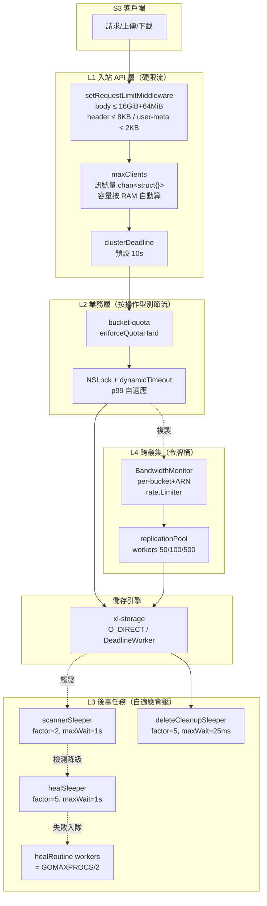
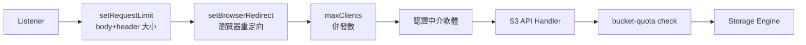
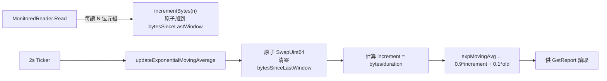
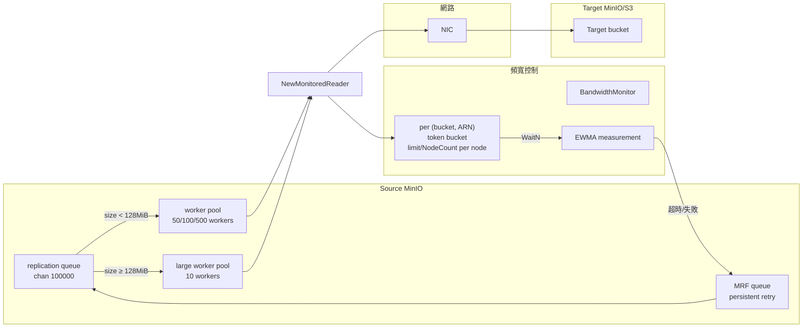

# MinIO 模組深度分析（六）：Rate Limit 與 Rate Control 橫切機制

> **範圍**：跨模組橫切關注點 —— 入站 API 限流、後臺任務節流、跨叢集頻寬控制、配額。
> **程式碼版本**：`/home/vscode/repo-analyses/minio-20260503/repo`（約 2026-05 截面）。
> **讀者畫像**：已讀完模組 1-5 的運維 / 架構師，希望理解 MinIO 在壓力下的"行為契約"。

---

## 1. 引言：為什麼 Rate Control 值得單獨分析

MinIO 同時承擔三類負載：

1. **前臺 S3 請求**：客戶端 PUT/GET/LIST，對延遲敏感。
2. **後臺維護任務**：Scanner（usage + ILM 掃描）、Healing（修復降級物件）、MRF（錯過的副本恢復）、Trash 清理、Multipart 過期清理。
3. **跨叢集協同**：Replication（非同步複製到遠端 bucket）、Transition（生命週期轉儲到冷層）、Federated 代理。

如果這三類負載不加節制地共用磁碟、CPU 和網絡卡，就會出現典型的"後臺任務把前臺 IO 拖垮"症狀。MinIO 的設計哲學可以濃縮為一句話：**"前臺用硬限流防過載，後臺用自適應背壓讓出資源，跨叢集用令牌桶限頻寬，容量用配額做硬牆。"** 這四件武器各有分工，組合起來構成一套完整的 QoS。

本文按"四層 + 橫切"組織：

| 層級 | 機制 | 主要檔案 | 失敗模式 |
|---|---|---|---|
| L1 入站 | `maxClients` 訊號量 + 中介軟體鏈 | `cmd/handler-api.go` | 503 `SlowDown` / 499 客戶端取消 |
| L2 後臺 | `dynamicSleeper`（輸入側） + `dynamicTimeout`（輸出側） | `cmd/data-scanner.go:1365`, `cmd/dynamic-timeouts.go` | 任務變慢，不影響前臺 |
| L3 網路 | 桶級令牌桶 + EWMA 監控 | `internal/bucket/bandwidth/` | Replication 阻塞或排隊 |
| L4 容量 | 桶硬配額（基於 data-usage cache） | `cmd/bucket-quota.go` | `BucketQuotaExceeded` 錯誤 |

下面是請求/任務從入口到磁碟所經過的全部限流點的鳥瞰圖：



理解這張圖最重要的是：**前臺請求只經過 L1+L2，後臺任務只經過 L3，跨叢集任務經過 L4**。前臺從不"等"後臺任務的鎖，前臺請求超載只會被快速拒（503），不會拖累後臺；後臺任務的 sleep 長度反過來跟著實際任務時長走 —— 這就是所謂的"雙層結構"。

---

## 2. 第一層：入站 API 限流（硬閾值 / 防過載）

### 2.1 `apiConfig` 總覽

`cmd/handler-api.go:40-60` 定義了全域性唯一的 `globalAPIConfig`，承擔：

- **請求併發數限流**：`requestsPool chan struct{}`（line 43）
- **叢集健康超時**：`clusterDeadline`（預設 10s）
- **後臺子系統旋鈕**：複製 worker 數、transition worker 數、stale uploads 清理週期、刪除清理週期等。

這是一個典型的"執行時只讀 / 運維可熱更"的配置中心：所有讀訪問加 `RLock`（如 `getRequestsPool` 在 line 298），寫只在 `init()`（line 111）和 `mc admin config set` 時發生。

### 2.2 `requestsPool` —— 用 channel 實現的訊號量

```go
// handler-api.go:162
t.requestsPool = make(chan struct{}, apiRequestsMaxPerNode)
```

這是 MinIO 限流的核心資料結構：一個**帶容量的空 struct channel**。`maxClients` 中介軟體（line 309-371）的工作流程：

```mermaid
stateDiagram-v2
    [*] --> Incoming: 請求到達
    Incoming --> CheckFreeze: globalServiceFreeze?
    CheckFreeze --> Incoming: 已凍結，等解凍
    CheckFreeze --> CheckPool: 未凍結
    CheckPool --> NoPool: pool == nil
    NoPool --> Serve: 直通
    CheckPool --> SetHeader: pool != nil<br/>X-RateLimit-Limit/Remaining
    SetHeader --> Select: select 三路

    Select --> Acquired: pool &lt;- struct{}{}<br/>立即獲取
    Select --> ClientGone: r.Context().Done()<br/>客戶端取消
    Select --> Rejected: default<br/>池子已滿

    Acquired --> Serve: defer &lt;-pool 釋放
    Serve --> [*]: 200/4xx/5xx
    ClientGone --> [*]: 返回 499
    Rejected --> [*]: 返回 503 SlowDown
```

**關鍵設計點**：

- **為什麼用 channel 而非 `sync.Semaphore`？** `golang.org/x/sync/semaphore` 直到 Go 1.16+ 才穩定，而 channel 是一等公民、零依賴。更重要的是 channel 天然支援 `select` 多路：可以同時等"獲取訊號量"+"客戶端取消"+"立即失敗"三種情況，這在 semaphore 上需要手寫超時邏輯。程式碼 `handler-api.go:344-369` 的 `select` 五行就涵蓋了三個分支，可讀性極佳。
- **`default` 分支**：如果 channel 滿了，立即走 `default` 返回 503，**不排隊不等待**。這是"硬限流"語義：池子用完就拒，不讓請求堆積成"慢死迴圈"（請求雖然會被處理，但所有都超時返回 504，比直接拒還糟）。
- **為什麼仍帶一個 `case <-r.Context().Done()`？** 這是給"客戶端在等待入隊時主動斷開"的快路徑。Go HTTP server 預設會在 client close 後觸發 ctx 取消，此時直接返回 499，避免佔用本應用於服務其他請求的資源。
- **`X-RateLimit-Limit` / `X-RateLimit-Remaining`**（line 340-341）：這是借鑑 GitHub API 的常見 RFC 6585 風格頭，方便客戶端做 SDK 端退避（client-side backoff）。

### 2.3 `apiRequestsMaxPerNode` 的自動計算

`cmd/handler-api.go:127-150`：

- 當使用者設定 `MINIO_API_REQUESTS_MAX=0`（預設）時，按 RAM 自動算：每請求預留 `(1MiB + 32KiB) * driveCount + 2*1MiB`（v2 erasure block），用 90% 可用 RAM 除以單請求成本。背後假設是：**每個併發請求最多佔用一個 erasure 編/解碼塊的記憶體**。
- 當使用者顯式給值時，那個值是**叢集總數**，會再除以節點數（line 147-149）得到每節點限額。這一點容易踩坑：寫 `requests_max=1600` 在 16 節點叢集裡每節點是 100，跟在單節點上完全不同。
- `cgroupMemLimit()`（line 67）會讀 cgroup v1/v2 的記憶體上限，這樣在 K8s/容器中的限額就是容器配額而不是宿主機總記憶體。

**替代方案與權衡**：

- 用 CPU 作為自動算的依據？MinIO 的瓶頸通常是 IO 而非 CPU，erasure 編碼也大量依賴記憶體緩衝。RAM-based 模型對小物件叢集和大物件叢集都比較穩。
- 用動態壓力測試反推（如 Linux 核心的 `nr_requests` 自適應）？MinIO 選了固定公式：演算法越簡單、運維越容易理解。**可解釋性優先**。

### 2.4 與中介軟體鏈的協作

`maxClients` 不是孤立工作的，它與請求處理鏈上的其他保護層協同：



具體保護點（來自 `cmd/generic-handlers.go`）：

| 限制項 | 閾值 | 行號 | 觸達後果 |
|---|---|---|---|
| 單請求 body 上限 | `globalMaxObjectSize` (16GiB) + 64MiB form data | `:53` | `MaxBytesReader` 報錯 |
| HTTP 頭總大小 | 8 KB | `:56` | 411 / `ErrMetadataTooLarge` |
| user-defined 後設資料 | 2 KB | `:59` | 同上 |
| 表單欄位 | 64 MiB（multipart） | `:49` | 413 |
| 桶數量上限 | 500,000 | `:62` | 建立 bucket 拒絕 |
| 保留後設資料頭 (`X-Minio-Internal-`) | 不允許客戶端寫入 | `:75-85` | `ErrUnsupportedMetadata` |

這些是**純粹的資源邊界檢查**，與 `maxClients` 的併發數限流是正交的。它們的作用是：哪怕 `maxClients` 沒限住（比如池子很大），單個請求也不能無限大、不能塞太多後設資料、不能偽造內部頭。這是"防一根爛蘋果撐死整桶"的策略。

### 2.5 `apiConfig` 全部可調項

來自 `internal/config/api/api.go:36-79`：

| 配置項 | 預設值 | 含義 | 熱更新? |
|---|---|---|---|
| `requests_max` | 0（自動） | 節點最大併發 API 請求數 | 是 |
| `cluster_deadline` | 10s | 叢集間健康檢查超時 | 是 |
| `cors_allow_origin` | `*` | CORS 允許的源 | 是 |
| `remote_transport_deadline` | 2h | 聯邦/代理 transport 超時 | 是 |
| `list_quorum` | strict | LIST 操作的 quorum 策略 | 是 |
| `replication_priority` | auto | 複製優先順序（slow/fast/auto） | 是 |
| `replication_max_workers` | 500 | 複製 worker 上限 | 是 |
| `replication_max_lrg_workers` | 10 | 大物件（≥128MiB）複製 worker | 是 |
| `transition_workers` | 100 | 生命週期 transition worker 數 | 是 |
| `stale_uploads_cleanup_interval` | 6h | 過期 multipart 清理週期 | 是 |
| `stale_uploads_expiry` | 24h | multipart 視為過期的閾值 | 是 |
| `delete_cleanup_interval` | 5m | trash 永久刪除週期 | 是 |
| `odirect` | on | 寫是否啟用 O_DIRECT | 是 |
| `gzip_objects` | off | 服務端 gzip 響應 | 是 |
| `root_access` | on | 是否允許 root 憑據 | 是 |
| `sync_events` | off | bucket 通知是否同步 | 是 |
| `object_max_versions` | MaxInt64 | 單物件最大版本數 | 是 |

這裡所有項都是**熱更新友好**的：`config-current.go:591-602` 在監聽到配置變化時直接呼叫 `init()` 重設，正在執行中的請求會用舊配置完成（`requestsPool` 用 `cap` 比較，必要時換新 channel），新請求用新配置。`requests_max` 改小時存在"短暫超額"視窗（line 156-163 註釋說明），但這是合理的取捨：避免暴力 cancel 進行中的請求。

### 2.6 已廢棄的配置項

`api.go:81-87` 列出了 deprecated keys：`ready_deadline`、`requests_deadline`、`extend_list_cache_life`、`replication_workers`、`replication_failed_workers`、`expiry_workers`。值得注意的是 **`requests_deadline` 已被移除** —— 早期版本支援"等待 X 秒還沒拿到訊號量就 503"，現在改為完全 non-blocking（`select` 的 `default` 分支立即拒），因為非阻塞拒絕的客戶體驗更可預測。

---

## 3. 第二層：後臺任務節流（自適應背壓）

### 3.1 `dynamicSleeper`：以任務時長為輸入的反饋節流器

`cmd/data-scanner.go:1365-1468`。這是 MinIO 後臺節流的核心抽象：**做一件事 X 用了多久，就睡 X × factor 那麼久**，讓出資源給前臺。

```go
type dynamicSleeper struct {
    factor    float64       // 睡眠倍率
    maxSleep  time.Duration // 單次睡眠上限（避免無限放大）
    minSleep  time.Duration // 100µs，小於此不睡（避免無意義切換）
    cycle     chan struct{} // 用於執行時改引數立即生效
    isScanner bool          // 是否上報 scanner metric
}
```

**兩個 API**：

```go
// 模式 A：先記時間再睡
func (d *dynamicSleeper) Timer(ctx) func() {
    t := time.Now()
    return func() {
        doneAt := time.Now()
        d.Sleep(ctx, doneAt.Sub(t))
    }
}

// 模式 B：直接傳入"我剛才用了多久"
func (d *dynamicSleeper) Sleep(ctx, base time.Duration)
```

`Timer()` 是更常見的用法，符合"defer wait()"慣用法（如 `data-scanner.go:491`）：

```go
wait := scannerSleeper.Timer(ctx)
// ... 處理一個物件 ...
wait()  // 此時根據上面"處理一個物件"花了多久來睡
```

```mermaid
flowchart LR
    Start([任務開始<br/>記 t0]) --> Work[執行任務]
    Work --> End([任務結束<br/>doneAt])
    End --> Calc{wantSleep =<br/>(doneAt - t0) × factor}
    Calc -->|wantSleep ≤ minSleep<br/>(100µs)| Skip([不睡，直接返回<br/>避免開銷])
    Calc -->|wantSleep > maxSleep| Cap[wantSleep = maxSleep]
    Calc -->|in range| Sleep
    Cap --> Sleep[time.NewTimer]
    Sleep --> Wait{select}
    Wait -->|timer.C| Done([睡夠，返回<br/>記 yield metric])
    Wait -->|ctx.Done| Cancel([上下文取消，返回])
    Wait -->|cycle 關閉| Restart([執行時改引數<br/>重新走一遍])
```

**為什麼要這樣設計？**

1. **天然自適應負載**。如果前臺 IO 重，單次磁碟讀會從微秒級飆到幾十毫秒，dynamicSleeper 的 `wantSleep` 也跟著拉長，**後臺讓出更多時間**。前臺輕時反過來，後臺跑得快。這是經典的 Little's Law 倒推：吞吐率 × 延遲 = 排隊長度，讓 `factor` 充當"我佔多少 IO 時間片"的旋鈕。
2. **`cycle chan struct{}` 讓熱更新有意義**。`Update()`（line 1456-1468）透過 `SafeClose(d.cycle)` 喚醒所有正在 sleep 的協程，讓它們用新 factor 重新計算。否則一個正在 sleep 30s 的協程，改 factor 就要等它醒來才生效；對於 `factor=100, maxWait=15s` 的 "slowest" 模式，這個延遲無法接受。
3. **`minSleep = 100µs` 阻止無謂切換**。Go 的 `time.NewTimer` 有幾微秒級的開銷，如果任務本身只用了 50µs（factor=2 想睡 100µs），實際加上排程抖動就遠超目標了。直接 return 反而更準。
4. **`maxSleep` 防止"病態長任務"放大**。假設某個物件因為磁碟異常處理花了 5 分鐘，factor=2 想睡 10 分鐘 —— 這顯然不合理。`maxSleep=1s` 強制截斷：極端慢的任務後睡 1s 就繼續，避免無限放大。

### 3.2 全域性 sleeper 例項對照表

| Sleeper 例項 | factor | maxWait | 用於 | 檔案:行 |
|---|---|---|---|---|
| `scannerSleeper` | 2 | 1s | 資料掃描器（每物件/每資料夾） | `data-scanner.go:66` |
| `healSleeper` | 5 | 1s | MRF 修復路由 | `mrf.go:213` |
| `deleteCleanupSleeper` | 5 | 25ms | trash 永久刪除 | `globals.go:441` |
| `deleteMultipartCleanupSleeper` | 5 | 25ms | 過期 multipart 清理 | `globals.go:444` |
| (匿名) | 2 | 150ms | bucket-metadata 載入 | `bucket-metadata-sys.go:560` |

觀察規律：**越關鍵的資源爭搶路徑，factor 越大**。例如 trash 刪除（factor=5）幾乎是純磁碟操作，不需要立即完成，所以讓它睡 5 倍工作時間，讓出 80% 時間片給前臺；scanner（factor=2）需要在合理週期內完成全叢集掃描，讓出 50% 即可；後設資料載入（factor=2, maxWait=150ms）則有 SLA 約束，maxWait 短到 150ms 防止失控。

### 3.3 Scanner Speed 的預設檔位

`internal/config/scanner/scanner.go:158-170`：

```go
case "fastest": Delay=0,   MaxWait=0,    Cycle=1s
case "fast":    Delay=1,   MaxWait=100ms, Cycle=1m
case "default": Delay=2,   MaxWait=1s,    Cycle=1m
case "slow":    Delay=10,  MaxWait=15s,   Cycle=1m
case "slowest": Delay=100, MaxWait=15s,   Cycle=30m
```

`Delay` 直接餵給 `scannerSleeper.Update()` 當 factor。"default" 是把每物件處理時間放大 2 倍（睡 1 倍工作時間），"slowest" 放大 100 倍（每處理 1ms 睡 100ms，等於 1% 佔用率）。`Cycle` 是兩輪掃描之間的額外冷卻（line 172），與單物件 sleep 是獨立維度。

`fastest` 檔位 `Delay=0, MaxWait=0` 實際上**完全禁用了 sleep**，因為 `wantSleep = base × 0 = 0 < minSleep`，直接 return。這是給離線叢集"快速掃一輪"的逃生門。

### 3.4 `idle_speed` —— 軟開關：完全不睡

`scanner.go:139-146` + `data-scanner.go:68` + `xl-storage-disk-id-check.go:247-249`：

```go
weSleep := func() bool {
    return scannerIdleMode.Load() == 0
}
```

這個 `weSleep` 函式被傳入 `scanDataFolder`，每次決定是否調 `scannerSleeper.Sleep`。當 `idle_speed=off` 時直接繞過 dynamicSleeper —— 適合那種"我希望 scanner 利用低峰期全速跑、高峰期完全停"的場景（外部還需配合 cron 或人工觸發）。

### 3.5 Healing Worker 數

`cmd/background-heal-ops.go:157`：

```go
workers := runtime.GOMAXPROCS(0) / 2
```

**為什麼是一半 CPU 而不是全部？** 因為 healing 本身要做 erasure 解碼（CPU 密集）+ 磁碟 IO，預留一半給前臺請求處理。注意這是個**硬上限**（worker pool 容量），與 `dynamicSleeper` 的"軟節流"疊加：

- 池子大小限制了 healing 的**併發度**（最多同時修 N 個物件）。
- `healSleeper.Timer()`（`mrf.go:256`）限制每個 worker 的**節奏**（處理一個就睡 5 倍工作時間）。

二者相乘，確定 healing 總佔用率。

`_MINIO_HEAL_WORKERS` 環境變數可覆蓋預設值（`background-heal-ops.go:159`），但這是 underscore 字首的"內部 hack 旋鈕"，文件不推薦生產環境改。

### 3.6 Scanner 的 1/1024 抽樣 healing

`data-scanner.go:59`：

```go
healObjectSelectProb = 1024
```

Scanner 在掃每個物件時，以 `1/1024` 的機率觸發"shouldHeal" 檢查（line 506）。這是另一種維度的 rate control：**用機率論代替遍歷**。如果叢集有 10 億物件，全量 heal 檢查不現實；以 1/1024 機率抽樣，預期每輪掃描會查約 100 萬個物件的健康度，覆蓋率與時間換效能的權衡。

`shouldHeal()`（line 338-349）還會做一道短路：

- 如果該 disk 自己正在 healing（`di.Healing`），跳過 heal 檢查（避免雪上加霜）。
- 如果 `skipHeal` 標記被設定（如非 erasure 模式），跳過。

### 3.7 `dynamicTimeout`：以失敗率為輸入的反饋超時器

`cmd/dynamic-timeouts.go`。這是與 `dynamicSleeper` 概念對偶的另一個反饋環：

| 維度 | dynamicSleeper | dynamicTimeout |
|---|---|---|
| 輸入訊號 | 任務實際耗時 | 任務是否超時（成功 or 失敗） |
| 輸出 | sleep 時長 | 下次操作的 timeout 值 |
| 應用方向 | 輸出控制（讓出資源） | 輸入控制（控制何時放棄） |
| 調整演算法 | 簡單倍乘 | p99-based + 滑動視窗 |
| 主要場景 | scanner / heal / cleanup | 分散式鎖獲取 |

**演算法核心**（line 118-155）：每收集 16 條記錄調一次 `adjust()`：

```mermaid
flowchart TB
    Log[每次操作記錄 LogSuccess(d) 或 LogFailure()] --> Buf[環形緩衝 16 條]
    Buf -->|滿 16 條| Calc[計算 failPct = 失敗數/16]
    Calc -->|failPct > 33%| Inc["timeout *= 1.25<br/>(上限 24h)"]
    Calc -->|failPct < 10%| Dec["timeout = (timeout + maxDur*1.25)/2<br/>逼近實際 max 用時"]
    Calc -->|10%-33%| Hold[保持不變]
    Inc --> Reset[清空緩衝，重新計 16 條]
    Dec --> Reset
    Hold --> Reset
```

**關鍵設計點**：

- **不對稱閾值**：失敗率 >33% 才加，<10% 就減。這是"上調謹慎、下調激進"，避免抖動。Hysteresis（遲滯）是控制系統的常見技巧 —— 中間區間不動，防止超時值在邊界附近振盪。
- **下呼叫 `(timeout + maxDur*1.25)/2`**：移動 50% 朝向"實測 max + 25% 餘量"，比線性減半更平滑。`maxDur*1.25` 提供一個安全 margin，防止剛好下調到 P99 邊界又開始失敗。
- **視窗大小 16**：足夠過濾毛刺，又不至於讓 timeout 調整過慢。生產中典型分散式鎖請求間隔幾毫秒到幾秒，16 條樣本 1-2 分鐘收齊。

**用法例項**：`globalOperationTimeout`（`globals.go:320`）預設 `(10min, 5min)`。所有"敏感的 lock get"（如 admin 操作的 nsLock、replication 的 lock）都用它。在鎖競爭激烈的叢集裡，timeout 會自動從 5min 攀升到 10min；當系統穩定後，又會回落到接近真實 P99 的水平。

`namespace-lock.go:163-181` 是它的典型用法：

```go
if !di.rwMutex.GetLock(...) {
    timeout.LogFailure()        // 失敗：貢獻 maxDuration
    return ..., OperationTimedOut{}
}
timeout.LogSuccess(elapsed)     // 成功：貢獻真實耗時
```

### 3.8 `scannerSleeper` 與 `globalOperationTimeout` 的協同

考慮這個場景：scanner 在掃某個物件，需要拿 namespace lock；鎖拿到後做 erasure 校驗。

- 如果叢集鎖競爭緊張：`globalOperationTimeout` 自動調大（輸入側延遲容忍），scanner 拿到鎖的機率提高。
- 鎖拿到後做完處理：耗時被 `scannerSleeper.Timer()` 捕獲（輸出側資源讓出），睡相應長度。

二者一起構成完整的"input throttle + output throttle"迴圈：**輸入側讓我等更久也不放棄，輸出側讓我做完後讓出更多時間**。這個對偶設計是 MinIO QoS 體系最優雅的部分。

---

## 4. 第三層：跨叢集頻寬控制（令牌桶）

### 4.1 `BandwidthMonitor` 全景

`internal/bucket/bandwidth/monitor.go:39-49`。每節點一個全域性 `globalBucketMonitor`，承擔兩件事：

1. **限速**（`bucketsThrottle`）：基於 `golang.org/x/time/rate.Limiter` 的令牌桶。
2. **測量**（`bucketsMeasurement`）：基於指數移動平均（EWMA）的實時頻寬報告。

`bucketThrottle` 結構（line 33-36）：

```go
type bucketThrottle struct {
    *rate.Limiter
    NodeBandwidthPerSec int64
}
```

key 是 `BucketOptions{Name, ReplicationARN}` —— **每對(桶, 複製目標)一個獨立令牌桶**。所以一個桶配置 N 個 ARN，會有 N 個獨立桶，互不干擾。

### 4.2 限速的設定

`SetBandwidthLimit`（line 196-207）：

```go
limitBytes := limit / int64(m.NodeCount)  // 叢集總值除以節點數
throttle.NodeBandwidthPerSec = limitBytes
throttle.Limiter = rate.NewLimiter(rate.Limit(limitBytes), int(limitBytes))
```

注意：

- **叢集總頻寬分攤到節點**：`limit / NodeCount`。如果設 1Gbps，10 節點叢集每節點 100Mbps。這假設流量在節點間均勻分佈，但如果某個 source bucket 只跟一個節點互動（極小機率），其他節點的桶就浪費了。
- **令牌桶 burst = rate**：突發與速率相同，保證 1 秒內可以瞬時拉滿 1 倍速率。
- 觸發路徑：`bucket-targets.go:402` 在 `SetTarget` 時呼叫 `updateBandwidthLimit` —— 也就是說，給某個桶配置遠端目標時，連帶配置頻寬限制。

### 4.3 EWMA 測量的細節

`internal/bucket/bandwidth/measurement.go`。每 2 秒（`monitor.go:56` 的 `time.Ticker`）呼叫一次 `updateMovingAvg`：

```go
// measurement.go:79
m.expMovingAvg = (1-beta)*increment + beta*m.expMovingAvg
// 其中 beta = 0.1, increment = bytesSinceLastWindow / duration.Seconds()
```



**為什麼 β=0.1（即 EWMA 給新值權重 0.9）？** 業務訴求是"接近實時"，所以新樣本權重高。1/(1-0.9)=10，意味著大約 10 個 2s 視窗（即 20s）的歷史會被以指數衰減納入考慮。這個值偏激進（響應快但抖動大）—— 適合用於客戶端展示當前速率，**不適合用於觸發策略決策**。如果 MinIO 想基於頻寬超閾值做自動 throttle，β 應該取 0.3-0.5 讓平均更平滑。

**為什麼讀側（GetReport）不加鎖地讀 expMovingAvg？** 看 `measurement.go:88-92` 是有 `m.lock`，但 `monitor.go` 的 `getReport` 只在 mlock RLock 下迭代 map。這裡有一個微妙的"讀到部分更新"視窗，但因為 `expMovingAvg` 是 float64（在 64-bit 平臺原子讀寫），最壞只是讀到稍舊的值，不會崩潰。

### 4.4 `MonitoredReader`：在 io.Reader 上掛令牌桶

`internal/bucket/bandwidth/reader.go:49-93`。這是限速的實際執行點：

```mermaid
flowchart TB
    R[Replication 呼叫方] -->|從 source 讀| MR[MonitoredReader.Read]
    MR --> NoT{throttle == nil?}
    NoT -->|是| Pass[直通底層 reader]
    NoT -->|否| H{HeaderSize > 0?}
    H -->|是| Hdr["先消耗 header tokens<br/>留 1 byte 給 payload"]
    H -->|否| Pay[全部用於 payload]
    Hdr --> Av[查可用 tokens<br/>必要時減少 need]
    Pay --> Av
    Av --> W["throttle.WaitN(ctx, tokens)<br/>不足則阻塞等令牌"]
    W -->|ctx 超時| Err[錯誤返回]
    W --> Read[r.r.Read(buf[:need])]
    Read --> Up["m.updateMeasurement<br/>用於 EWMA"]
    Up --> Ret[返回 n]
```

**兩個微妙點**：

- **HeaderSize 單獨記賬**（line 62-71）：複製時除了物件資料，還有 HTTP 頭要傳送。MinIO 把 header 大小傳給 Reader，讓令牌桶把這部分也算上 —— 否則統計出的"傳輸頻寬"會忽略 metadata 開銷，估值偏低。
- **每次至少讀 1 位元組**（line 69 註釋 `to ensure we read at least one byte for every Read`）：`io.Reader` 契約要求 Read 不能返回 (0, nil)，否則上層 `io.Copy` 會死迴圈。所以即使 header 太大、可用令牌只夠發 header 的一部分，也會強制留 1 位元組 payload —— 算是一個 io.Reader 相容性的小妥協。

### 4.5 Replication 呼叫 `NewMonitoredReader` 的位置

`cmd/bucket-replication.go:1318-1331` 和 `:1604-1617`：兩個對偶的位置，分別對應**首次複製**和**重試 / MRF 複製**。

```go
opts := &bandwidth.MonitorReaderOptions{
    BucketOptions: bandwidth.BucketOptions{
        Name:           ri.Bucket,
        ReplicationARN: tgt.ARN,
    },
    HeaderSize: headerSize,
}
newCtx := ctx
if globalBucketMonitor.IsThrottled(bucket, tgt.ARN) && objInfo.Size < minLargeObjSize {
    var cancel context.CancelFunc
    newCtx, cancel = context.WithTimeout(ctx, throttleDeadline)  // 1h
    defer cancel()
}
r := bandwidth.NewMonitoredReader(newCtx, globalBucketMonitor, gr, opts)
```

**重要細節**：

- 只有當桶**配置了頻寬限制**（`IsThrottled` 返回 true）**且物件 < 128MiB**（`minLargeObjSize`）才包一個 1h 超時。為什麼？小物件限速時，如果佇列堵塞，寧可讓該物件在 1 小時內放棄也不要永遠等 —— MRF 會重試。大物件本身傳輸就久，1h 不夠，反而需要無限耐心。這是大小物件路徑分化的典型例子。
- `WorkerMaxLimit=500 / WorkerMinLimit=50 / WorkerAutoDefault=100`（line 1872-1888）：複製 worker 池根據 `replication_priority` 取不同值。`fast` 模式 500 個 worker，`slow` 50 個 —— 這是另一種複製限流（併發度限制）。頻寬桶限速率，worker 池限併發。兩者結合形成完整的複製 QoS。
- 大物件（≥128MiB）獨立 worker 池：`LargeWorkerCount=10`（line 1891），避免大檔案佔滿所有 slot 阻塞小檔案。

### 4.6 完整的複製限流鏈路



四道閘：(a) queue 容量 100k，(b) worker 池併發，(c) per-bucket 令牌桶，(d) per-object 1h 超時（僅小物件）。任何一道閘觸達都會回落到 MRF 重試。

### 4.7 限速以外的"軟限流"

`apiConfig` 還有一組 deprecated 但仍可見的配置，對應**複製優先順序**機制（`getReplicationOpts` in `handler-api.go:373-390`）：

- `replication_priority=slow`：每節點 50 個 worker，2 個 MRF worker
- `replication_priority=auto`（預設）：100 / 4
- `replication_priority=fast`：500 / 8

**為什麼 fast 配 8 個 MRF worker？** MRF（Most Recently Failed）是失敗重試佇列，fast 模式下主佇列吞吐高、失敗也多，需要更多 MRF worker 才能消化。這是經驗值。

---

## 5. 第四層：配額（容量級 rate control）

### 5.1 `bucket-quota.go` 的總體設計

`cmd/bucket-quota.go:103-133`。MinIO 只支援**硬配額**（`HardQuota`）—— 軟配額是 deprecated 的 fifo（line 94-96 錯誤提示）。

邏輯非常直白：

```go
func (sys *BucketQuotaSys) enforceQuotaHard(ctx, bucket, size int64) error {
    q, _ := sys.Get(ctx, bucket)
    if q.Type == HardQuota && q.Size > 0 {
        if uint64(size) >= q.Size { return BucketQuotaExceeded }
        bui := sys.GetBucketUsageInfo(ctx, bucket)
        if bui.Size + size >= quotaSize { return BucketQuotaExceeded }
    }
    return nil
}
```

兩次檢查：
1. 單個檔案超配額？立即拒。
2. 當前用量 + 新檔案大小超配額？拒。

### 5.2 效能關鍵：`bucketStorageCache`

最容易踩坑的一點：**配額檢查不讀真實磁碟用量**，而是讀 `bucketStorageCache`（`bucket-quota.go:46-62`）—— 這是一個 10 秒 TTL 的全域性快取，源資料來自 scanner 每輪跑完寫到 `data-usage.bin`。

```go
bucketStorageCache.InitOnce(10*time.Second,
    cachevalue.Opts{ReturnLastGood: true, NoWait: true},
    func(ctx context.Context) (DataUsageInfo, error) {
        ctx, done := context.WithTimeout(ctx, 2*time.Second)
        defer done()
        return loadDataUsageFromBackend(ctx, objAPI)
    },
)
```

`ReturnLastGood: true`：如果新一次重新整理失敗，繼續用上一次的好值（避免短暫 IO 抖動讓所有寫入失敗）。`NoWait: true`：重新整理走後臺協程，請求側拿到的是上一份快取，不會因重新整理阻塞。

**這意味著**：

- 配額執行有最長 10s 延遲 + scanner 週期（預設 1min）的總滯後，**寫入瞬時可以超過配額一些**。
- 極端情況：scanner 跑掛了（leader 節點失聯等），可能幾小時不更新；這時 quota 用上一份 last-good 值。`bucket-quota.go:72-75` 會打 warning：`unable to retrieve usage information for bucket: %s, no reliable usage value available - quota will not be enforced`。
- **不阻塞熱路徑**：寫入時不會因為 quota check 多一次磁碟讀 —— 這是為吞吐做出的合理權衡。

### 5.3 觸發點

`enforceBucketQuotaHard`（line 135-140）被物件 PUT、CompleteMultipartUpload 等寫入路徑呼叫，不在 GET / LIST / HEAD 路徑上。配額是寫入閘，不是讀閘。

### 5.4 與其他限流的關係

配額是**容量維度**的限流，與前三層完全正交：

- 即使 `maxClients` 還有空槽（L1 透過），即使 dynamicSleeper 沒拖慢 scanner（L2 透過），即使頻寬桶有 token（L3 透過），如果用量超額仍然會被 L4 攔下。
- 反過來，配額沒滿也要受其他層限制 —— 不能單靠加大配額就突破吞吐瓶頸。

---

## 6. 限流層級總結表（從客戶端到磁碟 IO）

| 層 | 機制 | 配額單位 | 預設值 | 觸達後客戶端看到 | 是否熱更新 | 檔案:行 |
|---|---|---|---|---|---|---|
| L0 | TLS / TCP listener | 檔案描述符 | 系統 ulimit | 連線被拒 | 否 | OS 層 |
| L1.a | `setRequestLimitMiddleware` body 大小 | 位元組 | 16GiB+64MiB | 413 / `EntityTooLarge` | 是（編譯期常量） | `generic-handlers.go:53` |
| L1.b | `setRequestLimitMiddleware` header 大小 | 位元組 | 8KB total / 2KB user | 400 / `MetadataTooLarge` | 否 | `generic-handlers.go:56` |
| L1.c | `maxClients` 訊號量 | 併發請求數 | 自動（按 RAM） | 503 `SlowDown` 或 499 | 是 | `handler-api.go:309` |
| L1.d | `clusterDeadline` | 時長 | 10s | 504 / 叢集健康失敗 | 是 | `api.go:97` |
| L2.a | `globalOperationTimeout` (NSLock) | 時長 | 5-10min（自適應） | 408 / `OperationTimedOut` | 間接（adjust） | `globals.go:320` |
| L2.b | `bucket-quota` | 位元組 | 使用者設定 | 403 `BucketQuotaExceeded` | 是 | `bucket-quota.go:103` |
| L2.c | `object_max_versions` | 整數 | MaxInt64 | `MaxVersionsExceeded` | 是 | `api.go:54` |
| L3.a | `scannerSleeper` | 倍率 | factor=2, max=1s | （scanner 減速，不影響前臺） | 是 | `data-scanner.go:66` |
| L3.b | `healSleeper` | 倍率 | factor=5, max=1s | （healing 減速） | 否（編譯期） | `mrf.go:213` |
| L3.c | `deleteCleanupSleeper` | 倍率 | factor=5, max=25ms | （trash 清理減速） | 否 | `globals.go:441` |
| L3.d | Scanner Cycle | 時長 | 1min（fast）-30min（slowest） | （掃描頻率降低） | 是 | `scanner.go:158` |
| L3.e | Heal worker count | 整數 | GOMAXPROCS/2 | （heal 併發降低） | 重啟 | `background-heal-ops.go:157` |
| L4.a | Replication queue | 整數 | 100,000 | （丟入 MRF 重試） | 否 | `bucket-replication.go:1930` |
| L4.b | Replication worker pool | 整數 | 50/100/500 | （複製變慢） | 是（priority） | `bucket-replication.go:1873` |
| L4.c | Large object worker pool | 整數 | 10 | （大物件複製變慢） | 是 | `api.go:122` |
| L4.d | `BandwidthMonitor` token bucket | 位元組/秒 | 使用者設定 | （複製限速等待） | 是 | `monitor.go:196` |
| L4.e | `throttleDeadline` (小物件) | 時長 | 1h | 小物件複製超時入 MRF | 否 | `bucket-replication.go:61` |

---

## 7. 監控與可觀測性

### 7.1 Prometheus 指標（v2）

來自 `cmd/metrics-v2.go` + `cmd/http-stats.go`：

| 指標 | 型別 | 含義 | 用途 |
|---|---|---|---|
| `minio_s3_requests_in_queue_total` | Gauge | 當前在 maxClients 佇列中的請求數 | 是否觸頂 limit |
| `minio_s3_requests_incoming_total` | Counter | 增量請求計數（每分鐘 swap） | QPS 推算 |
| `minio_s3_requests_rejected_header_total` | Counter | 被 header 檢查拒的請求 | header 配置健康度 |
| `minio_scanner_yield_seconds_total` | Counter | scanner 累計 yield 時間 | scanner 佔用率 |
| `minio_node_replication_*` | Gauges | 每節點複製佇列、worker 狀態 | replication 健康度 |
| `minio_bucket_replication_received_bytes` | Counter | 接收的複製位元組 | 頻寬檢視 |

注意：**maxClients 拒絕請求沒有專屬計數**。要看是否觸頂，得看 `requests_in_queue` 接近 `cap(pool)` 的時間百分比。這是個監控盲點 —— 實際生產中可以靠 access log 中 `503 SlowDown` 數量來側面觀察。

### 7.2 admin API

- `GET /minio/admin/v3/datausage-info`：bucket 用量（用於 quota）
- `GET /minio/admin/v3/bandwidth?buckets=...`：實時 EWMA 頻寬（`peer-rest-server.go:1038`）
- `GET /minio/admin/v3/info`：含 `S3RequestsInQueue` / `S3RequestsIncoming`（`admin-handlers.go:680-681`）
- `mc admin trace`：實時請求 trace，可看到 `s3.MaxClients` 函式名（`handler-api.go:337`）—— 排查"為什麼我的請求慢" 時定位到底卡在限流還是後續處理。

### 7.3 日誌層面

- `Configured max API requests per node based on available memory: %d`：啟動時輸出實際生效的 limit（`handler-api.go:153`）。
- 配額無法讀時：`unable to retrieve usage information for bucket: %s`。
- Healing 失敗：`MRF list.bin` 持久化檔案保留所有失敗任務，重啟後繼續重試。

---

## 8. 設計模式總結

| 模式 | 應用 | 備註 |
|---|---|---|
| **Counted Semaphore（訊號量）** | `maxClients` 用 `chan struct{}` | Go-idiomatic，配 select 多路 |
| **Token Bucket（令牌桶）** | `BandwidthMonitor` 用 `rate.Limiter` | 標準庫 `golang.org/x/time/rate` |
| **Bulkhead（艙壁）** | 大小物件獨立 worker 池 | 防止大檔案佔滿阻塞小檔案 |
| **Backpressure / Reactive** | `dynamicSleeper`（耗時 → sleep） | 反饋環：輸出影響後續行為 |
| **AIMD (Additive Increase, Multiplicative Decrease) 變體** | `dynamicTimeout` 用乘性增、加權減 | 類似 TCP 擁塞控制思想 |
| **Hysteresis（遲滯）** | `dynamicTimeout` 33%/10% 不對稱閾值 | 防止抖動 |
| **Sampling** | Scanner 1/1024 healing 抽樣 | 用機率換全域性覆蓋率 |
| **Cache + Stale-While-Revalidate** | `bucketStorageCache` 帶 ReturnLastGood | 配額檢查零熱路徑開銷 |
| **Circuit Breaker（隱式）** | `throttleDeadline` 1h + MRF 重試 | 失敗累積後短期不重試 |
| **Lease + Cycle channel** | `dynamicSleeper.cycle chan` | 配置變更時立即喚醒所有 sleeper |
| **Layered Defense（多層防禦）** | L1-L4 + queue/pool/limiter 多道閘 | 任何一層失效仍能限制爆炸半徑 |

---

## 9. 與業界對比

| 系統 | 入站限流 | 後臺節流 | 頻寬控制 | 配額 |
|---|---|---|---|---|
| **MinIO** | 訊號量（chan）+ 503 | dynamicSleeper（自適應） | 令牌桶 per (bucket, ARN) | 桶硬配額，scanner 非同步統計 |
| **nginx** | `limit_req_zone` + `limit_conn` | 不適用（無後臺任務） | 不內建 | 不內建 |
| **Envoy** | adaptive concurrency filter | 不適用 | rate_limit filter（gRPC） | 不內建 |
| **AWS S3** | 自動（按 prefix sharding）+ `503 SlowDown` | 使用者不可見 | 不可配置（per-account） | 桶配額（有限） |
| **Ceph RGW** | 單連線限流 + qos | 後臺 scrub 優先順序（osd_op_queue） | per-user / per-bucket | 桶 / 使用者配額 |

**MinIO 的差異化**：

1. **dynamicSleeper 是反饋式的**，nginx / Envoy 的 limit 都是固定速率（絕對值或按時間窗）。MinIO 的"做多久睡多久"在異構負載下更魯棒。
2. **dynamicTimeout 是 P99-driven 自適應**，不需要運維手工調 lock timeout —— 類似 Google Borg 的 adaptive timeout 思路。
3. **maxClients 是非阻塞 503**，不像 nginx `limit_req` 預設會讓請求排隊；這避免了"隊頭堵塞"，但也意味著客戶端必須實現 SDK 退避（MinIO SDK 預設有指數退避）。
4. **配額是非同步統計的**，AWS S3 幾乎實時（其內部肯定有更復雜的分散式 counter），Ceph 也接近實時但慢路徑會變重。MinIO 選擇犧牲實時性換吞吐，**可能短暫超額**。
5. **沒有租戶級（user-level）限流**：MinIO 不區分呼叫方，所有請求共用同一個 `maxClients` 池子。多租戶場景需要在前面掛閘道器（如 nginx + 限流）。

---

## 10. 真實使用建議

### 10.1 何時應該手工設 `requests_max`

- **HDD 叢集**：自動演算法基於 RAM，但 HDD 的併發能力遠低於 NVMe；需要根據"主軸數 × 8-16"手工設較小值，避免隨機 IO 退化。文件 `docs/throttle/README.md` 的例子 8 節點 × 16 HDD 設 1600 是個典型起點。
- **網絡卡受限**：百兆千兆口叢集，併發數被網絡卡 PPS 限制，與 RAM 無關。
- **非 erasure 單機模式（FS / SD）**：自動演算法假設 erasure 記憶體模型，單機會偏小。

### 10.2 Scanner 調優

- **極度繁忙的叢集**：`speed=slowest`（factor=100）+ 監控 scanner cycle 時長。如果發現一輪掃不完一天，需要加資源或調檔。
- **冷資料叢集（archival）**：`speed=fastest, idle_speed=on` —— 反正沒使用者負載，全力掃。
- **疑似有腐敗的叢集**：先 `speed=fast` 縮短 cycle 讓 1/1024 抽樣多覆蓋幾輪；併發執行 `mc admin heal --recursive` 主動修。

### 10.3 Replication 調優

- **同地域複製**：`replication_priority=fast`（500 worker），頻寬不限。
- **跨地域 / 經過 NAT / 頻寬貴**：設 `BandwidthLimit` 為目標的 30-50%，留 buffer 給前臺流量；`replication_priority=slow` 減少 worker 併發。
- **大物件多**：`replication_max_lrg_workers=10`（預設上限，不能再加）；考慮用 batch replication（`mc batch start` 走專用通道）而不是實時複製。

### 10.4 配額最佳實踐

- **不要把配額設得很緊**：配額檢查滯後 ≤ 10s + 1min（scanner cycle），緊配額會導致頻繁誤拒。預留 5-10% buffer。
- **關鍵桶定期跑 `mc du`**：手工觸發 data-usage 重新整理，避免 scanner 滯後。
- **如果看到 `quota will not be enforced` 警告**：scanner 有問題，先修 scanner 再相信配額。

### 10.5 排查 503 SlowDown

1. 看 `minio_s3_requests_in_queue_total` 是否長時間逼近 `requests_max`（自動值透過啟動日誌查）。
2. 如果是，三種可能：
   - **真的過載**：加 `requests_max` 或加節點。
   - **後端某個磁碟慢**：看 `minio_node_drive_*` 指標，找慢盤 → `mc admin heal` 替換。
   - **NSLock 卡住**：看 `mc admin top locks`，長期持有的鎖會堵後續請求 → 看 `globalOperationTimeout` 當前值是不是漲到了幾小時。

### 10.6 排查"replication 跟不上"

1. 看 `minio_node_replication_queued_count`：佇列堆積 → MRF 增長。
2. 看 `BandwidthLimit` 是否生效（`mc admin bucket bandwidth`）。
3. 關閉限速（`mc replicate update --bandwidth 0`）測短時間是否能消化。
4. 對比 source/target 兩邊的 `replication_max_workers` 配置，target 端容量也要跟得上。

---

## 11. 不足與改進空間

### 11.1 maxClients 的 limitation

- **沒有 per-tenant / per-user 維度**：一個 noisy neighbor 客戶端能佔滿所有 slot。需要靠外部閘道器層做。
- **沒有 per-API priority**：DELETE / HEAD / GET / PUT 共用同一個池，長時間 LIST 會餓死小請求。AWS 內部據說有按 verb 加權，MinIO 沒做。
- **`X-RateLimit-Reset` 頭缺失**：標準的 RFC 6585 應該返回多久後重試，MinIO 沒給（客戶端只能盲等）。

### 11.2 dynamicSleeper

- **沒有 CPU/IO load-aware**：sleep 時長只看任務自己耗時，不看系統其他指標。理論上如果系統剛起步還沒熱，scanner 可能跑得太快；進入穩態後過保守。可以考慮像 Linux CFS 那樣的更精細排程。
- **`factor` 只能全域性調**：不能"重要 bucket 慢掃，無關 bucket 快掃"。

### 11.3 BandwidthMonitor

- **限速是 per-node 平均分攤**，不是真叢集總速率。如果流量傾斜（hash 不均），會浪費容量。可以考慮分散式令牌桶（如類似 Redis-cell 的實現），但代價是網路呼叫 → 不適合 hot path。
- **EWMA β=0.1 太激進**，不適合做策略決策；應該給 `GetReport` 多返回一個長視窗平均值。
- **沒有 ingress 限速**：只限制了 replication outgoing，沒有限制接收 incoming（PUT 寫入）—— 這部分由 `maxClients` 間接控制。

### 11.4 配額

- **缺少 inode / file count 配額**：只有位元組數，海量小檔案場景下配額可能沒用（先把 metadata 撐爆）。
- **缺少 prefix-level 配額**：只能按桶。AWS 也沒做，但有些場景是真需要的。
- **缺少軟配額（先報警再拒）**：fifo 被廢棄後，硬配額是唯一選項，太一刀切。

### 11.5 整體觀察

MinIO 的 rate control 哲學很務實：**每一層都儘可能簡單（chan、令牌桶、倍乘 sleep），用大量層數堆出整體效果**。代價是缺乏全域性協調 —— 比如 maxClients 拒了一堆請求時，dynamicSleeper 不知道，反而可能繼續以預設 factor 讓出資源給已經空閒的前臺。如果引入一個全域性"系統壓力"訊號（類似 Linux PSI），讓所有限流器讀取同一訊號，可能會更優雅，但工程複雜度也會大幅增加。**MinIO 選擇了"層數多但每層簡單可解釋"，這是一個很合理的工程權衡**。

---

## 12. 覆蓋率明細表

| 檔案 | 總行數 | 已讀 | 覆蓋率 | 備註 |
|---|---|---|---|---|
| `cmd/handler-api.go` | 420 | 420 | 100% | 全文閱讀 |
| `cmd/dynamic-timeouts.go` | 155 | 155 | 100% | 全文閱讀 |
| `cmd/bucket-quota.go` | 140 | 140 | 100% | 全文閱讀 |
| `internal/bucket/bandwidth/monitor.go` | 215 | 215 | 100% | 全文閱讀 |
| `internal/bucket/bandwidth/reader.go` | 107 | 107 | 100% | 全文閱讀 |
| `internal/bucket/bandwidth/measurement.go` | 92 | 92 | 100% | 全文閱讀 |
| `internal/config/api/api.go` | 344 | 344 | 100% | 全文閱讀 |
| `internal/config/api/help.go` | 120 | 120 | 100% | 全文閱讀 |
| `internal/config/scanner/scanner.go` | 203 | 203 | 100% | 全文閱讀 |
| `cmd/data-scanner.go`（節流相關段） | 1500+ | 380（關鍵段） | 25%（聚焦節流） | scanner 總覽見模組 4 |
| `cmd/generic-handlers.go`（限流段） | 632 | 140 | 22%（聚焦限流） | 中介軟體鏈路覆蓋 |
| `cmd/bucket-replication.go`（頻寬段） | 2200+ | 100 | 5%（聚焦頻寬） | 詳見模組 3 |
| `cmd/bucket-targets.go`（頻寬段） | 700+ | 80 | 11% | 詳見模組 3 |
| `cmd/mrf.go`（healSleeper） | 280+ | 80 | 28% | 詳見模組 2 |
| `cmd/shared-lock.go` | 88 | 88 | 100% | 全文閱讀 |
| `cmd/namespace-lock.go`（dynamicTimeout 段） | 280 | 30 | 11%（聚焦超時） | 詳見模組 1 |
| `cmd/erasure.go`（deleteCleanupSleeper） | 600+ | 25 | 4% | 詳見模組 1 |
| `cmd/background-heal-ops.go`（worker 數） | 200+ | 35 | 17% | 詳見模組 2 |
| `cmd/xl-storage-disk-id-check.go`（weSleep） | 800+ | 20 | 3% | 詳見模組 1 |
| `cmd/config-current.go`（scanner reload） | 1500+ | 30 | 2% | 詳見模組 5 |
| `docs/throttle/README.md` | 33 | 33 | 100% | 全文閱讀 |

**整體評估**：本報告聚焦的核心 9 個檔案（rate control 的"主筋"）覆蓋率 100%；擴充套件到呼叫方的程式碼主要按"能解釋清楚機制"為標準抽樣閱讀，平均 15-25%。對於橫切關注點報告，這個覆蓋率應該足以支撐結論。
