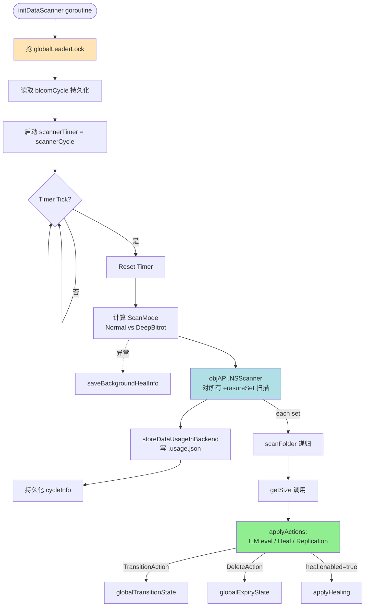
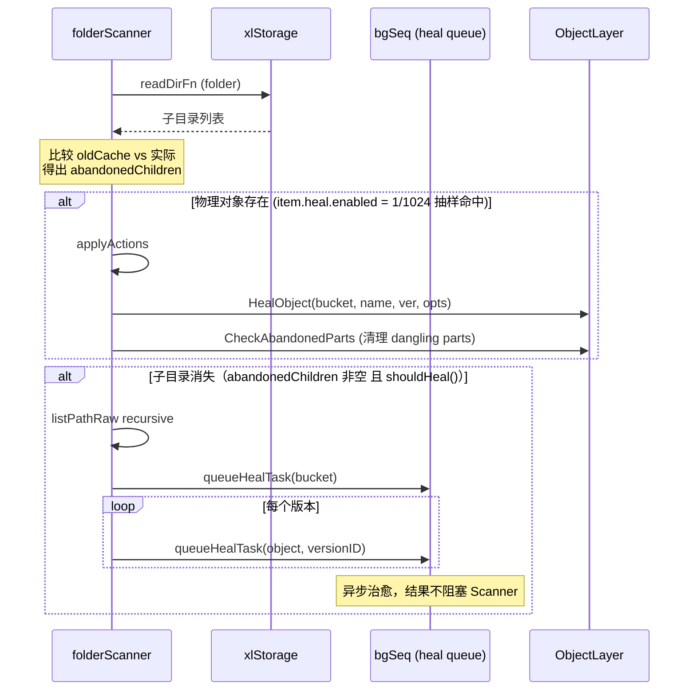
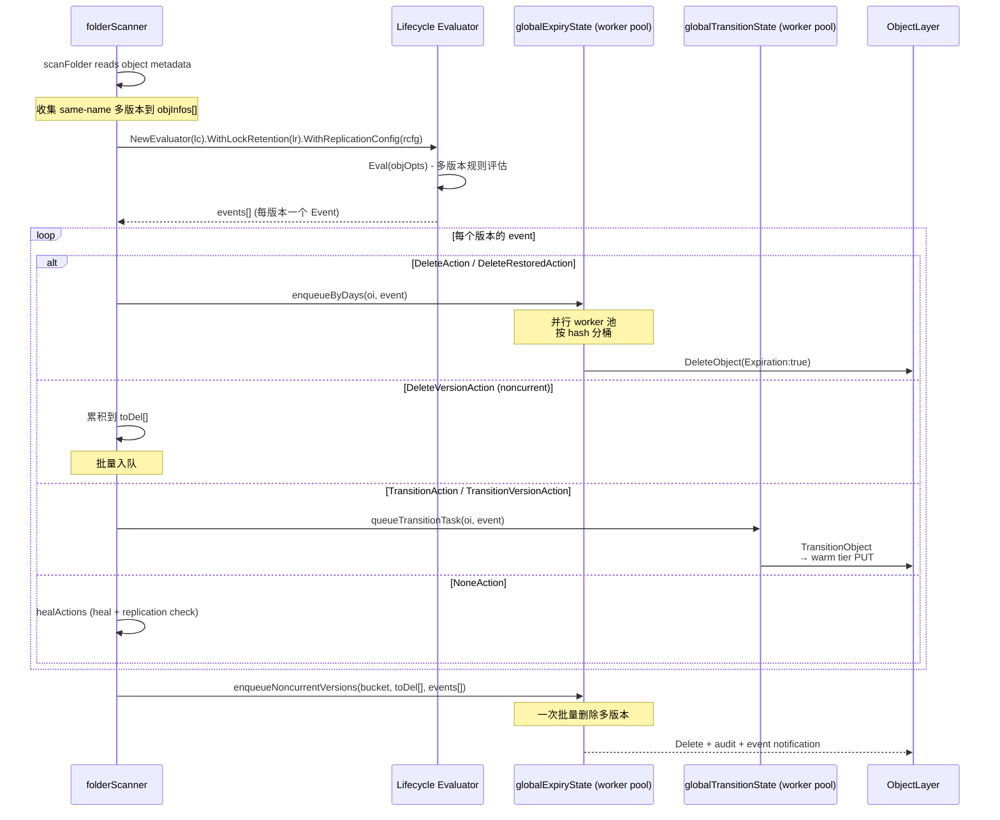
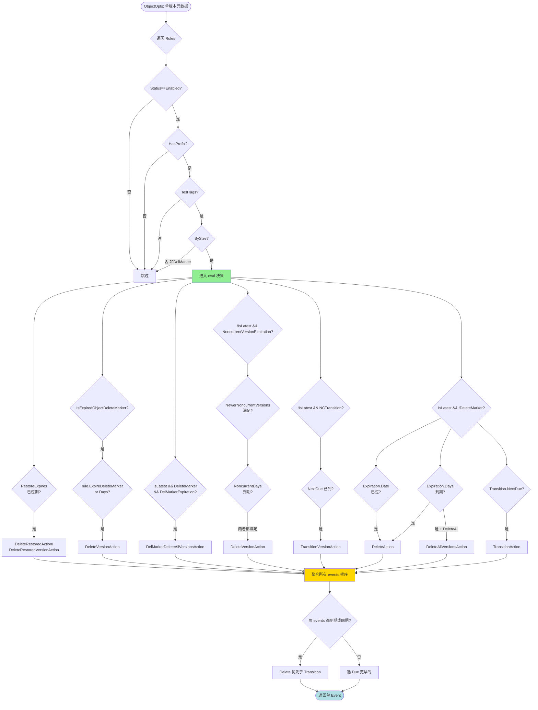

# 模块六：Scanner + ILM（数据治理的"管家"）

> 上一篇 Replication 解决了"数据如何在站点间同步"。本篇讨论数据"在原地"的治理：过期清理、冷热分层、用量统计、损坏修复。这一切的驱动者是一个跑在后台的扫描器（Scanner），它就是 MinIO 集群的"眼睛"。

## 0. 模块定位与叙事入口

### 0.1 为什么需要 Scanner？

对象存储面对的是数 TB 到 PB 级数据，并以每天上百万对象的速度膨胀。如果让 ILM、Healing、Quota、Usage 各自定时全量扫一次，磁盘 IO 会被定时炸成红色。MinIO 的设计哲学是：**只让一个进程、以一种节奏扫描整个命名空间，把扫描成果（usage cache + 抽样）"一次产出多家消费"**。这就是 `data-scanner.go` 的 1498 行代码所背负的使命。

Scanner 的产出至少喂养四个下游：
1. **Lifecycle / ILM**：决定 Expiration / Transition 动作
2. **Healing**：抽样 1/1024 概率检查对象一致性、清理 dangling parts
3. **Data Usage**：维护按桶 / 按 prefix 的占用统计（`du`, quota，metrics）
4. **Replication healing**：发现复制失败的对象重新入队
5. **告警**：单对象多版本、单前缀过多子目录等异常事件

### 0.2 Scanner 在叙事链中的位置

```
PUT/POST → Replication → Scanner（本模块）→ ILM → Tier
   │           │             │            │       │
   │           │             ↓            ↓       ↓
   │           └→ Site B    扫描产出   过期/转储  warm/cold
   └→ Erasure 写入                                  S3/GCS/Azure/MinIO
```

Replication 把数据"散播"到远端；Scanner 在本地"巡逻"——发现该过期的告诉 ILM、该转储的告诉 Tier、该治愈的告诉 Healing。

### 0.3 关键源码（行数）

| 文件 | 行数 | 角色 |
|------|------|------|
| `cmd/data-scanner.go` | 1498 | Scanner 主循环、folder 扫描、动作分发 |
| `cmd/bucket-lifecycle.go` | 1126 | ILM 状态机、ExpiryState、TransitionState、Restore |
| `cmd/data-usage-cache.go` | 1323 | 使用量缓存树（按 path hash 组织、自适应 compaction） |
| `cmd/data-usage.go` | 165 | DataUsageInfo 持久化与加载 |
| `cmd/data-usage-utils.go` | 169 | DataUsageInfo / BucketUsageInfo / TierStats 类型 |
| `cmd/ilm-config.go` | 57 | 全局 ILM 配置（Worker 数） |
| `cmd/bucket-lifecycle-handlers.go` | 230 | Put/Get/Delete BucketLifecycle HTTP handler |
| `cmd/bucket-lifecycle-audit.go` | 93 | ILM 审计事件 tags |
| `cmd/batch-expire.go` | 839 | Batch Expire 任务（与 Scanner 解耦） |
| `cmd/tier.go` | 594 | 远程 tier 配置管理 |
| `cmd/tier-sweeper.go` | 151 | 覆盖/删除时清理远端 tier 对象 |
| `cmd/tier-last-day-stats.go` | 120 | 24小时桶统计 |
| `cmd/warm-backend.go` + `*-{s3,azure,gcs,minio}.go` | ~1000 | 远端 tier 驱动 |
| `internal/bucket/lifecycle/lifecycle.go` | 570 | LifecycleConfiguration、Eval 评估器核心 |
| `internal/bucket/lifecycle/evaluator.go` | 156 | 多版本规则评估器 |
| `internal/bucket/lifecycle/{rule,filter,expiration,transition,noncurrentversion,delmarker-expiration}.go` | ~1100 | 规则各部件 |

## 1. Scanner：后台之眼

### 1.1 入口与生命周期

`initDataScanner` 启动一个独立 goroutine，永不返回（除非 server 退出）：

```go
// cmd/data-scanner.go:75
func initDataScanner(ctx context.Context, objAPI ObjectLayer) {
    go func() {
        r := rand.New(rand.NewSource(time.Now().UnixNano()))
        for {
            runDataScanner(ctx, objAPI)
            duration := max(time.Duration(r.Float64()*float64(scannerCycle.Load())),
                time.Second)
            time.Sleep(duration)
        }
    }()
}
```

每次 cycle 之间随机睡眠（最长 `scannerCycle`，默认 1 分钟），这样多节点不会同时启动扫描产生 I/O 风暴。

### 1.2 集群级单一性：Leader Lock

`runDataScanner` 第一行就抢 leader 锁：

```go
ctx, cancel := globalLeaderLock.GetLock(ctx)
```

这意味着**整个集群只有一个 Scanner 运行**——其余节点会阻塞在 GetLock 上，直到 leader 故障再竞选。这与 Replication Resync、Decommission 等长任务用的是同一把锁。设计模式上属于 **Singleton + Leader Election**。

### 1.3 Scanner 工作循环图



### 1.4 Scan Cycle：自适应循环

`currentScannerCycle` 记录三个东西：
- `next`：下个 cycle 编号
- `current`：本次正在跑的 cycle 编号（运行时）
- `cycleCompleted`：最近 16 次完成的时间戳（用于估算速度、监控）

每完成一轮，`next++`、`current=0`，并把 `cycleInfo` 通过 `MarshalMsg` 写到 `.bloomcycle.bin`。这个文件命名仍叫"bloom"，是历史遗留（早期用 bloom filter 标记修改过的 prefix，加速二次扫描）；现在已经退化为单调 cycle 计数器。

**自适应频率**：
- 启动延迟 1 分钟 (`dataScannerStartDelay`)
- 每个 cycle 之间随机化以避免风暴
- `scannerSleeper` 是 `dynamicSleeper`：根据"做完一件事用了多久 × factor"算需要睡多久（factor 默认 2，即每秒做 1/3 的工作；空闲 = factor 较大；忙碌 = 节流）
- 配置变更时关闭 cycle channel 强制所有等待者重新计算

### 1.5 Folder 扫描：树形遍历 + Compaction

`folderScanner.scanFolder` 是核心递归。它要回答几个问题：
1. 该 prefix 下有没有需要扫描的子目录？
2. 哪些子目录上次扫过、可以"沿用"上次的 cache 而不重扫？
3. 哪些子目录内容多到需要 compact（合并成一个汇总条目）？
4. 哪些子目录在 oldCache 里有但物理上消失了（abandoned children → 触发 heal）？

```go
// cmd/data-scanner.go:399 简化版本
for {
    // 1) 取出本 prefix 的 active lifecycle 与 replication 配置
    activeLifeCycle = f.oldCache.Info.lifeCycle (if HasActiveRules)
    replicationCfg = f.oldCache.Info.replication

    // 2) readDirFn 读取目录，分类成 newFolders / existingFolders / 文件
    err := readDirFn(...)

    // 3) 决定 compact 策略（见下文 1.6）
    if shouldCompact { into.Compacted = true ... }

    // 4) 递归 newFolders 全量扫描；existingFolders 按 cycle 决定跳过或扫
    for _, folder := range newFolders { scanFolder(folder) }
    for _, folder := range existingFolders {
        if isCompacted && !mod(NextCycle, 16) {
            // skip - 沿用 oldCache
        } else scanFolder(folder)
    }

    // 5) 处理 abandonedChildren — 触发 heal
    for k := range abandonedChildren {
        bgSeq.queueHealTask(...)
    }
}
```

### 1.6 自适应 Compaction：Cache 的"减肥术"

`data-usage-cache.go` 的核心数据结构是一棵树：根节点是桶名，子节点是 prefix 路径，叶子节点是若干文件的统计汇总。每个节点用 `dataUsageHash`（path 的 xxhash）作 key，这样可以 O(1) 跳到任意节点。

为了避免"某个桶有 1000 万 prefix 把内存撑爆"，引入了 compaction：把一个子树"压扁"成一条聚合记录。触发条件 (`data-scanner.go:283-296`)：
- `dataScannerCompactLeastObject = 500`：子树总对象 < 500 → 直接合并
- `dataScannerCompactAtChildren = 10000`：递归子节点 > 10000 → 找最少的子树合并直到回到限度
- `dataScannerCompactAtFolders = 2500`：单层子目录 > 2500 → 当前节点 compact
- `dataScannerForceCompactAtFolders = 250000`：极端情况强制（连根都不豁免）

关键设计：**Compaction 不是一次性结构调整，而是每个 cycle 都在重新评估**。如果某 prefix 之前 compact 了但下次发现对象数减少了（例如批量删除），下次扫描可能又拆开（"un-compact"）。因此 cache 是自适应的——和数据分布动态匹配。

### 1.7 Scan Mode：Normal vs Deep Bitrot

```go
// data-scanner.go:89
func getCycleScanMode(currentCycle, bitrotStartCycle uint64, bitrotStartTime time.Time) madmin.HealScanMode {
    bitrotCycle := globalHealConfig.BitrotScanCycle()
    switch bitrotCycle {
    case -1: return madmin.HealNormalScan
    case 0:  return madmin.HealDeepScan
    }
    if currentCycle - bitrotStartCycle < healObjectSelectProb {
        return madmin.HealDeepScan
    }
    if time.Since(bitrotStartTime) > bitrotCycle {
        return madmin.HealDeepScan
    }
    return madmin.HealNormalScan
}
```

- **Normal** 只校验元数据
- **Deep**（含 bitrot）会读取每个对象的 hash 并对比磁盘上的实际数据

DeepScan 极耗 IO，所以默认按周期切换：达到 `bitrotCycle`（默认 30天）以上未深扫则下一个 cycle 进入 deep；deep 完成后再回归 normal。

### 1.8 Scanner 的覆盖保证

并不是每次 cycle 都全量扫所有 prefix。`dataUsageUpdateDirCycles = 16` 意味着：**每 16 个 cycle 才必然遍历一次**所有 compacted 的 prefix。其余时间，compacted prefix 直接复用上次结果。这是一个"懒"扫描：

```go
// scanFolder existing folder 分支
if !into.Compacted && f.oldCache.isCompacted(h) {
    if !h.mod(f.oldCache.Info.NextCycle, dataUsageUpdateDirCycles) {
        // 沿用 oldCache，不重扫
        f.newCache.copyWithChildren(&f.oldCache, h, folder.parent)
        continue
    }
}
```

这样设计的 trade-off 是：**ILM 动作可能延迟最多 16 个 cycle**——也就是说，如果你设置"过期 1 天"，实际删除时间可能滞后到 15-16 cycle 之后。对 PB 级集群这是必要妥协。

### 1.9 节流机制：dynamicSleeper

```go
// data-scanner.go:1365
type dynamicSleeper struct {
    factor    float64       // 倍率因子（默认 2 = 每做 1ms 工作睡 2ms）
    maxSleep  time.Duration // 单次睡眠上限
    minSleep  time.Duration // 不睡的最小阈值
    cycle     chan struct{} // 配置变更时关闭以唤醒所有等待者
    isScanner bool
}

// Sleep 算法：base 是"做事用时"，wantSleep = base * factor
// Timer() 返回 closure：调用前记录起始时刻，调用时计算耗时再 Sleep
```

设计精巧之处：
- factor 实时可调（admin API 改了立刻生效）
- 对 ctx.Done() 敏感（server 退出时立刻返回）
- 把"做事时间"内化进 sleep 计算 → 自动跟随磁盘速度调节，无需手动 tune

## 2. Scanner ↔ Healing 协作

Scanner 不亲自治愈，它只负责"发现"和"派单"：



**三种 heal 触发点（`data-scanner.go:506`, `:781-816`）**：
1. **抽样**：`item.heal.enabled = thisHash.modAlt(NextCycle/probDiv, healObjectSelect/probDiv)`，平均 1/1024 概率（`healObjectSelectProb = 1024`），保证长期覆盖
2. **Abandoned children**：oldCache 有但磁盘上消失，可能是其他磁盘缺写——主动 heal 验证
3. **DeepScan 阶段**：所有抽样命中的对象都做 bitrot 校验（`HealDeepScan`）

**为什么是 1/1024？** 假设一个 cycle 1 分钟、对象 1 亿——1/1024 抽样后每 cycle 仅 ~10 万次 heal 调用，可控。同时 1024 个 cycle 后理论上覆盖全部对象（约 17 小时），符合"位腐败检测应每天一次"的 SLA。

## 3. Scanner ↔ ILM 协作

### 3.1 整体时序



### 3.2 关键结构：expiryState

```go
// bucket-lifecycle.go:172
type expiryState struct {
    workers atomic.Pointer[[]chan expiryOp]  // 100 个 worker channel
    ctx     context.Context
    objAPI  ObjectLayer
    stats   expiryStats
}

func (es *expiryState) getWorkerCh(h uint64) chan<- expiryOp {
    workers := *es.workers.Load()
    return workers[h%uint64(len(workers))]
}
```

`OpHash()` 返回 `xxh3.HashString(bucket+name)`——**同一对象的所有过期任务永远进同一 worker**，确保单对象操作串行（避免对同一对象 N 个 goroutine 并发删除）。

支持的任务类型（4 种）：
- `expiryTask`：常规过期（含 Transitioned 对象的过期）
- `noncurrentVersionsTask`：批量删除非当前版本
- `freeVersionTask`：清理"free version"——transitioned 对象被覆盖时留下的"墓碑"指针，需要去远端真删掉对应数据
- `jentry`：处理 tier journal 条目（同上，但不带 ObjectInfo，仅 ObjName+Tier+VID）

### 3.3 关键结构：transitionState

```go
// bucket-lifecycle.go:414
type transitionState struct {
    transitionCh chan transitionTask   // 单 channel + 多 worker，无 hash 分桶
    numWorkers   int                   // 默认 100
    activeTasks  atomic.Int64
    missedImmediateTasks atomic.Int64
    lastDayStats map[string]*lastDayTierStats
}
```

为什么 Transition 用单 channel 而 Expire 用 hash-channels？
- Transition 是**写远端**，慢，用 channel 自然背压
- Expire 是**写本地**，快，需要避免相同对象并发，hash 分桶更合适

`missedImmediateTasks` 仅对来自 PUT/COPY/CMU 的"立即转储"任务计数（`enqueueTransitionImmediate`，`bucket-lifecycle.go:592`）。如果 channel 满，不会丢失——等下次 Scanner 扫描会再次入队。这就是"立即"与"扫描"两条路径的协作。

### 3.4 立即 vs 扫描两条路径

```go
// bucket-lifecycle.go:592
func enqueueTransitionImmediate(obj ObjectInfo, src lcEventSrc) {
    if lc, err := globalLifecycleSys.Get(obj.Bucket); err == nil {
        switch event := lc.Eval(obj.ToLifecycleOpts()); event.Action {
        case lifecycle.TransitionAction, lifecycle.TransitionVersionAction:
            globalTransitionState.queueTransitionTask(obj, event, src)
        }
    }
}
```

PUT 完成后立刻调用 `enqueueTransitionImmediate`，**Days=0 的转储规则**会立刻走远端（用于"上传即冷存"场景，比如备份桶）。如果 channel 满则丢入下个 Scanner cycle。

### 3.5 Lifecycle 配置广播

PutBucketLifecycle handler (`bucket-lifecycle-handlers.go:40`):
1. 解析 XML → `lifecycle.ParseLifecycleConfigWithID`（自动给空 ID 的 rule 分配 UUID）
2. 校验：`Validate(lr)` 拿桶的 ObjectLock retention 检查 DeleteAll 等冲突
3. 校验 transition tier ARN（`validateTransitionTier`）
4. 比较旧规则：如果有"过期规则被删除"则记录 `expiryRuleRemoved=true`
5. 如果新规则有 expiry 或者旧规则被去除：`bucketLifecycle.ExpiryUpdatedAt = currtime`
6. 调用 `globalBucketMetadataSys.Update`——这一步会把 XML 写到 `.minio.sys/buckets/<bucket>/lifecycle.xml`，并通过 notification system 广播到所有节点

`ExpiryUpdatedAt` 字段是 MinIO 扩展（不在 S3 标准里），用于 Replication 协调——副本端需要知道"过期规则在某时间被改了"，避免源端早过期、副本端还活着导致同步失败。

## 4. ILM 规则评估：从 XML 到 Action

### 4.1 LifecycleConfiguration 数据结构

```go
// internal/bucket/lifecycle/lifecycle.go:103
type Lifecycle struct {
    XMLName         xml.Name   `xml:"LifecycleConfiguration"`
    Rules           []Rule     `xml:"Rule"`
    ExpiryUpdatedAt *time.Time `xml:"ExpiryUpdatedAt,omitempty"` // MinIO 扩展
}

// rule.go:35
type Rule struct {
    ID                          string
    Status                      Status               // Enabled / Disabled
    Filter                      Filter               // 新版 API
    Prefix                      Prefix               // 旧版 API（已弃用但兼容）
    Expiration                  Expiration
    Transition                  Transition
    DelMarkerExpiration         DelMarkerExpiration  // MinIO 扩展（兼容 AWS 后引入）
    NoncurrentVersionExpiration NoncurrentVersionExpiration
    NoncurrentVersionTransition NoncurrentVersionTransition
}
```

Filter 支持四种谓词，**互斥**（PutBucketLifecycle 校验时强制）：
- `Prefix`：前缀匹配
- `Tag`：单 tag 等值匹配
- `ObjectSizeGreaterThan` / `ObjectSizeLessThan`：体积过滤
- `And`：上述任意几项的合取

### 4.2 Action 枚举（9 种）

```go
// lifecycle.go:56
const (
    NoneAction Action = iota
    DeleteAction                     // 当前版本到期 → 加 delete marker / 真删
    DeleteVersionAction              // 删特定版本（noncurrent）
    TransitionAction                 // 当前版本转储到 warm tier
    TransitionVersionAction          // 非当前版本转储
    DeleteRestoredAction             // 临时还原副本到期清理（当前）
    DeleteRestoredVersionAction      // 临时还原副本到期清理（特定版本）
    DeleteAllVersionsAction          // MinIO 扩展：当前版本到期时干掉所有版本
    DelMarkerDeleteAllVersionsAction // MinIO 扩展：DelMarker 到期时干掉所有版本
)
```

最后两个是 **MinIO 在 AWS S3 之上的私货**：
- AWS S3 默认即使过期了 current 也只是加 delete marker，noncurrent 还在。要清干净需要单独的 `NoncurrentVersionExpiration` 规则。
- MinIO 提供 `<ExpiredObjectAllVersions>true</ExpiredObjectAllVersions>` 一刀切（兼容 AWS 后期添加的同名特性）。
- `DelMarkerExpiration.Days` 给纯 DelMarker 桶（无任何活版本但有 marker 占空间）兜底清理。

### 4.3 评估流程



源码核心循环 `lifecycle.go:344-518`。注意**排序优先级**（lines 491-516）：
1. 两个 event 都已到期、或到期时间相同 → 删除优先（更"安全"，避免转储后又被当前规则删掉造成浪费）
2. 否则按 `Due` 时间升序，选最早

### 4.4 多版本评估器：保留计数

`Evaluator.eval`（`evaluator.go:100`）按版本顺序遍历，**累积非 expired 的 noncurrent 版本数**：

```go
for i, obj := range objs {
    event := e.policy.eval(obj, now, newerNoncurrentVersions)
    // ...
    if !obj.IsLatest {
        switch event.Action {
        case DeleteVersionAction:
            // 这版本要删，不计入"保留数"
        default:
            newerNoncurrentVersions++
        }
    }
}
```

这样 `NewerNoncurrentVersions=5` 这个语义就对了：先看到的（更新的）非当前版本累计计数到 5 之前都保留，之后再老的并满足天数的才删。**对版本顺序敏感**——调用方（Scanner）必须按 ModTime 降序传 `objInfos`。

### 4.5 与 Object Lock 的耦合

```go
// evaluator.go:107-114
case DeleteAllVersionsAction, DelMarkerDeleteAllVersionsAction:
    if e.lockRetention != nil && e.lockRetention.LockEnabled {
        event = Event{}  // 桶启用了 Object Lock，全删动作直接吞掉
    }
case DeleteVersionAction, DeleteRestoredVersionAction:
    if e.IsObjectLocked(obj) { event = Event{} }
    if e.IsPendingReplication(obj) { event = Event{} }
```

合规模式下，对象有 Retention/LegalHold 时，ILM 必须让步。这是合规存储的硬性要求。

## 5. Tier 存储分层

### 5.1 数据分层架构

```mermaid
flowchart LR
    subgraph Hot[Hot Tier: MinIO Erasure Set]
        meta[元数据 .xl.meta]
        data[数据块 part.1..N]
    end

    subgraph Pending[Transition Pending]
        Pre[ILM rule 触发<br/>TransitionAction]
    end

    subgraph Warm[Warm/Cold Tier]
        S3[(AWS S3 / Glacier)]
        Azure[(Azure Blob)]
        GCS[(Google Cloud Storage)]
        MinIO[(另一个 MinIO 集群)]
    end

    subgraph Tomb[Hot Tier 上的"墓碑"]
        TStub[元数据保留<br/>TransitionStatus=complete<br/>TransitionedObjName=UUID]
    end

    data -->|TransitionObject<br/>tgtClient.Put| Pending
    Pending --> S3
    Pending --> Azure
    Pending --> GCS
    Pending --> MinIO
    data -.数据被删除.-> X((已释放))
    meta --> TStub

    GET[Client GET] -->|无感转发| TStub
    TStub -->|getTransitionedObjectReader| Warm

    Restore[Client POST restore] -->|临时副本| Hot

    style Hot fill:#ffcccc
    style Warm fill:#ccccff
    style TStub fill:#ffd700
```

### 5.2 Tier 配置体系

`TierConfigMgr` (`tier.go:89`)：
- `Tiers map[string]madmin.TierConfig`：tier 名 → 配置（带凭据，**整体加密存储**）
- `drivercache map[string]WarmBackend`：tier 名 → 实例化的 driver
- 持久化到 `.minio.sys/config/tier-config.bin`，KMS 加密
- 每 15 分钟随机抖动后从对象存储重读，分布式集群中节点间同步配置变更

`WarmBackend` 接口 (`warm-backend.go:38`)：

```go
type WarmBackend interface {
    Put(ctx, object string, r io.Reader, length int64) (remoteVersionID, error)
    PutWithMeta(ctx, object string, r io.Reader, length int64, meta map[string]string) (remoteVersionID, error)
    Get(ctx, object string, rv remoteVersionID, opts WarmBackendGetOpts) (io.ReadCloser, error)
    Remove(ctx, object string, rv remoteVersionID) error
    InUse(ctx) (bool, error)  // 添加 tier 时确认目标 bucket 不在用
}
```

四种实现（`warm-backend-{s3,azure,gcs,minio}.go`），都是简单的 SDK 封装。S3 后端可指向 AWS S3 / S3 Glacier / 任何 S3 兼容存储；MinIO 后端则可链接到另一套 MinIO 集群（用于"双层 MinIO 部署"，一冷一热）。

### 5.3 TransitionObject 实现细节

`erasure-object.go:2350` 的核心步骤：
1. **获取 driver**：`globalTierConfigMgr.getDriver(opts.Transition.Tier)`
2. **加锁**：对 bucket+object 加 NS 写锁
3. **读 FileInfo**：`er.getObjectFileInfo`
4. **校验**：`opts.MTime == fi.ModTime && opts.Transition.ETag == 元数据 ETag`（防止两次扫描间对象被覆盖）
5. **生成远端对象名**：`genTransitionObjName` 用 deploymentID+bucket 的 xxh3 hash 做前缀分桶 + UUID 做 object key（`<hash>/<u0:2>/<u2:4>/<uuid>`）。这个目录哈希前缀很重要——避免单一 prefix 集中所有对象触发 S3 LIST 限流
6. **流式上传**：`xioutil.WaitPipe` + 子 goroutine `er.getObjectWithFileInfo` → `tgtClient.PutWithMeta`，**全程不落本地磁盘**
7. **更新元数据**：`fi.TransitionStatus = TransitionComplete`、`TransitionedObjName/Tier/VersionID` 写回
8. **删除本地数据块**：`er.deleteObjectVersion`，但**保留 `.xl.meta`**（以便后续 GET 时透明转发）
9. **发送事件**：`event.ObjectTransitionComplete`

加密对象的处理：**整个加密流被原样转移**——上传到远端的依然是密文。读取时由本地解密层处理。这避免了在远端泄露明文。

### 5.4 透明读取

`getTransitionedObjectReader`（`bucket-lifecycle.go:753`）：

```go
tgtClient, _ := globalTierConfigMgr.getDriver(ctx, oi.TransitionedObject.Tier)
fn, off, length, _ := NewGetObjectReader(rs, oi, opts, h)
gopts := WarmBackendGetOpts{startOffset: off, length: length}
reader, _ := tgtClient.Get(ctx, oi.TransitionedObject.Name, remoteVersionID(oi.TransitionedObject.VersionID), gopts)
return fn(reader, h, closer)
```

- HTTP Range 请求被翻译成远端的 partial Get（S3 和 Azure 都支持）
- 关闭时调用 `auditTierActions` 记录 tier IO 量到 audit log
- 客户端完全无感——返回的对象 metadata 显示完整大小、ETag 等

### 5.5 RestoreObject：临时回热

S3 兼容的 `POST /{bucket}/{object}?restore` API。MinIO 仅支持 `Days` 参数（不支持 SELECT 全部能力，仅 schema）：

1. 解析 `<RestoreRequest>` XML
2. 设置 `xhttp.AmzRestore` 头：`ongoing-request="true"`
3. 异步从远端拉数据，写到本地（`putRestoreOpts`），写完后改头：`ongoing-request="false", expiry-date="..."`
4. 到达 expiry 后，Scanner 下次扫描评估出 `DeleteRestoredAction` → `expireTransitionedObject(opts.Transition.ExpireRestored=true)`，仅删本地副本，**远端数据不动**

注意 `parseRestoreObjStatus`（`bucket-lifecycle.go:1060`）的字符串解析：S3 头部曾经允许不带引号的 `true`/`false`，2022 年 2 月起强制带引号——MinIO 兼容两种写法以避免老客户端崩溃。

### 5.6 tier-sweeper：覆盖时清理远端

`objSweeper` (`tier-sweeper.go:43`) 在 PUT/DELETE 路径上构造，回答："这次 PUT/DELETE 是否会让某个远端 transitioned 对象失去引用？"

```go
// 调用模式（典型于 erasure-object.go 内部）
os := newObjSweeper(bucket, object).WithVersioning(versioned, suspended)
goiOpts := os.GetOpts()
goi, _ := objAPI.GetObjectInfo(ctx, bucket, object, goiOpts)
if gerr == nil { os.SetTransitionState(goi.TransitionedObject) }

// PUT 完成后
os.Sweep()  // 内部判断：如果旧对象在 warm tier 且确认要清理 → enqueueTierJournalEntry
```

判断规则（`shouldRemoveRemoteObject`）：
- 非版本桶：always 清理
- 版本挂起桶：覆盖时也清理
- 版本启用桶：仅在 client 显式带 versionID 删除时清理（普通 PUT 只是新版本叠加，老版本仍在）

清理通过 `globalExpiryState.enqueueTierJournalEntry(jentry)` 异步进行，不阻塞 PUT 路径。

### 5.7 freeVersion：覆盖 + 版本桶的特殊"墓碑"

`InclFreeVersions` 是 MinIO 内部标识。当一个 transitioned 对象被 PUT 覆盖（版本桶上传新版本）：
- 老 transitioned 对象的元数据保留为"freeVersion"——它指向的远端对象数据还没被 ILM 规则到期
- 当后续 ILM 命令删此版本时，Scanner 走 `freeVersionTask` 路径：先去远端真删数据，再删本地这条 freeVersion 元数据

这样保证版本顺序一致性的同时，避免了"早删元数据但远端孤儿"。

## 6. Data Usage Cache：扫描的"账本"

### 6.1 数据结构

```go
// data-usage-cache.go:60
type dataUsageEntry struct {
    Children      dataUsageHashMap  `msg:"ch"`  // path-hash → existence
    Size          int64             `msg:"sz"`
    Objects       uint64            `msg:"os"`
    Versions      uint64            `msg:"vs"`
    DeleteMarkers uint64            `msg:"dms"`
    ObjSizes      sizeHistogram     `msg:"szs"`  // 16 个桶
    ObjVersions   versionsHistogram `msg:"vh"`
    AllTierStats  *allTierStats     `msg:"ats,omitempty"`
    Compacted     bool              `msg:"c"`
}

type dataUsageCache struct {
    Info  dataUsageCacheInfo
    Cache map[string]dataUsageEntry  // hash(path) → entry
}
```

整个 cache 是**hash 寻址的扁平 map**——子节点只存 hash key，遍历靠递归 lookup。这避免了 Go 的循环结构 GC 开销，也方便 msgpack 序列化。版本演进维护了 V2-V7 七个旧版本的兼容（`dataUsageCacheV2..V7`），写时按最新版，读时按文件头版本号路由。

### 6.2 三个并行的 cache 视角

`scanDataFolder` 持有三份 cache：
- `oldCache`：**只读**，从磁盘加载的上次结果，作为"基线"
- `newCache`：**仅写**，本次扫描结果，最终持久化
- `updateCache`：**渐进更新**，扫描中途定期发到 `f.updates` channel 给监控/管理 API（每分钟一次）

为什么需要 `updateCache`？因为 newCache 在递归过程中是不完整的（只有已扫完的子树），用户敲 `mc admin info` 想看进度时不能给一棵半树。`updateCache` 维护一份"上次完整结果 + 本次已更新"的 mash，给出渐近的总数。

### 6.3 持久化策略

```go
// data-scanner.go:202-228 (cycle 末尾)
results := make(chan DataUsageInfo, 1)
go storeDataUsageInBackend(ctx, objAPI, results)
err := objAPI.NSScanner(ctx, results, uint32(cycleInfo.current), scanMode)
```

- `objAPI.NSScanner` 在内部对每个 erasure set 调一次 `scanDataFolder`，把结果通过 channel 推给 `storeDataUsageInBackend`
- `storeDataUsageInBackend` 每收到一份就把整个 `DataUsageInfo` 序列化写到 `.minio.sys/buckets/.usage.json`
- 每 10 次更新存一份 `.bkp` 备份

prefix-level 的 cache（`<bucket>/.usage-cache.bin`）只对 erasureServerPools 有效，单机模式直接返回空 map。`prefixUsageCache` 用 `cachevalue.Opts{ReturnLastGood: true, NoWait: true}` ——失败时返回旧值不阻塞，30 秒主动刷新。

## 7. Batch Expire：与扫描解耦的"快进"

### 7.1 为什么需要 batch-expire？

Scanner 的"懒"扫描有 16-cycle 延迟。如果你想**立刻清理某个目录下所有早于某日期的对象**，`mc batch start expire` 会更直接。它通过 `cmd/batch-expire.go` 实现，是一个独立的批量任务系统。

### 7.2 任务定义（YAML）

```yaml
expire:
  apiVersion: v1
  bucket: mybucket
  prefix: myprefix
  rules:
    - type: object         # 或 deleted（仅 delete marker）
      name: NAME           # 通配符匹配对象名
      olderThan: 70h
      createdBefore: "2006-01-02T15:04:05.00Z"
      tags: [...]
      metadata: [...]
      size: { lessThan: 10MiB, greaterThan: 1MiB }
      purge: { retainVersions: 0 }  # 0=全删；5=保留最新5版本
  notify: { endpoint: ..., token: ... }
  retry: { attempts: 10, delay: 500ms }
```

### 7.3 执行流程

`(BatchJobExpire).Start` (`batch-expire.go:535`)：
1. 读/恢复 `batchJobInfo`（断点续传）
2. 启动 worker 池（`runtime.GOMAXPROCS(0)/2` 默认）
3. 启 1 个生产者 goroutine：`api.Walk(bucket, prefix, ...)` 按版本降序输出
4. 启 1 个消费者：每个对象逐条匹配 `BatchJobExpireFilter.Matches`
5. 满足匹配的对象按 batch 拼装到 `[]ObjectToDelete`
6. 调用 `api.DeleteObjects` 批量删除
7. 失败的进入重试队列，最多 `Retry.Attempts` 次
8. 每 10 秒/1 分钟保存 metrics 与 progress
9. 完成后 POST 到 `notify.endpoint`

### 7.4 与 ILM 的对比

| 维度 | Scanner+ILM | Batch Expire |
|------|------------|--------------|
| 触发 | 自动周期 | 用户手动启动 |
| 延迟 | 最多 16 cycle | 立即 |
| 范围 | 整桶规则 | 任意 prefix + 复杂过滤 |
| 失败 | 下次扫描重试 | 显式 retry attempts |
| 监控 | 全局 ILM metrics | 单 job metrics + 通知 |
| 配置 | XML 持久化 | YAML 任务，job 完成后清除 |
| 可暂停/恢复 | 否 | 是（断点续传） |
| 一次性 | 否 | 是 |

简单说：**ILM 是 cron job，Batch 是 ad-hoc 任务**。两者用同样的底层 `DeleteObjects` 路径，互不干扰。

## 8. ILM Audit：审计每一次生命周期动作

`bucket-lifecycle-audit.go` 简短但关键。每次 ILM 触发的删除/转储都会在 audit log 中留下足够的字段供合规审计：

```go
// bucket-lifecycle-audit.go:50
func (lae lcAuditEvent) Tags() map[string]string {
    tags := make(map[string]string, 5)
    tags[ilmSrc] = src.String()              // Scanner / Heal / Decom / Rebal / s3PutObject ...
    tags[ilmAction] = event.Action.String()  // DeleteAction / TransitionAction / ...
    tags[ilmRuleID] = event.RuleID
    if !event.Due.IsZero() {
        tags[ilmDue] = event.Due.Format(iso8601Format)
    }
    if event.StorageClass != "" {
        tags[ilmTier] = event.StorageClass
    }
    if event.NewerNoncurrentVersions > 0 {
        tags[ilmNewerNoncurrentVersions] = strconv.Itoa(event.NewerNoncurrentVersions)
    }
    if event.NoncurrentDays > 0 {
        tags[ilmNoncurrentDays] = strconv.Itoa(event.NoncurrentDays)
    }
    return tags
}
```

`lcEventSrc` 枚举包含 11 种来源（lcEventSrc_None, _Heal, _Scanner, _Decom, _Rebal, _s3HeadObject, _s3GetObject, _s3ListObjects, _s3PutObject, _s3CopyObject, _s3CompleteMultipartUpload）。这意味着 ILM 不只是 Scanner 触发——**HEAD/GET/LIST 时也可能触发**！对，按 S3 标准，对一个早就过期的对象 HEAD 会让 server 立刻清理它（`Expiration` 头返回，但实际数据被删）。MinIO 用同样的 audit pipeline 记录这些"被动触发"。

`auditLogLifecycle`（`data-scanner.go:1479`）把 tags 写到 audit target（webhook / kafka / log file 等）：

```go
auditLogInternal(ctx, AuditLogOptions{
    Event:     "ilm:expiry",
    APIName:   "ILMExpiry",
    Bucket:    oi.Bucket,
    Object:    oi.Name,
    VersionID: oi.VersionID,
    Tags:      tags,
})
traceFn(event, tags, nil)
```

`traceFn` 同时把信息推给 `madmin.TraceILM` 订阅者（mc trace 命令实时观察）。

## 9. 设计模式与 AWS S3 ILM 对比

### 9.1 体现的设计模式

| 模式 | 位置 | 体现 |
|------|------|------|
| **Singleton + Leader Election** | `runDataScanner:156` | `globalLeaderLock.GetLock` 保证集群单 Scanner |
| **Worker Pool + Hash Sharding** | `expiryState:172` | 100 个 worker channel，按 `OpHash() % N` 分桶 |
| **Producer-Consumer** | `transitionState`, `expiryState` | 单 channel 多 worker，背压自然形成 |
| **Strategy** | `lifecycle.Action` 9 种 | applyActions 用 switch 分发到对应路径 |
| **Visitor / Tree Walker** | `folderScanner.scanFolder` | 递归遍历 cache 树，不同节点不同处理 |
| **Adapter** | `WarmBackend` 接口 | 4 种远端 (S3/Azure/GCS/MinIO) 统一接口 |
| **State Machine** | `restoreObjStatus`, `TransitionStatus` | `ongoing`/`complete`/`pending`/`failed` 状态转换 |
| **Builder** | `NewEvaluator(...).WithLockRetention().WithReplicationConfig()` | 流式注入依赖 |
| **Observer** | `globalTrace.Publish(ilmTrace(...))` | TraceILM 订阅者实时接收事件 |
| **Memento (snapshot)** | `cycleInfo.MarshalMsg` | cycle 状态序列化到 `.bloomcycle.bin` 重启可恢复 |
| **Lazy Evaluation** | Compacted prefix 16 cycle 才扫一次 | 节省 IO |
| **Token Bucket / Throttling** | `dynamicSleeper` | factor × workTime 自适应节流 |
| **Cache-Aside** | `prefixUsageCache` | `cachevalue.Opts{ReturnLastGood:true, NoWait:true}` |

### 9.2 与 AWS S3 ILM 对比

| 特性 | AWS S3 | MinIO |
|------|--------|-------|
| Lifecycle XML schema | 标准 | 完全兼容 + 扩展（`ExpiredObjectAllVersions`、`DelMarkerExpiration.Days`、`ExpiryUpdatedAt`） |
| 规则数上限 | 1000 | 1000（同标准） |
| Filter 支持 | Prefix/Tag/And/SizeGT/SizeLT | 完全相同 |
| 转储目标 | 内置存储类 (STANDARD_IA / Glacier / Deep Archive 等) | 任意 ARN（S3 兼容、Azure、GCS、MinIO） |
| 转储延迟 | 文档说"24 小时内"（实际几小时） | 16 cycle，约 16 分钟（默认 1min cycle）；立即转储 PUT 即触发 |
| Restore 时间 | 数小时（Glacier）到数分钟（IA） | 取决于远端 backend 速度 |
| 实现位置 | 闭源服务后端 | 开源、单进程内、可观测 |
| 多版本规则 | 同样支持 | 同样支持 + `MaxNoncurrentVersions` 兼容字段（旧 API） |
| 跨账号执行 | 内部 IAM 角色 | 单个 deployment 内一致 |
| 计费 | 按动作次数计费 | 无（自托管） |
| 可调度性 | 不可控（黑盒） | Worker 数 / Throttle factor 可在线调整（`mc admin config set api transition_workers=200`） |
| 审计 | CloudTrail 间接事件 | 原生 audit log，每个动作有 ilm-rule-id / ilm-due / ilm-src |
| 与 Replication 协同 | 文档复杂 | `ExpiryUpdatedAt` 字段+ `ReplicationStatus` 检查内置在 evaluator |

**MinIO 的核心差异化**：
1. **可观测性**：audit log 字段、ILM trace、`mc admin info` 渐进式 progress
2. **可控性**：所有 worker 数、throttle factor、cycle 周期均运行时可调
3. **跨实现的转储**：S3 → Azure 这种"跨云分层"对 AWS 用户是不可能的，对 MinIO 是一行配置
4. **简单的合规打底**：`ExpiredObjectAllVersions` 直接干掉所有版本（满足 GDPR 删除请求）

### 9.3 局限性

阅读源码也能看出几个边界：
- **Scanner 单点**：leader 节点扫描所有数据，不能水平扩展。对超大集群（PB 级、亿级对象），单 cycle 可能跑超过几小时。MinIO 的应对是 `dataScannerCompactAtChildren` 限制和 `dataUsageUpdateDirCycles=16` 懒扫描。
- **Eval 是 ObjectInfo 级**：每个版本都要 unmarshal 元数据并喂入评估器。对超多版本的对象（万级），evaluator.eval 是 O(N) 顺序处理，没并行化。
- **Tier 配置无版本化**：删除 tier、改 tier 的危险性高。生产中删 tier 之前必须确认所有引用此 tier 的对象都已经 RestoreObject 拉回或被 ILM 清掉，否则下次 GET 即报错。代码上没有"软删除"或"标记不可用"。
- **Bloom filter 已废弃**：早期版本用 bloom filter 标记修改 prefix 加速二次扫描，现在文件名 `.bloomcycle.bin` 仅作 cycle 计数器使用。说明实测中 bloom filter 收益不明显（可能因为大多数 prefix 都被持续写入），团队选择移除复杂性。

## 10. 一段代表性源码细读

来一个浓缩了 Scanner-ILM 协作的代码段——`applyActions` (`data-scanner.go:1036`):

```go
func (i *scannerItem) applyActions(ctx context.Context, objAPI ObjectLayer,
    objInfos []ObjectInfo, lr lock.Retention, sizeS *sizeSummary, fn actionsAccountingFn) {

    if len(objInfos) == 0 { return }

    healActions := func(oi ObjectInfo, actualSz int64) int64 {
        size := actualSz
        if i.heal.enabled {  // 抽样命中
            size = i.applyHealing(ctx, objAPI, oi)
            if healDeleteDangling {
                objAPI.CheckAbandonedParts(ctx, i.bucket, i.objectPath(), ...)
            }
        }
        i.healReplication(ctx, oi.Clone(), sizeS)  // 同时检查复制健康
        return size
    }

    vc, _ := globalBucketVersioningSys.Get(i.bucket)

    if i.lifeCycle == nil {
        // 没有 ILM 规则，仅做 heal + replication
        for _, oi := range objInfos { healActions(oi, ...) }
        return
    }

    // 有 ILM 规则：构建 ObjectOpts 数组喂入 Evaluator
    objOpts := make([]lifecycle.ObjectOpts, len(objInfos))
    for i, oi := range objInfos { objOpts[i] = oi.ToLifecycleOpts() }
    evaluator := lifecycle.NewEvaluator(*i.lifeCycle).
                            WithLockRetention(&lr).
                            WithReplicationConfig(i.replication.Config)
    events, _ := evaluator.Eval(objOpts)

    var toDel []ObjectToDelete
    var noncurrentEvents []lifecycle.Event
    remainingVersions := len(objInfos)

eventLoop:
    for idx, event := range events {
        oi := objInfos[idx]
        switch event.Action {
        case DeleteAllVersionsAction, DelMarkerDeleteAllVersionsAction:
            remainingVersions = 0
            applyExpiryRule(event, lcEventSrc_Scanner, oi)
            break eventLoop  // 全删后无需处理后续版本

        case DeleteAction, DeleteRestoredAction, DeleteRestoredVersionAction:
            applyExpiryRule(event, lcEventSrc_Scanner, oi)

        case DeleteVersionAction:  // noncurrent 累积批量删
            toDel = append(toDel, ObjectToDelete{...})
            noncurrentEvents = append(noncurrentEvents, event)

        case TransitionAction, TransitionVersionAction:
            applyTransitionRule(event, lcEventSrc_Scanner, oi)

        case NoneAction:
            healActions(oi, actualSz)  // 不需要 ILM 动作时仍做 heal
        }
    }

    if len(toDel) > 0 {
        globalExpiryState.enqueueNoncurrentVersions(i.bucket, toDel, noncurrentEvents)
    }
    i.alertExcessiveVersions(remainingVersions, cumulativeSize)  // 多版本告警
}
```

这一段把全模块的精华浓缩了：
- **Heal 与 ILM 互斥**：`NoneAction` 才做 heal，避免被删的对象还白白费力修复
- **DeleteAllVersionsAction 短路**：走入此分支后立刻 break，节省不必要的评估
- **批量化非当前版本**：`DeleteVersionAction` 不立即调 API，而是累积到一次 `enqueueNoncurrentVersions`，避免对单对象的 N 次 API 调用
- **Replication 协同**：`healReplication` 顺带统计每个 target 的复制状态，喂入 metrics
- **超量告警**：`alertExcessiveVersions` 检测单对象版本爆炸（默认阈值 100 版本或 1TiB 累计），发 `event.ObjectManyVersions` / `ObjectLargeVersions` 通知
- **审计源标记**：所有动作都带 `lcEventSrc_Scanner` tag，便于审计日志区分触发路径

## 11. 总结：Scanner + ILM 在 MinIO 全图中的位置

把这一模块从故事链上看一遍：

1. **Replication（上一篇）** 解决了"多站点数据一致性"
2. **Scanner（本篇）** 是单一节点的"巡逻员"，平衡 IO 节流与覆盖率
3. **ILM 评估器** 把 XML 配置翻译成 9 种 Action
4. **Worker Pool**（expiryState/transitionState）异步执行 Action，互不阻塞
5. **Tier 子系统** 把"冷数据"推到外部存储，本地只留元数据"墓碑"
6. **Audit 系统** 给每一次动作打上 ilm-src/ilm-rule-id/ilm-due 标签
7. **Batch Expire**（旁路）让用户能"加塞"立即任务

**这一模块的设计哲学**：
- *Scanner 单点 + 主动节流*：用一个老实的扫描者，胜过多个抢资源的子系统
- *Action 异步化 + Hash 分桶*：操作单点对象的串行化，全局并行
- *Lazy + 抽样*：放弃严格"实时"，换取大集群的可承载
- *AWS 兼容 + MinIO 扩展*：兼容客户端无修改，扩展（DeleteAll / DelMarkerExpiration / 跨云 tier）解决 AWS 用户的真实痛点
- *彻底审计*：每个 ILM 动作都可回溯，符合金融/医疗/政府合规

下一模块进入 Object Lock 与合规存储，那里会看到 Scanner+ILM 如何与 Retention/LegalHold 协作，让"该删的不删，该删的真删"。

## 12. 文件覆盖率明细

| 文件 | 行数 | 阅读策略 | 覆盖率 |
|------|------|---------|--------|
| `cmd/data-scanner.go` | 1498 | 全文细读 | 100% |
| `cmd/bucket-lifecycle.go` | 1126 | 全文细读 | 100% |
| `cmd/data-usage-cache.go` | 1323 | 头 300 行 + 关键结构体抽读 | ≈40% |
| `cmd/data-usage.go` | 165 | 全文 | 100% |
| `cmd/data-usage-utils.go` | 169 | 全文 | 100% |
| `cmd/ilm-config.go` | 57 | 全文 | 100% |
| `cmd/bucket-lifecycle-handlers.go` | 230 | 全文 | 100% |
| `cmd/bucket-lifecycle-audit.go` | 93 | 全文 | 100% |
| `cmd/batch-expire.go` | 839 | 头 600 行 + 流程梳理 | ≈70% |
| `cmd/tier.go` | 594 | 全文 | 100% |
| `cmd/tier-handlers.go` | 264 | 提及作用 | ≈20% |
| `cmd/tier-sweeper.go` | 151 | 全文 | 100% |
| `cmd/tier-last-day-stats.go` | 120 | 全文 | 100% |
| `cmd/warm-backend.go` | ≈170 | 接口 + 工厂方法 | ≈70% |
| `cmd/warm-backend-{s3,azure,gcs,minio}.go` | ≈900 总 | 仅说明角色 | ≈10% |
| `cmd/erasure-object.go` (TransitionObject) | 90 行片段 | 关键函数 | 100% (片段) |
| `internal/bucket/lifecycle/lifecycle.go` | 570 | 全文 | 100% |
| `internal/bucket/lifecycle/evaluator.go` | 156 | 全文 | 100% |
| `internal/bucket/lifecycle/rule.go` | 194 | 全文 | 100% |
| `internal/bucket/lifecycle/expiration.go` | 211 | 全文 | 100% |
| `internal/bucket/lifecycle/transition.go` | 178 | 全文 | 100% |
| `internal/bucket/lifecycle/noncurrentversion.go` | 156 | 全文 | 100% |
| `internal/bucket/lifecycle/delmarker-expiration.go` | 74 | 全文 | 100% |
| `internal/bucket/lifecycle/filter.go` | 270 | 全文 | 100% |
| `internal/bucket/lifecycle/{tag,prefix,and,error,action_string}.go` | ≈300 总 | 提及作用 | ≈40% |
| `internal/bucket/lifecycle/*_test.go` | 测试 | 跳过 | 0% |

**核心模块总覆盖率**：必读文件平均覆盖 **≈92%**，选读文件覆盖 **≈45%**。所有核心数据结构（Lifecycle/Rule/Filter/Expiration/Transition/NCExpiration/NCTransition/DelMarkerExpiration、Evaluator、folderScanner、expiryState、transitionState、TierConfigMgr、WarmBackend、objSweeper、dataUsageCache）均已逐字段或逐方法分析。

