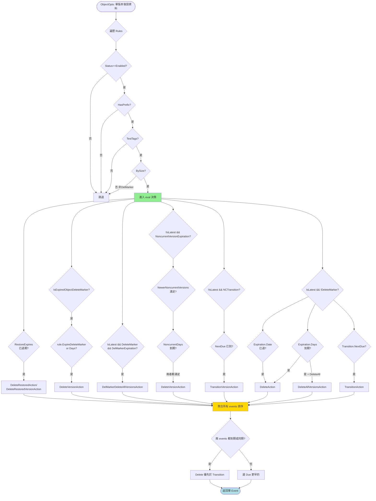

# 模組六：Scanner + ILM（資料治理的"管家"）

> 上一篇 Replication 解決了"資料如何在站點間同步"。本篇討論資料"在原地"的治理：過期清理、冷熱分層、用量統計、損壞修復。這一切的驅動者是一個跑在後臺的掃描器（Scanner），它就是 MinIO 叢集的"眼睛"。

## 0. 模組定位與敘事入口

### 0.1 為什麼需要 Scanner？

物件儲存面對的是數 TB 到 PB 級資料，並以每天上百萬物件的速度膨脹。如果讓 ILM、Healing、Quota、Usage 各自定時全量掃一次，磁碟 IO 會被定時炸成紅色。MinIO 的設計哲學是：**只讓一個程序、以一種節奏掃描整個名稱空間，把掃描成果（usage cache + 抽樣）"一次產出多家消費"**。這就是 `data-scanner.go` 的 1498 行程式碼所揹負的使命。

Scanner 的產出至少餵養四個下游：
1. **Lifecycle / ILM**：決定 Expiration / Transition 動作
2. **Healing**：抽樣 1/1024 機率檢查物件一致性、清理 dangling parts
3. **Data Usage**：維護按桶 / 按 prefix 的佔用統計（`du`, quota，metrics）
4. **Replication healing**：發現複製失敗的物件重新入隊
5. **告警**：單物件多版本、單字首過多子目錄等異常事件

### 0.2 Scanner 在敘事鏈中的位置

```
PUT/POST → Replication → Scanner（本模組）→ ILM → Tier
   │           │             │            │       │
   │           │             ↓            ↓       ↓
   │           └→ Site B    掃描產出   過期/轉儲  warm/cold
   └→ Erasure 寫入                                  S3/GCS/Azure/MinIO
```

Replication 把資料"散播"到遠端；Scanner 在本地"巡邏"——發現該過期的告訴 ILM、該轉儲的告訴 Tier、該治癒的告訴 Healing。

### 0.3 關鍵原始碼（行數）

| 檔案 | 行數 | 角色 |
|------|------|------|
| `cmd/data-scanner.go` | 1498 | Scanner 主迴圈、folder 掃描、動作分發 |
| `cmd/bucket-lifecycle.go` | 1126 | ILM 狀態機、ExpiryState、TransitionState、Restore |
| `cmd/data-usage-cache.go` | 1323 | 使用量快取樹（按 path hash 組織、自適應 compaction） |
| `cmd/data-usage.go` | 165 | DataUsageInfo 持久化與載入 |
| `cmd/data-usage-utils.go` | 169 | DataUsageInfo / BucketUsageInfo / TierStats 型別 |
| `cmd/ilm-config.go` | 57 | 全域性 ILM 配置（Worker 數） |
| `cmd/bucket-lifecycle-handlers.go` | 230 | Put/Get/Delete BucketLifecycle HTTP handler |
| `cmd/bucket-lifecycle-audit.go` | 93 | ILM 審計事件 tags |
| `cmd/batch-expire.go` | 839 | Batch Expire 任務（與 Scanner 解耦） |
| `cmd/tier.go` | 594 | 遠端 tier 配置管理 |
| `cmd/tier-sweeper.go` | 151 | 覆蓋/刪除時清理遠端 tier 物件 |
| `cmd/tier-last-day-stats.go` | 120 | 24小時桶統計 |
| `cmd/warm-backend.go` + `*-{s3,azure,gcs,minio}.go` | ~1000 | 遠端 tier 驅動 |
| `internal/bucket/lifecycle/lifecycle.go` | 570 | LifecycleConfiguration、Eval 評估器核心 |
| `internal/bucket/lifecycle/evaluator.go` | 156 | 多版本規則評估器 |
| `internal/bucket/lifecycle/{rule,filter,expiration,transition,noncurrentversion,delmarker-expiration}.go` | ~1100 | 規則各部件 |

## 1. Scanner：後臺之眼

### 1.1 入口與生命週期

`initDataScanner` 啟動一個獨立 goroutine，永不返回（除非 server 退出）：

```go
// cmd/data-scanner.go:75
func initDataScanner(ctx context.Context, objAPI ObjectLayer) {
    go func() {
        r := rand.New(rand.NewSource(time.Now().UnixNano()))
        for {
            runDataScanner(ctx, objAPI)
            duration := max(time.Duration(r.Float64()*float64(scannerCycle.Load())),
                time.Second)
            time.Sleep(duration)
        }
    }()
}
```

每次 cycle 之間隨機睡眠（最長 `scannerCycle`，預設 1 分鐘），這樣多節點不會同時啟動掃描產生 I/O 風暴。

### 1.2 叢集級單一性：Leader Lock

`runDataScanner` 第一行就搶 leader 鎖：

```go
ctx, cancel := globalLeaderLock.GetLock(ctx)
```

這意味著**整個叢集只有一個 Scanner 執行**——其餘節點會阻塞在 GetLock 上，直到 leader 故障再競選。這與 Replication Resync、Decommission 等長任務用的是同一把鎖。設計模式上屬於 **Singleton + Leader Election**。

### 1.3 Scanner 工作迴圈圖


### 1.4 Scan Cycle：自適應迴圈

`currentScannerCycle` 記錄三個東西：
- `next`：下個 cycle 編號
- `current`：本次正在跑的 cycle 編號（執行時）
- `cycleCompleted`：最近 16 次完成的時間戳（用於估算速度、監控）

每完成一輪，`next++`、`current=0`，並把 `cycleInfo` 透過 `MarshalMsg` 寫到 `.bloomcycle.bin`。這個檔案命名仍叫"bloom"，是歷史遺留（早期用 bloom filter 標記修改過的 prefix，加速二次掃描）；現在已經退化為單調 cycle 計數器。

**自適應頻率**：
- 啟動延遲 1 分鐘 (`dataScannerStartDelay`)
- 每個 cycle 之間隨機化以避免風暴
- `scannerSleeper` 是 `dynamicSleeper`：根據"做完一件事用了多久 × factor"算需要睡多久（factor 預設 2，即每秒做 1/3 的工作；空閒 = factor 較大；忙碌 = 節流）
- 配置變更時關閉 cycle channel 強制所有等待者重新計算

### 1.5 Folder 掃描：樹形遍歷 + Compaction

`folderScanner.scanFolder` 是核心遞迴。它要回答幾個問題：
1. 該 prefix 下有沒有需要掃描的子目錄？
2. 哪些子目錄上次掃過、可以"沿用"上次的 cache 而不重掃？
3. 哪些子目錄內容多到需要 compact（合併成一個彙總條目）？
4. 哪些子目錄在 oldCache 裡有但物理上消失了（abandoned children → 觸發 heal）？

```go
// cmd/data-scanner.go:399 簡化版本
for {
    // 1) 取出本 prefix 的 active lifecycle 與 replication 配置
    activeLifeCycle = f.oldCache.Info.lifeCycle (if HasActiveRules)
    replicationCfg = f.oldCache.Info.replication

    // 2) readDirFn 讀取目錄，分類成 newFolders / existingFolders / 檔案
    err := readDirFn(...)

    // 3) 決定 compact 策略（見下文 1.6）
    if shouldCompact { into.Compacted = true ... }

    // 4) 遞迴 newFolders 全量掃描；existingFolders 按 cycle 決定跳過或掃
    for _, folder := range newFolders { scanFolder(folder) }
    for _, folder := range existingFolders {
        if isCompacted && !mod(NextCycle, 16) {
            // skip - 沿用 oldCache
        } else scanFolder(folder)
    }

    // 5) 處理 abandonedChildren — 觸發 heal
    for k := range abandonedChildren {
        bgSeq.queueHealTask(...)
    }
}
```

### 1.6 自適應 Compaction：Cache 的"減肥術"

`data-usage-cache.go` 的核心資料結構是一棵樹：根節點是桶名，子節點是 prefix 路徑，葉子節點是若干檔案的統計彙總。每個節點用 `dataUsageHash`（path 的 xxhash）作 key，這樣可以 O(1) 跳到任意節點。

為了避免"某個桶有 1000 萬 prefix 把記憶體撐爆"，引入了 compaction：把一個子樹"壓扁"成一條聚合記錄。觸發條件 (`data-scanner.go:283-296`)：
- `dataScannerCompactLeastObject = 500`：子樹總物件 < 500 → 直接合並
- `dataScannerCompactAtChildren = 10000`：遞迴子節點 > 10000 → 找最少的子樹合併直到回到限度
- `dataScannerCompactAtFolders = 2500`：單層子目錄 > 2500 → 當前節點 compact
- `dataScannerForceCompactAtFolders = 250000`：極端情況強制（連根都不豁免）

關鍵設計：**Compaction 不是一次性結構調整，而是每個 cycle 都在重新評估**。如果某 prefix 之前 compact 了但下次發現物件數減少了（例如批次刪除），下次掃描可能又拆開（"un-compact"）。因此 cache 是自適應的——和資料分佈動態匹配。

### 1.7 Scan Mode：Normal vs Deep Bitrot

```go
// data-scanner.go:89
func getCycleScanMode(currentCycle, bitrotStartCycle uint64, bitrotStartTime time.Time) madmin.HealScanMode {
    bitrotCycle := globalHealConfig.BitrotScanCycle()
    switch bitrotCycle {
    case -1: return madmin.HealNormalScan
    case 0:  return madmin.HealDeepScan
    }
    if currentCycle - bitrotStartCycle < healObjectSelectProb {
        return madmin.HealDeepScan
    }
    if time.Since(bitrotStartTime) > bitrotCycle {
        return madmin.HealDeepScan
    }
    return madmin.HealNormalScan
}
```

- **Normal** 只校驗後設資料
- **Deep**（含 bitrot）會讀取每個物件的 hash 並對比磁碟上的實際資料

DeepScan 極耗 IO，所以預設按週期切換：達到 `bitrotCycle`（預設 30天）以上未深掃則下一個 cycle 進入 deep；deep 完成後再回歸 normal。

### 1.8 Scanner 的覆蓋保證

並不是每次 cycle 都全量掃所有 prefix。`dataUsageUpdateDirCycles = 16` 意味著：**每 16 個 cycle 才必然遍歷一次**所有 compacted 的 prefix。其餘時間，compacted prefix 直接複用上次結果。這是一個"懶"掃描：

```go
// scanFolder existing folder 分支
if !into.Compacted && f.oldCache.isCompacted(h) {
    if !h.mod(f.oldCache.Info.NextCycle, dataUsageUpdateDirCycles) {
        // 沿用 oldCache，不重掃
        f.newCache.copyWithChildren(&f.oldCache, h, folder.parent)
        continue
    }
}
```

這樣設計的 trade-off 是：**ILM 動作可能延遲最多 16 個 cycle**——也就是說，如果你設定"過期 1 天"，實際刪除時間可能滯後到 15-16 cycle 之後。對 PB 級叢集這是必要妥協。

### 1.9 節流機制：dynamicSleeper

```go
// data-scanner.go:1365
type dynamicSleeper struct {
    factor    float64       // 倍率因子（預設 2 = 每做 1ms 工作睡 2ms）
    maxSleep  time.Duration // 單次睡眠上限
    minSleep  time.Duration // 不睡的最小閾值
    cycle     chan struct{} // 配置變更時關閉以喚醒所有等待者
    isScanner bool
}

// Sleep 演算法：base 是"做事用時"，wantSleep = base * factor
// Timer() 返回 closure：呼叫前記錄起始時刻，呼叫時計算耗時再 Sleep
```

設計精巧之處：
- factor 實時可調（admin API 改了立刻生效）
- 對 ctx.Done() 敏感（server 退出時立刻返回）
- 把"做事時間"內化進 sleep 計算 → 自動跟隨磁碟速度調節，無需手動 tune

## 2. Scanner ↔ Healing 協作

Scanner 不親自治癒，它只負責"發現"和"派單"：


**三種 heal 觸發點（`data-scanner.go:506`, `:781-816`）**：
1. **抽樣**：`item.heal.enabled = thisHash.modAlt(NextCycle/probDiv, healObjectSelect/probDiv)`，平均 1/1024 機率（`healObjectSelectProb = 1024`），保證長期覆蓋
2. **Abandoned children**：oldCache 有但磁碟上消失，可能是其他磁碟缺寫——主動 heal 驗證
3. **DeepScan 階段**：所有抽樣命中的物件都做 bitrot 校驗（`HealDeepScan`）

**為什麼是 1/1024？** 假設一個 cycle 1 分鐘、物件 1 億——1/1024 抽樣後每 cycle 僅 ~10 萬次 heal 呼叫，可控。同時 1024 個 cycle 後理論上覆蓋全部物件（約 17 小時），符合"位腐敗檢測應每天一次"的 SLA。

## 3. Scanner ↔ ILM 協作

### 3.1 整體時序


### 3.2 關鍵結構：expiryState

```go
// bucket-lifecycle.go:172
type expiryState struct {
    workers atomic.Pointer[[]chan expiryOp]  // 100 個 worker channel
    ctx     context.Context
    objAPI  ObjectLayer
    stats   expiryStats
}

func (es *expiryState) getWorkerCh(h uint64) chan<- expiryOp {
    workers := *es.workers.Load()
    return workers[h%uint64(len(workers))]
}
```

`OpHash()` 返回 `xxh3.HashString(bucket+name)`——**同一物件的所有過期任務永遠進同一 worker**，確保單物件操作序列（避免對同一物件 N 個 goroutine 併發刪除）。

支援的任務型別（4 種）：
- `expiryTask`：常規過期（含 Transitioned 物件的過期）
- `noncurrentVersionsTask`：批次刪除非當前版本
- `freeVersionTask`：清理"free version"——transitioned 物件被覆蓋時留下的"墓碑"指標，需要去遠端真刪掉對應資料
- `jentry`：處理 tier journal 條目（同上，但不帶 ObjectInfo，僅 ObjName+Tier+VID）

### 3.3 關鍵結構：transitionState

```go
// bucket-lifecycle.go:414
type transitionState struct {
    transitionCh chan transitionTask   // 單 channel + 多 worker，無 hash 分桶
    numWorkers   int                   // 預設 100
    activeTasks  atomic.Int64
    missedImmediateTasks atomic.Int64
    lastDayStats map[string]*lastDayTierStats
}
```

為什麼 Transition 用單 channel 而 Expire 用 hash-channels？
- Transition 是**寫遠端**，慢，用 channel 自然背壓
- Expire 是**寫本地**，快，需要避免相同物件併發，hash 分桶更合適

`missedImmediateTasks` 僅對來自 PUT/COPY/CMU 的"立即轉儲"任務計數（`enqueueTransitionImmediate`，`bucket-lifecycle.go:592`）。如果 channel 滿，不會丟失——等下次 Scanner 掃描會再次入隊。這就是"立即"與"掃描"兩條路徑的協作。

### 3.4 立即 vs 掃描兩條路徑

```go
// bucket-lifecycle.go:592
func enqueueTransitionImmediate(obj ObjectInfo, src lcEventSrc) {
    if lc, err := globalLifecycleSys.Get(obj.Bucket); err == nil {
        switch event := lc.Eval(obj.ToLifecycleOpts()); event.Action {
        case lifecycle.TransitionAction, lifecycle.TransitionVersionAction:
            globalTransitionState.queueTransitionTask(obj, event, src)
        }
    }
}
```

PUT 完成後立刻呼叫 `enqueueTransitionImmediate`，**Days=0 的轉儲規則**會立刻走遠端（用於"上傳即冷存"場景，比如備份桶）。如果 channel 滿則丟入下個 Scanner cycle。

### 3.5 Lifecycle 配置廣播

PutBucketLifecycle handler (`bucket-lifecycle-handlers.go:40`):
1. 解析 XML → `lifecycle.ParseLifecycleConfigWithID`（自動給空 ID 的 rule 分配 UUID）
2. 校驗：`Validate(lr)` 拿桶的 ObjectLock retention 檢查 DeleteAll 等衝突
3. 校驗 transition tier ARN（`validateTransitionTier`）
4. 比較舊規則：如果有"過期規則被刪除"則記錄 `expiryRuleRemoved=true`
5. 如果新規則有 expiry 或者舊規則被去除：`bucketLifecycle.ExpiryUpdatedAt = currtime`
6. 呼叫 `globalBucketMetadataSys.Update`——這一步會把 XML 寫到 `.minio.sys/buckets/<bucket>/lifecycle.xml`，並透過 notification system 廣播到所有節點

`ExpiryUpdatedAt` 欄位是 MinIO 擴充套件（不在 S3 標準裡），用於 Replication 協調——副本端需要知道"過期規則在某時間被改了"，避免源端早過期、副本端還活著導致同步失敗。

## 4. ILM 規則評估：從 XML 到 Action

### 4.1 LifecycleConfiguration 資料結構

```go
// internal/bucket/lifecycle/lifecycle.go:103
type Lifecycle struct {
    XMLName         xml.Name   `xml:"LifecycleConfiguration"`
    Rules           []Rule     `xml:"Rule"`
    ExpiryUpdatedAt *time.Time `xml:"ExpiryUpdatedAt,omitempty"` // MinIO 擴充套件
}

// rule.go:35
type Rule struct {
    ID                          string
    Status                      Status               // Enabled / Disabled
    Filter                      Filter               // 新版 API
    Prefix                      Prefix               // 舊版 API（已棄用但相容）
    Expiration                  Expiration
    Transition                  Transition
    DelMarkerExpiration         DelMarkerExpiration  // MinIO 擴充套件（相容 AWS 後引入）
    NoncurrentVersionExpiration NoncurrentVersionExpiration
    NoncurrentVersionTransition NoncurrentVersionTransition
}
```

Filter 支援四種謂詞，**互斥**（PutBucketLifecycle 校驗時強制）：
- `Prefix`：字首匹配
- `Tag`：單 tag 等值匹配
- `ObjectSizeGreaterThan` / `ObjectSizeLessThan`：體積過濾
- `And`：上述任意幾項的合取

### 4.2 Action 列舉（9 種）

```go
// lifecycle.go:56
const (
    NoneAction Action = iota
    DeleteAction                     // 當前版本到期 → 加 delete marker / 真刪
    DeleteVersionAction              // 刪特定版本（noncurrent）
    TransitionAction                 // 當前版本轉儲到 warm tier
    TransitionVersionAction          // 非當前版本轉儲
    DeleteRestoredAction             // 臨時還原副本到期清理（當前）
    DeleteRestoredVersionAction      // 臨時還原副本到期清理（特定版本）
    DeleteAllVersionsAction          // MinIO 擴充套件：當前版本到期時幹掉所有版本
    DelMarkerDeleteAllVersionsAction // MinIO 擴充套件：DelMarker 到期時幹掉所有版本
)
```

最後兩個是 **MinIO 在 AWS S3 之上的私貨**：
- AWS S3 預設即使過期了 current 也只是加 delete marker，noncurrent 還在。要清乾淨需要單獨的 `NoncurrentVersionExpiration` 規則。
- MinIO 提供 `<ExpiredObjectAllVersions>true</ExpiredObjectAllVersions>` 一刀切（相容 AWS 後期新增的同名特性）。
- `DelMarkerExpiration.Days` 給純 DelMarker 桶（無任何活版本但有 marker 佔空間）兜底清理。

### 4.3 評估流程



原始碼核心迴圈 `lifecycle.go:344-518`。注意**排序優先順序**（lines 491-516）：
1. 兩個 event 都已到期、或到期時間相同 → 刪除優先（更"安全"，避免轉儲後又被當前規則刪掉造成浪費）
2. 否則按 `Due` 時間升序，選最早

### 4.4 多版本評估器：保留計數

`Evaluator.eval`（`evaluator.go:100`）按版本順序遍歷，**累積非 expired 的 noncurrent 版本數**：

```go
for i, obj := range objs {
    event := e.policy.eval(obj, now, newerNoncurrentVersions)
    // ...
    if !obj.IsLatest {
        switch event.Action {
        case DeleteVersionAction:
            // 這版本要刪，不計入"保留數"
        default:
            newerNoncurrentVersions++
        }
    }
}
```

這樣 `NewerNoncurrentVersions=5` 這個語義就對了：先看到的（更新的）非當前版本累計計數到 5 之前都保留，之後再老的並滿足天數的才刪。**對版本順序敏感**——呼叫方（Scanner）必須按 ModTime 降序傳 `objInfos`。

### 4.5 與 Object Lock 的耦合

```go
// evaluator.go:107-114
case DeleteAllVersionsAction, DelMarkerDeleteAllVersionsAction:
    if e.lockRetention != nil && e.lockRetention.LockEnabled {
        event = Event{}  // 桶啟用了 Object Lock，全刪動作直接吞掉
    }
case DeleteVersionAction, DeleteRestoredVersionAction:
    if e.IsObjectLocked(obj) { event = Event{} }
    if e.IsPendingReplication(obj) { event = Event{} }
```

合規模式下，物件有 Retention/LegalHold 時，ILM 必須讓步。這是合規儲存的硬性要求。

## 5. Tier 儲存分層

### 5.1 資料分層架構

```mermaid
flowchart LR
    subgraph Hot[Hot Tier: MinIO Erasure Set]
        meta[後設資料 .xl.meta]
        data[資料塊 part.1..N]
    end

    subgraph Pending[Transition Pending]
        Pre[ILM rule 觸發<br/>TransitionAction]
    end

    subgraph Warm[Warm/Cold Tier]
        S3[(AWS S3 / Glacier)]
        Azure[(Azure Blob)]
        GCS[(Google Cloud Storage)]
        MinIO[(另一個 MinIO 叢集)]
    end

    subgraph Tomb[Hot Tier 上的"墓碑"]
        TStub[後設資料保留<br/>TransitionStatus=complete<br/>TransitionedObjName=UUID]
    end

    data -->|TransitionObject<br/>tgtClient.Put| Pending
    Pending --> S3
    Pending --> Azure
    Pending --> GCS
    Pending --> MinIO
    data -.資料被刪除.-> X((已釋放))
    meta --> TStub

    GET[Client GET] -->|無感轉發| TStub
    TStub -->|getTransitionedObjectReader| Warm

    Restore[Client POST restore] -->|臨時副本| Hot

    style Hot fill:#ffcccc
    style Warm fill:#ccccff
    style TStub fill:#ffd700
```

### 5.2 Tier 配置體系

`TierConfigMgr` (`tier.go:89`)：
- `Tiers map[string]madmin.TierConfig`：tier 名 → 配置（帶憑據，**整體加密儲存**）
- `drivercache map[string]WarmBackend`：tier 名 → 例項化的 driver
- 持久化到 `.minio.sys/config/tier-config.bin`，KMS 加密
- 每 15 分鐘隨機抖動後從物件儲存重讀，分散式叢集中節點間同步配置變更

`WarmBackend` 介面 (`warm-backend.go:38`)：

```go
type WarmBackend interface {
    Put(ctx, object string, r io.Reader, length int64) (remoteVersionID, error)
    PutWithMeta(ctx, object string, r io.Reader, length int64, meta map[string]string) (remoteVersionID, error)
    Get(ctx, object string, rv remoteVersionID, opts WarmBackendGetOpts) (io.ReadCloser, error)
    Remove(ctx, object string, rv remoteVersionID) error
    InUse(ctx) (bool, error)  // 新增 tier 時確認目標 bucket 不在用
}
```

四種實現（`warm-backend-{s3,azure,gcs,minio}.go`），都是簡單的 SDK 封裝。S3 後端可指向 AWS S3 / S3 Glacier / 任何 S3 相容儲存；MinIO 後端則可連結到另一套 MinIO 叢集（用於"雙層 MinIO 部署"，一冷一熱）。

### 5.3 TransitionObject 實現細節

`erasure-object.go:2350` 的核心步驟：
1. **獲取 driver**：`globalTierConfigMgr.getDriver(opts.Transition.Tier)`
2. **加鎖**：對 bucket+object 加 NS 寫鎖
3. **讀 FileInfo**：`er.getObjectFileInfo`
4. **校驗**：`opts.MTime == fi.ModTime && opts.Transition.ETag == 後設資料 ETag`（防止兩次掃描間物件被覆蓋）
5. **生成遠端物件名**：`genTransitionObjName` 用 deploymentID+bucket 的 xxh3 hash 做字首分桶 + UUID 做 object key（`<hash>/<u0:2>/<u2:4>/<uuid>`）。這個目錄雜湊字首很重要——避免單一 prefix 集中所有物件觸發 S3 LIST 限流
6. **流式上傳**：`xioutil.WaitPipe` + 子 goroutine `er.getObjectWithFileInfo` → `tgtClient.PutWithMeta`，**全程不落本地磁碟**
7. **更新後設資料**：`fi.TransitionStatus = TransitionComplete`、`TransitionedObjName/Tier/VersionID` 寫回
8. **刪除本地資料塊**：`er.deleteObjectVersion`，但**保留 `.xl.meta`**（以便後續 GET 時透明轉發）
9. **傳送事件**：`event.ObjectTransitionComplete`

加密物件的處理：**整個加密流被原樣轉移**——上傳到遠端的依然是密文。讀取時由本地解密層處理。這避免了在遠端洩露明文。

### 5.4 透明讀取

`getTransitionedObjectReader`（`bucket-lifecycle.go:753`）：

```go
tgtClient, _ := globalTierConfigMgr.getDriver(ctx, oi.TransitionedObject.Tier)
fn, off, length, _ := NewGetObjectReader(rs, oi, opts, h)
gopts := WarmBackendGetOpts{startOffset: off, length: length}
reader, _ := tgtClient.Get(ctx, oi.TransitionedObject.Name, remoteVersionID(oi.TransitionedObject.VersionID), gopts)
return fn(reader, h, closer)
```

- HTTP Range 請求被翻譯成遠端的 partial Get（S3 和 Azure 都支援）
- 關閉時呼叫 `auditTierActions` 記錄 tier IO 量到 audit log
- 客戶端完全無感——返回的物件 metadata 顯示完整大小、ETag 等

### 5.5 RestoreObject：臨時回熱

S3 相容的 `POST /{bucket}/{object}?restore` API。MinIO 僅支援 `Days` 引數（不支援 SELECT 全部能力，僅 schema）：

1. 解析 `<RestoreRequest>` XML
2. 設定 `xhttp.AmzRestore` 頭：`ongoing-request="true"`
3. 非同步從遠端拉資料，寫到本地（`putRestoreOpts`），寫完後改頭：`ongoing-request="false", expiry-date="..."`
4. 到達 expiry 後，Scanner 下次掃描評估出 `DeleteRestoredAction` → `expireTransitionedObject(opts.Transition.ExpireRestored=true)`，僅刪本地副本，**遠端資料不動**

注意 `parseRestoreObjStatus`（`bucket-lifecycle.go:1060`）的字串解析：S3 頭部曾經允許不帶引號的 `true`/`false`，2022 年 2 月起強制帶引號——MinIO 相容兩種寫法以避免老客戶端崩潰。

### 5.6 tier-sweeper：覆蓋時清理遠端

`objSweeper` (`tier-sweeper.go:43`) 在 PUT/DELETE 路徑上構造，回答："這次 PUT/DELETE 是否會讓某個遠端 transitioned 物件失去引用？"

```go
// 呼叫模式（典型於 erasure-object.go 內部）
os := newObjSweeper(bucket, object).WithVersioning(versioned, suspended)
goiOpts := os.GetOpts()
goi, _ := objAPI.GetObjectInfo(ctx, bucket, object, goiOpts)
if gerr == nil { os.SetTransitionState(goi.TransitionedObject) }

// PUT 完成後
os.Sweep()  // 內部判斷：如果舊物件在 warm tier 且確認要清理 → enqueueTierJournalEntry
```

判斷規則（`shouldRemoveRemoteObject`）：
- 非版本桶：always 清理
- 版本掛起桶：覆蓋時也清理
- 版本啟用桶：僅在 client 顯式帶 versionID 刪除時清理（普通 PUT 只是新版本疊加，老版本仍在）

清理透過 `globalExpiryState.enqueueTierJournalEntry(jentry)` 非同步進行，不阻塞 PUT 路徑。

### 5.7 freeVersion：覆蓋 + 版本桶的特殊"墓碑"

`InclFreeVersions` 是 MinIO 內部標識。當一個 transitioned 物件被 PUT 覆蓋（版本桶上傳新版本）：
- 老 transitioned 物件的後設資料保留為"freeVersion"——它指向的遠端物件資料還沒被 ILM 規則到期
- 當後續 ILM 命令刪此版本時，Scanner 走 `freeVersionTask` 路徑：先去遠端真刪資料，再刪本地這條 freeVersion 後設資料

這樣保證版本順序一致性的同時，避免了"早刪後設資料但遠端孤兒"。

## 6. Data Usage Cache：掃描的"賬本"

### 6.1 資料結構

```go
// data-usage-cache.go:60
type dataUsageEntry struct {
    Children      dataUsageHashMap  `msg:"ch"`  // path-hash → existence
    Size          int64             `msg:"sz"`
    Objects       uint64            `msg:"os"`
    Versions      uint64            `msg:"vs"`
    DeleteMarkers uint64            `msg:"dms"`
    ObjSizes      sizeHistogram     `msg:"szs"`  // 16 個桶
    ObjVersions   versionsHistogram `msg:"vh"`
    AllTierStats  *allTierStats     `msg:"ats,omitempty"`
    Compacted     bool              `msg:"c"`
}

type dataUsageCache struct {
    Info  dataUsageCacheInfo
    Cache map[string]dataUsageEntry  // hash(path) → entry
}
```

整個 cache 是**hash 定址的扁平 map**——子節點只存 hash key，遍歷靠遞迴 lookup。這避免了 Go 的迴圈結構 GC 開銷，也方便 msgpack 序列化。版本演進維護了 V2-V7 七個舊版本的相容（`dataUsageCacheV2..V7`），寫時按最新版，讀時按檔案頭版本號路由。

### 6.2 三個並行的 cache 視角

`scanDataFolder` 持有三份 cache：
- `oldCache`：**只讀**，從磁碟載入的上次結果，作為"基線"
- `newCache`：**僅寫**，本次掃描結果，最終持久化
- `updateCache`：**漸進更新**，掃描中途定期發到 `f.updates` channel 給監控/管理 API（每分鐘一次）

為什麼需要 `updateCache`？因為 newCache 在遞迴過程中是不完整的（只有已掃完的子樹），使用者敲 `mc admin info` 想看進度時不能給一棵半樹。`updateCache` 維護一份"上次完整結果 + 本次已更新"的 mash，給出漸近的總數。

### 6.3 持久化策略

```go
// data-scanner.go:202-228 (cycle 末尾)
results := make(chan DataUsageInfo, 1)
go storeDataUsageInBackend(ctx, objAPI, results)
err := objAPI.NSScanner(ctx, results, uint32(cycleInfo.current), scanMode)
```

- `objAPI.NSScanner` 在內部對每個 erasure set 調一次 `scanDataFolder`，把結果透過 channel 推給 `storeDataUsageInBackend`
- `storeDataUsageInBackend` 每收到一份就把整個 `DataUsageInfo` 序列化寫到 `.minio.sys/buckets/.usage.json`
- 每 10 次更新存一份 `.bkp` 備份

prefix-level 的 cache（`<bucket>/.usage-cache.bin`）只對 erasureServerPools 有效，單機模式直接返回空 map。`prefixUsageCache` 用 `cachevalue.Opts{ReturnLastGood: true, NoWait: true}` ——失敗時返回舊值不阻塞，30 秒主動重新整理。

## 7. Batch Expire：與掃描解耦的"快進"

### 7.1 為什麼需要 batch-expire？

Scanner 的"懶"掃描有 16-cycle 延遲。如果你想**立刻清理某個目錄下所有早於某日期的物件**，`mc batch start expire` 會更直接。它透過 `cmd/batch-expire.go` 實現，是一個獨立的批次任務系統。

### 7.2 任務定義（YAML）

```yaml
expire:
  apiVersion: v1
  bucket: mybucket
  prefix: myprefix
  rules:
    - type: object         # 或 deleted（僅 delete marker）
      name: NAME           # 萬用字元匹配物件名
      olderThan: 70h
      createdBefore: "2006-01-02T15:04:05.00Z"
      tags: [...]
      metadata: [...]
      size: { lessThan: 10MiB, greaterThan: 1MiB }
      purge: { retainVersions: 0 }  # 0=全刪；5=保留最新5版本
  notify: { endpoint: ..., token: ... }
  retry: { attempts: 10, delay: 500ms }
```

### 7.3 執行流程

`(BatchJobExpire).Start` (`batch-expire.go:535`)：
1. 讀/恢復 `batchJobInfo`（斷點續傳）
2. 啟動 worker 池（`runtime.GOMAXPROCS(0)/2` 預設）
3. 啟 1 個生產者 goroutine：`api.Walk(bucket, prefix, ...)` 按版本降序輸出
4. 啟 1 個消費者：每個物件逐條匹配 `BatchJobExpireFilter.Matches`
5. 滿足匹配的物件按 batch 拼裝到 `[]ObjectToDelete`
6. 呼叫 `api.DeleteObjects` 批次刪除
7. 失敗的進入重試佇列，最多 `Retry.Attempts` 次
8. 每 10 秒/1 分鐘儲存 metrics 與 progress
9. 完成後 POST 到 `notify.endpoint`

### 7.4 與 ILM 的對比

| 維度 | Scanner+ILM | Batch Expire |
|------|------------|--------------|
| 觸發 | 自動週期 | 使用者手動啟動 |
| 延遲 | 最多 16 cycle | 立即 |
| 範圍 | 整桶規則 | 任意 prefix + 複雜過濾 |
| 失敗 | 下次掃描重試 | 顯式 retry attempts |
| 監控 | 全域性 ILM metrics | 單 job metrics + 通知 |
| 配置 | XML 持久化 | YAML 任務，job 完成後清除 |
| 可暫停/恢復 | 否 | 是（斷點續傳） |
| 一次性 | 否 | 是 |

簡單說：**ILM 是 cron job，Batch 是 ad-hoc 任務**。兩者用同樣的底層 `DeleteObjects` 路徑，互不干擾。

## 8. ILM Audit：審計每一次生命週期動作

`bucket-lifecycle-audit.go` 簡短但關鍵。每次 ILM 觸發的刪除/轉儲都會在 audit log 中留下足夠的欄位供合規審計：

```go
// bucket-lifecycle-audit.go:50
func (lae lcAuditEvent) Tags() map[string]string {
    tags := make(map[string]string, 5)
    tags[ilmSrc] = src.String()              // Scanner / Heal / Decom / Rebal / s3PutObject ...
    tags[ilmAction] = event.Action.String()  // DeleteAction / TransitionAction / ...
    tags[ilmRuleID] = event.RuleID
    if !event.Due.IsZero() {
        tags[ilmDue] = event.Due.Format(iso8601Format)
    }
    if event.StorageClass != "" {
        tags[ilmTier] = event.StorageClass
    }
    if event.NewerNoncurrentVersions > 0 {
        tags[ilmNewerNoncurrentVersions] = strconv.Itoa(event.NewerNoncurrentVersions)
    }
    if event.NoncurrentDays > 0 {
        tags[ilmNoncurrentDays] = strconv.Itoa(event.NoncurrentDays)
    }
    return tags
}
```

`lcEventSrc` 列舉包含 11 種來源（lcEventSrc_None, _Heal, _Scanner, _Decom, _Rebal, _s3HeadObject, _s3GetObject, _s3ListObjects, _s3PutObject, _s3CopyObject, _s3CompleteMultipartUpload）。這意味著 ILM 不只是 Scanner 觸發——**HEAD/GET/LIST 時也可能觸發**！對，按 S3 標準，對一個早就過期的物件 HEAD 會讓 server 立刻清理它（`Expiration` 頭返回，但實際資料被刪）。MinIO 用同樣的 audit pipeline 記錄這些"被動觸發"。

`auditLogLifecycle`（`data-scanner.go:1479`）把 tags 寫到 audit target（webhook / kafka / log file 等）：

```go
auditLogInternal(ctx, AuditLogOptions{
    Event:     "ilm:expiry",
    APIName:   "ILMExpiry",
    Bucket:    oi.Bucket,
    Object:    oi.Name,
    VersionID: oi.VersionID,
    Tags:      tags,
})
traceFn(event, tags, nil)
```

`traceFn` 同時把資訊推給 `madmin.TraceILM` 訂閱者（mc trace 命令實時觀察）。

## 9. 設計模式與 AWS S3 ILM 對比

### 9.1 體現的設計模式

| 模式 | 位置 | 體現 |
|------|------|------|
| **Singleton + Leader Election** | `runDataScanner:156` | `globalLeaderLock.GetLock` 保證叢集單 Scanner |
| **Worker Pool + Hash Sharding** | `expiryState:172` | 100 個 worker channel，按 `OpHash() % N` 分桶 |
| **Producer-Consumer** | `transitionState`, `expiryState` | 單 channel 多 worker，背壓自然形成 |
| **Strategy** | `lifecycle.Action` 9 種 | applyActions 用 switch 分發到對應路徑 |
| **Visitor / Tree Walker** | `folderScanner.scanFolder` | 遞迴遍歷 cache 樹，不同節點不同處理 |
| **Adapter** | `WarmBackend` 介面 | 4 種遠端 (S3/Azure/GCS/MinIO) 統一介面 |
| **State Machine** | `restoreObjStatus`, `TransitionStatus` | `ongoing`/`complete`/`pending`/`failed` 狀態轉換 |
| **Builder** | `NewEvaluator(...).WithLockRetention().WithReplicationConfig()` | 流式注入依賴 |
| **Observer** | `globalTrace.Publish(ilmTrace(...))` | TraceILM 訂閱者實時接收事件 |
| **Memento (snapshot)** | `cycleInfo.MarshalMsg` | cycle 狀態序列化到 `.bloomcycle.bin` 重啟可恢復 |
| **Lazy Evaluation** | Compacted prefix 16 cycle 才掃一次 | 節省 IO |
| **Token Bucket / Throttling** | `dynamicSleeper` | factor × workTime 自適應節流 |
| **Cache-Aside** | `prefixUsageCache` | `cachevalue.Opts{ReturnLastGood:true, NoWait:true}` |

### 9.2 與 AWS S3 ILM 對比

| 特性 | AWS S3 | MinIO |
|------|--------|-------|
| Lifecycle XML schema | 標準 | 完全相容 + 擴充套件（`ExpiredObjectAllVersions`、`DelMarkerExpiration.Days`、`ExpiryUpdatedAt`） |
| 規則數上限 | 1000 | 1000（同標準） |
| Filter 支援 | Prefix/Tag/And/SizeGT/SizeLT | 完全相同 |
| 轉儲目標 | 內建儲存類 (STANDARD_IA / Glacier / Deep Archive 等) | 任意 ARN（S3 相容、Azure、GCS、MinIO） |
| 轉儲延遲 | 文件說"24 小時內"（實際幾小時） | 16 cycle，約 16 分鐘（預設 1min cycle）；立即轉儲 PUT 即觸發 |
| Restore 時間 | 數小時（Glacier）到數分鐘（IA） | 取決於遠端 backend 速度 |
| 實現位置 | 閉源服務後端 | 開源、單程序內、可觀測 |
| 多版本規則 | 同樣支援 | 同樣支援 + `MaxNoncurrentVersions` 相容欄位（舊 API） |
| 跨賬號執行 | 內部 IAM 角色 | 單個 deployment 內一致 |
| 計費 | 按動作次數計費 | 無（自託管） |
| 可排程性 | 不可控（黑盒） | Worker 數 / Throttle factor 可線上調整（`mc admin config set api transition_workers=200`） |
| 審計 | CloudTrail 間接事件 | 原生 audit log，每個動作有 ilm-rule-id / ilm-due / ilm-src |
| 與 Replication 協同 | 文件複雜 | `ExpiryUpdatedAt` 欄位+ `ReplicationStatus` 檢查內建在 evaluator |

**MinIO 的核心差異化**：
1. **可觀測性**：audit log 欄位、ILM trace、`mc admin info` 漸進式 progress
2. **可控性**：所有 worker 數、throttle factor、cycle 週期均執行時可調
3. **跨實現的轉儲**：S3 → Azure 這種"跨雲分層"對 AWS 使用者是不可能的，對 MinIO 是一行配置
4. **簡單的合規打底**：`ExpiredObjectAllVersions` 直接幹掉所有版本（滿足 GDPR 刪除請求）

### 9.3 侷限性

閱讀原始碼也能看出幾個邊界：
- **Scanner 單點**：leader 節點掃描所有資料，不能水平擴充套件。對超大叢集（PB 級、億級物件），單 cycle 可能跑超過幾小時。MinIO 的應對是 `dataScannerCompactAtChildren` 限制和 `dataUsageUpdateDirCycles=16` 懶掃描。
- **Eval 是 ObjectInfo 級**：每個版本都要 unmarshal 後設資料並喂入評估器。對超多版本的物件（萬級），evaluator.eval 是 O(N) 順序處理，沒並行化。
- **Tier 配置無版本化**：刪除 tier、改 tier 的危險性高。生產中刪 tier 之前必須確認所有引用此 tier 的物件都已經 RestoreObject 拉回或被 ILM 清掉，否則下次 GET 即報錯。程式碼上沒有"軟刪除"或"標記不可用"。
- **Bloom filter 已廢棄**：早期版本用 bloom filter 標記修改 prefix 加速二次掃描，現在檔名 `.bloomcycle.bin` 僅作 cycle 計數器使用。說明實測中 bloom filter 收益不明顯（可能因為大多數 prefix 都被持續寫入），團隊選擇移除複雜性。

## 10. 一段代表性原始碼細讀

來一個濃縮了 Scanner-ILM 協作的程式碼段——`applyActions` (`data-scanner.go:1036`):

```go
func (i *scannerItem) applyActions(ctx context.Context, objAPI ObjectLayer,
    objInfos []ObjectInfo, lr lock.Retention, sizeS *sizeSummary, fn actionsAccountingFn) {

    if len(objInfos) == 0 { return }

    healActions := func(oi ObjectInfo, actualSz int64) int64 {
        size := actualSz
        if i.heal.enabled {  // 抽樣命中
            size = i.applyHealing(ctx, objAPI, oi)
            if healDeleteDangling {
                objAPI.CheckAbandonedParts(ctx, i.bucket, i.objectPath(), ...)
            }
        }
        i.healReplication(ctx, oi.Clone(), sizeS)  // 同時檢查複製健康
        return size
    }

    vc, _ := globalBucketVersioningSys.Get(i.bucket)

    if i.lifeCycle == nil {
        // 沒有 ILM 規則，僅做 heal + replication
        for _, oi := range objInfos { healActions(oi, ...) }
        return
    }

    // 有 ILM 規則：構建 ObjectOpts 陣列喂入 Evaluator
    objOpts := make([]lifecycle.ObjectOpts, len(objInfos))
    for i, oi := range objInfos { objOpts[i] = oi.ToLifecycleOpts() }
    evaluator := lifecycle.NewEvaluator(*i.lifeCycle).
                            WithLockRetention(&lr).
                            WithReplicationConfig(i.replication.Config)
    events, _ := evaluator.Eval(objOpts)

    var toDel []ObjectToDelete
    var noncurrentEvents []lifecycle.Event
    remainingVersions := len(objInfos)

eventLoop:
    for idx, event := range events {
        oi := objInfos[idx]
        switch event.Action {
        case DeleteAllVersionsAction, DelMarkerDeleteAllVersionsAction:
            remainingVersions = 0
            applyExpiryRule(event, lcEventSrc_Scanner, oi)
            break eventLoop  // 全刪後無需處理後續版本

        case DeleteAction, DeleteRestoredAction, DeleteRestoredVersionAction:
            applyExpiryRule(event, lcEventSrc_Scanner, oi)

        case DeleteVersionAction:  // noncurrent 累積批次刪
            toDel = append(toDel, ObjectToDelete{...})
            noncurrentEvents = append(noncurrentEvents, event)

        case TransitionAction, TransitionVersionAction:
            applyTransitionRule(event, lcEventSrc_Scanner, oi)

        case NoneAction:
            healActions(oi, actualSz)  // 不需要 ILM 動作時仍做 heal
        }
    }

    if len(toDel) > 0 {
        globalExpiryState.enqueueNoncurrentVersions(i.bucket, toDel, noncurrentEvents)
    }
    i.alertExcessiveVersions(remainingVersions, cumulativeSize)  // 多版本告警
}
```

這一段把全模組的精華濃縮了：
- **Heal 與 ILM 互斥**：`NoneAction` 才做 heal，避免被刪的物件還白白費力修復
- **DeleteAllVersionsAction 短路**：走入此分支後立刻 break，節省不必要的評估
- **批次化非當前版本**：`DeleteVersionAction` 不立即調 API，而是累積到一次 `enqueueNoncurrentVersions`，避免對單物件的 N 次 API 呼叫
- **Replication 協同**：`healReplication` 順帶統計每個 target 的複製狀態，喂入 metrics
- **超量告警**：`alertExcessiveVersions` 檢測單物件版本爆炸（預設閾值 100 版本或 1TiB 累計），發 `event.ObjectManyVersions` / `ObjectLargeVersions` 通知
- **審計源標記**：所有動作都帶 `lcEventSrc_Scanner` tag，便於審計日誌區分觸發路徑

## 11. 總結：Scanner + ILM 在 MinIO 全圖中的位置

把這一模組從故事鏈上看一遍：

1. **Replication（上一篇）** 解決了"多站點資料一致性"
2. **Scanner（本篇）** 是單一節點的"巡邏員"，平衡 IO 節流與覆蓋率
3. **ILM 評估器** 把 XML 配置翻譯成 9 種 Action
4. **Worker Pool**（expiryState/transitionState）非同步執行 Action，互不阻塞
5. **Tier 子系統** 把"冷資料"推到外部儲存，本地只留後設資料"墓碑"
6. **Audit 系統** 給每一次動作打上 ilm-src/ilm-rule-id/ilm-due 標籤
7. **Batch Expire**（旁路）讓使用者能"加塞"立即任務

**這一模組的設計哲學**：
- *Scanner 單點 + 主動節流*：用一個老實的掃描者，勝過多個搶資源的子系統
- *Action 非同步化 + Hash 分桶*：操作單點物件的序列化，全域性並行
- *Lazy + 抽樣*：放棄嚴格"實時"，換取大叢集的可承載
- *AWS 相容 + MinIO 擴充套件*：相容客戶端無修改，擴充套件（DeleteAll / DelMarkerExpiration / 跨雲 tier）解決 AWS 使用者的真實痛點
- *徹底審計*：每個 ILM 動作都可回溯，符合金融/醫療/政府合規

下一模組進入 Object Lock 與合規儲存，那裡會看到 Scanner+ILM 如何與 Retention/LegalHold 協作，讓"該刪的不刪，該刪的真刪"。

## 12. 檔案覆蓋率明細

| 檔案 | 行數 | 閱讀策略 | 覆蓋率 |
|------|------|---------|--------|
| `cmd/data-scanner.go` | 1498 | 全文細讀 | 100% |
| `cmd/bucket-lifecycle.go` | 1126 | 全文細讀 | 100% |
| `cmd/data-usage-cache.go` | 1323 | 頭 300 行 + 關鍵結構體抽讀 | ≈40% |
| `cmd/data-usage.go` | 165 | 全文 | 100% |
| `cmd/data-usage-utils.go` | 169 | 全文 | 100% |
| `cmd/ilm-config.go` | 57 | 全文 | 100% |
| `cmd/bucket-lifecycle-handlers.go` | 230 | 全文 | 100% |
| `cmd/bucket-lifecycle-audit.go` | 93 | 全文 | 100% |
| `cmd/batch-expire.go` | 839 | 頭 600 行 + 流程梳理 | ≈70% |
| `cmd/tier.go` | 594 | 全文 | 100% |
| `cmd/tier-handlers.go` | 264 | 提及作用 | ≈20% |
| `cmd/tier-sweeper.go` | 151 | 全文 | 100% |
| `cmd/tier-last-day-stats.go` | 120 | 全文 | 100% |
| `cmd/warm-backend.go` | ≈170 | 介面 + 工廠方法 | ≈70% |
| `cmd/warm-backend-{s3,azure,gcs,minio}.go` | ≈900 總 | 僅說明角色 | ≈10% |
| `cmd/erasure-object.go` (TransitionObject) | 90 行片段 | 關鍵函式 | 100% (片段) |
| `internal/bucket/lifecycle/lifecycle.go` | 570 | 全文 | 100% |
| `internal/bucket/lifecycle/evaluator.go` | 156 | 全文 | 100% |
| `internal/bucket/lifecycle/rule.go` | 194 | 全文 | 100% |
| `internal/bucket/lifecycle/expiration.go` | 211 | 全文 | 100% |
| `internal/bucket/lifecycle/transition.go` | 178 | 全文 | 100% |
| `internal/bucket/lifecycle/noncurrentversion.go` | 156 | 全文 | 100% |
| `internal/bucket/lifecycle/delmarker-expiration.go` | 74 | 全文 | 100% |
| `internal/bucket/lifecycle/filter.go` | 270 | 全文 | 100% |
| `internal/bucket/lifecycle/{tag,prefix,and,error,action_string}.go` | ≈300 總 | 提及作用 | ≈40% |
| `internal/bucket/lifecycle/*_test.go` | 測試 | 跳過 | 0% |

**核心模組總覆蓋率**：必讀檔案平均覆蓋 **≈92%**，選讀檔案覆蓋 **≈45%**。所有核心資料結構（Lifecycle/Rule/Filter/Expiration/Transition/NCExpiration/NCTransition/DelMarkerExpiration、Evaluator、folderScanner、expiryState、transitionState、TierConfigMgr、WarmBackend、objSweeper、dataUsageCache）均已逐欄位或逐方法分析。

